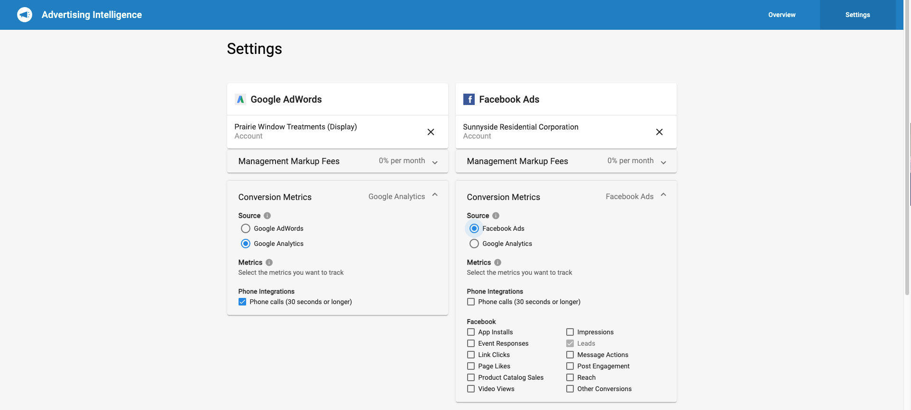
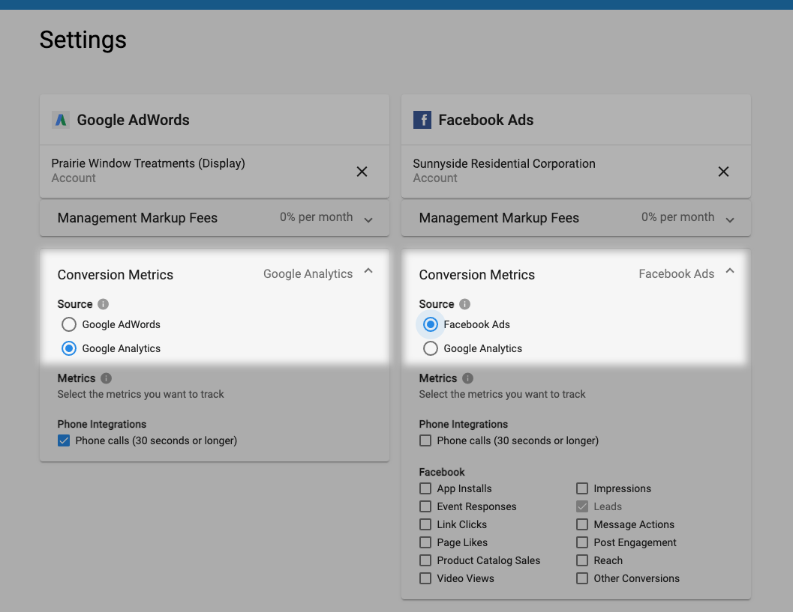

Select Google Analytics as the source for your Conversion metrics in Advertising Intelligence. Track conversions from objectives set on Google Analytics, instead of Google Ads or Facebook Ads.

## Supported Google Analytics account types

Standard GA4 properties are supported. Google Analytics 360 sub-properties are not supported. If you attempt to connect a GA 360 sub-property, the connection will not work.

## How to set up Google Analytics conversion tracking

1. Open Advertising Intelligence and go to `Settings`.
2. Click the `Conversion Metrics` section under Google Ads or Facebook Ads.
3. Select `Google Analytics` as the source. The option you select supplies the data for the Conversions metric in Advertising Intelligence.

## Why is there a data difference between Google Analytics and Advertising Intelligence?

Advertising Intelligence pulls and stores Google Analytics data once per day. The data comes from the `Sessions` column (not Users) in the Google Analytics dashboard. Small differences between the GA dashboard and Advertising Intelligence are normal. New session data may be added to Google Analytics between pulls, so Advertising Intelligence may lag the live GA dashboard by up to 24 hours.