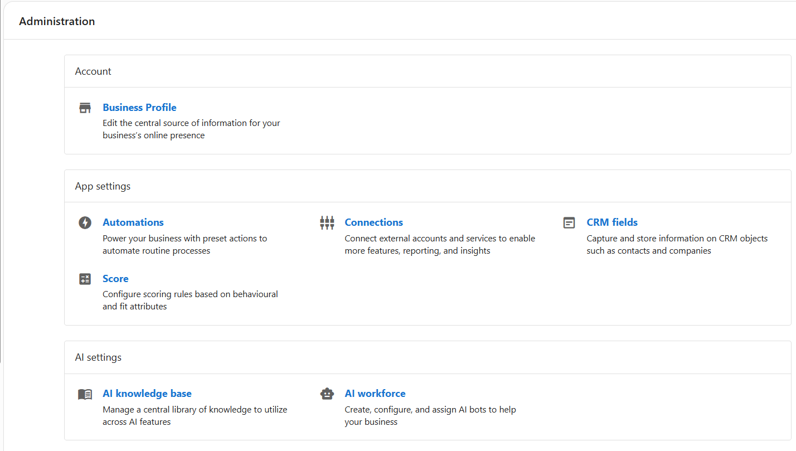

## What can You Manage in the Administration Section?
The **Administration** section provides access to system-wide configuration tools all in one place. Your dashboard relies on key configurations that determine how leads are captured, communications are handled, and automations are triggered. **The Administration section includes your Business Profile, App Settings, AI Settings, and Conversations Settings.** Everything that lives in the administration section works together to ensure that:
- Your tools are connected and synced correctly
- AI and messaging features are properly configured
- Workflows and communication channels are set-up in a way that steamlines your operations specific to your needs

Keeping these foundational settings aligned improves daily operations and makes your system easier to manage over time.

## Table of Contents
- [Business Profile](./business_profile.md)
- [App Settings](./app-settings/app_settings.md)
- [AI Settings](/administration/ai-settings/ai_settings)
- [Conversations Settings](./conversations-settings.md)

## What is Included in the Administration section?

### Account
- **Business Profile**  
  Update your business name, address, contact info, categories, branding, services, and more. This is the first thing you should setup to ensure your business information is accurate and consistent across all tools.

### App Settings
- **Automations**  
  Power your business with preset actions to automate routine processes.
- **Connections**  
  Connect external accounts and services to enable more features, reporting and insights.
- **CRM Fields**  
  Capture and store information on CRM objects such as contracts and companies.
- **Score**  
 Configure scoring rules based on behavioral and fit attributes.

### AI Settings
- **AI Knowledge Base**  
 Manage a central library of knowledge to utilize across AI features
- **AI Workforce**  
  Create, configure, and assign AI employees to help your business

### Conversations Settings
- **Conversations Settings**  
  Manage messaging channels and setup AI responses for customer inquiries.
- **Email Configuration**  
  Set the email addresses used for communication sent and received through the app.
- **SMS Configuration**  
  Set up A2P registration to send text messages. 
- **Email History**  
  Review emails sent to and from your business through the app and connected products.

## Frequently Asked Questions (FAQs)

**Can I return to update settings later?**  
Yes. You can revisit any section in Administration at any time to make updates as your business grows.

**Does changing these settings affect my team?**  
Most settings apply across your account, so updates will reflect for all users.

**Where should I get started to set up my app?**  
Start with the **Business Profile** inside the Administration tab to ensure your basic business information is accurate and consistent across all tools.

---
