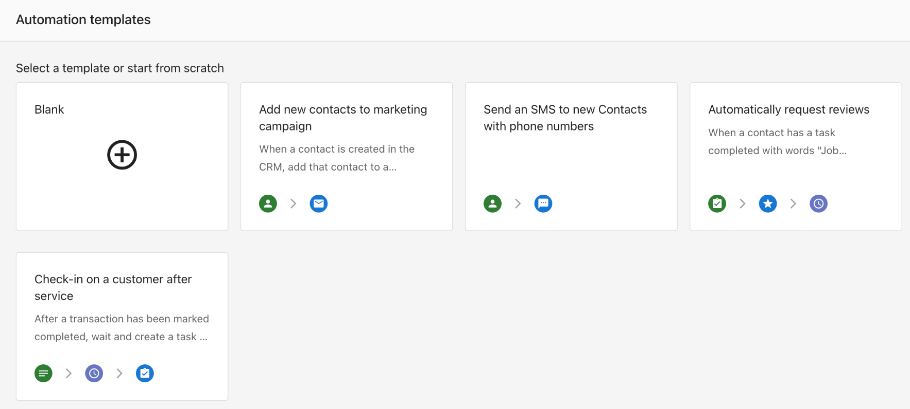

# Automations Overview

## What is an Automation?
**Automations** allow you to create workflows that trigger specific actions when certain events occur. These rules help automate repetitive tasks and ensure important processes run consistently without manual input.

With Automations, you can set triggers like a new contact or company being created, then define what actions should happen in response—such as sending an SMS, email, or updating CRM fields.

## Table of Contents
- [Key Terminology](#key-terminology)
- [Why are Automations Important?](#why-are-automations-important)
- [What is Included with Automations](#what-is-included-with-automations)
- [How to Set Up Your First Automation](#how-to-set-up-your-first-automation)
- [How to Configure Settings for Your Automations](#how-to-configure-settings-for-your-automations)
- [Frequently Asked Questions (FAQs)](#frequently-asked-questions-faqs)
- [Automation Templates](./automations_templates.md)

## Key Terminology

- **Trigger**  
  The event that starts the automation. Examples include: a contact is created, a meeting is booked, or a company is updated.

- **Condition**  
  Optional filters that narrow when the automation runs. For example, only run if the contact has a certain tag or source.

- **Action**  
  What happens when the automation is triggered. Actions include: sending an SMS, sending a plain text email, updating a field, or applying a tag.

- **Template**  
  A pre-configured automation you can use as a starting point. Templates include a suggested trigger, condition, and actions.

- **Workflow**  
  The full structure of an automation, combining one trigger, any conditions, and one or more actions.

## Why are Automations Important?
Automations reduce manual effort, speed up response times, and improve consistency for business owners. They help:

- Follow up with leads instantly
- Notify your team about new activity
- Keep contact and company records updated
- Send SMS and email communications automatically

Automations save time while improving customer experience and internal efficiency.

## What is Included with Automations
- A visual workflow builder
- Trigger options like contact creation or company updates
- Optional conditions to refine when automations run
- Action steps including send SMS, send email, update CRM fields, or apply tags
- Full compatibility with Inbox, CRM, and third-party integrations

## How to Set Up Your First Automation
1. Go to `Business App` > `Administration` > `Automations`
2. Click the `Create Automation` button in the top-right corner
3. Choose a starting point:
   - Select a template from the gallery
   - Or build from scratch using `Blank`

    

4. Set your `Trigger` (e.g., When a Contact is created)

    

5. Add `Conditions` (optional)

    

6. Add `Actions` like:
   - `Send SMS`
   - `Send a plain text email` (Inbox Pro required)
   - `Update Company`
   - `Apply tag`

    

7. Click `Save` and toggle the automation to `Active`

## How to Configure Settings for Your Automations

Each automation includes a `Settings` tab where you can control how and when your workflow runs, and how it behaves if an error occurs.

### Entry Settings

This controls how many times the automation can run for the same record (e.g., a company or contact):

- **Only once per company**  
  The automation will run just one time for each company, even if the trigger conditions happen again.

- **Multiple times per company**  
  The automation will run every time the trigger conditions are met, even if it's for the same company.

- **One at a time per company**  
  The automation will only run again after the previous instance for that company has finished.  
  _Use this option to avoid overlapping actions or duplicated outcomes._

### Error Handling Settings

This controls what should happen if one of the steps in your automation fails.

- **Skip the step and continue the automation run**  
  Recommended in most cases. The automation continues, even if one step fails (for example, due to missing data).

- **Stop the automation run**  
  If any step fails, the entire automation stops immediately. This is useful when each step relies on the success of the previous one.

All errors are logged in the `Activity` tab, where you can review and retry errored automations if needed.

## Frequently Asked Questions (FAQs)

**Do SMS and email actions require anything extra?**  
Yes. Sending SMS or plain text emails requires Inbox Pro.

**Can I pause or edit an automation after creating it?**  
Yes, automations can be edited or turned off at any time.

**Can one automation trigger another?**  
Automations can't directly trigger one another, but you can use tags or fields to create layered logic.

**How can I avoid automations running too often?**  
Use conditions or field filters to control when an automation runs.

