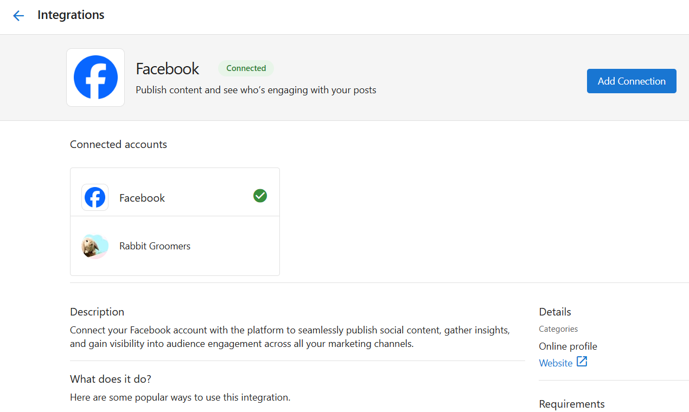

## What Can I Manage in Connections?
The **Connections** section allows you to link third-party tools directly to your app. These integrations bring your most important business data into one place and allow services across your app to work together.

By connecting platforms like Google, Facebook, and others, you can:

- Sync location, lead, or campaign data  
- Power reporting tools like the Executive Report and Marketing Funnel  
- Enable automations and trigger workflows  
- Improve communication and scheduling with customers

Connections are shared across most activated products.

## Why Are Connections Important?
When your tools are connected, your app can use real data to show what's working. Integrations help you track marketing performance, and trigger smart actions—like sending review requests or appointment reminders.

Connecting accounts also reduces manual work by automatically syncing data between systems, improving the accuracy and efficiency of your daily operations.

## Table of Contents
- [What Can I Manage in Connections](#what-can-i-manage-in-connections)
- [How to Browse and Add New Integrations](#how-to-browse-and-add-new-integrations)
- [How to Manage or Disconnect Integrations](#how-to-manage-or-disconnect-integrations)
- [What Data Gets Synced](#what-data-gets-synced)
- [Frequently Asked Questions (FAQs)](#frequently-asked-questions-faqs)

## What is Included?
The `Browse` tab in the **Connections** section displays available integrations. You can search for or scroll through a list of platforms to connect.

Common integrations include:

### Google and Meta
- **Google Business Profile** – Syncs location details and visibility metrics  
- **Google Analytics** – Tracks site activity and marketing performance  
- **Google Search Console** – Adds search insights
- **Facebook** – For reporting and automation  

### Scheduling and Service Tools
- **Housecall Pro** – Syncs job scheduling and service activity  
- **Jobber** – Connects field service workflows  
- **Gingr**, **PetExec**, **Pet Resort Pro**, **Paw Partner**, **PawLoyalty** – Connect customer and service data for pet-related businesses  

### Finance and Productivity Tools
- **QuickBooks Online / Personal** – Syncs invoices, transactions, and billing data
- **Zapier** – Connects and automates workflows with thousands of apps  

## How to Browse and Add New Integrations
1. Go to `Administration` in your side bar. 
2. Select `Connections`.  
3. Click the `Browse` tab.  
4. Use the search bar or scroll through available integrations.  
5. Click the integration tile.  
6. Follow the steps to authorize your account.

Each integration has it's own required steps to connect. You can find these detailed set up steps outlined in each integration card once you click the `Browse` tab and click on a specific integration. Once connected, data will begin syncing automatically into your app (some integrations will take up to 48 hours to sync).

## Types of Integrations

Your app supports three different methods of connecting external platforms. Each method serves a different use case depending on how the integration is built, who manages it, and how it’s authenticated. Understanding these types will help you navigate set up for the connection you are working with. 

| **Integration Type**  | **Best For**                             | **Setup Method**                |
|-----------------------|-------------------------------------------|----------------------------------|
| **Vendor-Managed**    | Prebuilt connections                      | Log in and connect               |
| **SSO-Based**         | Secure logins and synced data             | Single sign-on authorization     |
| **API-Key Based**     | Custom or advanced external connections   | Generate and use API credentials |

Within each specific app (after you press `Connect`) you will be prompted with special instructions on how to nagivate and set up the connection. 

## How to Manage or Disconnect Integrations
1. From the `Connections` section, select the `Manage` tab.  
2. View the list of active integrations and their connection status.  
3. Click any integration to:
   - See connected accounts  
   - Reconnect if authorization has expired  
   - Disconnect the platform  

## What Data Gets Synced
Each integration sends specific data to your app, depending on its purpose. For example:

- **Lead forms** from Facebook  
- **Website performance** from Google Analytics  
- **Search visibility** from Google Business Profile  
- **Customer and job data** from Housecall Pro or Jobber  
- **Financial records** from QuickBooks (including enhanced email field support)
- **Contact and company data** from HubSpot (two-way synchronization)
- **Call data and contact lists** from Kixie dialer

## Featured Integration: HubSpot CRM

The HubSpot integration provides powerful two-way synchronization between your Vendasta CRM and HubSpot CRM.

### What syncs with HubSpot:
- **Contacts**: Full two-way sync of contact information and custom fields
- **Companies**: Complete company data synchronization 
- **Real-time updates**: Changes in either system sync automatically
- **Duplicate prevention**: Built-in safeguards prevent duplicate connections

### Setup requirements:
- Valid HubSpot account with appropriate permissions
- Cannot connect the same HubSpot account to both Partner Center and Business App simultaneously
- Initial sync may take several hours for large datasets

:::warning
**Important**: A HubSpot account can only be connected to either Partner Center OR Business App, not both. This prevents data conflicts and ensures data integrity.
:::

## Featured Integration: Kixie Dialer

Kixie integration brings powerful dialing capabilities directly into your CRM workflow.

### What Kixie provides:
- **Power dialing**: Make calls directly from contact records
- **Contact management**: Add/remove contacts from Kixie power lists via automations
- **Call logging**: Automatic call activity tracking in your CRM
- **Workflow automation**: Trigger actions based on call outcomes

### Automation capabilities:
- Add contacts to Kixie power lists automatically
- Remove contacts from lists based on call results
- Create follow-up tasks after calls
- Update contact status based on dialing outcomes  

### Frequently Asked Questions (FAQs)

**Do I have to connect everything right away?**  
No, but connecting key platforms early helps you get value faster from reports and automation tools.

**Are connections shared across my products?**  
Yes. Integrations and synced data is shared across (most) products. 

**Why is one of my integrations disconnected?**  
This may happen if permissions are removed or login credentials change. Reconnect to restore data syncing.

**Where does the integration data appear?**  
In the Executive Report, Marketing Funnel, and any features connected to that service.

**Are there setup guides for individual integrations?**  
Yes. Click any integration in the `Browse` tab to view detailed instructions.

**Will disconnecting an integration remove my data?**  
No, but it will stop new data from syncing. Reports and tools will retain past data until updated.

**How do I set up HubSpot two-way sync?**  
Browse to HubSpot in the Connections section and follow the authorization flow. Make sure your HubSpot account isn't already connected to Partner Center, as each HubSpot account can only connect to one platform.

**What data syncs between HubSpot and Vendasta?**  
Both contacts and companies sync in real-time, including custom fields and properties. Changes made in either system automatically update in the other.

**Can I prevent duplicate HubSpot connections?**  
Yes, the system automatically prevents connecting the same HubSpot account to both Partner Center and Business App simultaneously.

**How do I use Kixie with automations?**  
After connecting Kixie, you can use automation actions to add or remove contacts from Kixie power lists, making it easy to build automated calling workflows.

**Do Kixie calls get logged in the CRM?**  
Yes, call activity from Kixie automatically appears in your contact's activity feed for complete interaction tracking.

---

## Quick Add Via Settings

You can also connect platforms directly from the `Settings` > `Connections` page.

Connecting your accounts early is one of the most important steps you can take to start seeing value in Business App. The metrics pulled in through Connections power analytics in the Executive Report and Marketing Funnel.
