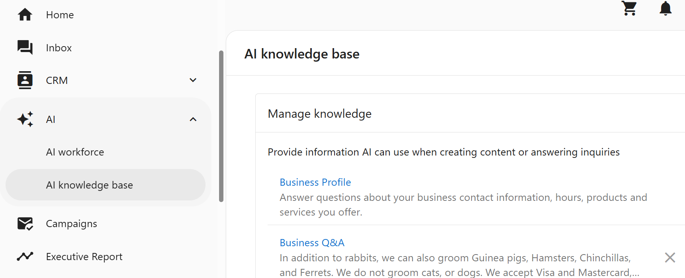

This best practice guide is designed to help you successfully set up and manage your AI Receptionist inside your app. With the right foundation, you can start seeing real results—like more captured leads and faster, accurate responses—from day one.

## AI Receptionist Behavior & Goals

The AI Receptionist operates with the following primary objectives:

1. **Answer Business-Related Questions**: Utilizing knowledge from the business profile and additional provided information, the assistant responds confidently to inquiries about services, pricing, and more. If uncertain, it informs the visitor that someone will follow up.

2. **Capture Lead Contact Information**: Engages visitors to understand their needs and collects their name and contact details (preferably mobile number, alternatively email) to facilitate continued communication.

3. **Multilingual Support**: Automatically detects and responds in the visitor's language, supporting over 40 languages, including English, French, and Spanish.

## Treat Your AI Like a New Employee

Your AI Receptionist is smart—but it still needs training. Think of it like onboarding a new team member. You wouldn't expect a new hire to instantly know your services, policies, and tone of voice just by reading your website.

Just like a human employee, your AI Receptionist requires:

- **Training** (via instructions and knowledge)
- **Feedback** (by reviewing past chats)
- **Ongoing coaching** (by updating based on performance)

## Step 1: Configure the Basics

Start in your app's `AI Workforce` section and click `Configure`.

- **Name and Image**  
  Give your AI a friendly, professional name and photo. Be transparent—make it clear to customers that they're chatting with an AI.

- **Communication Channels**  
  Enable `Web Chat` (default) and optionally turn on `SMS`.

- **Set Your Goals**:
  - **Capture Lead Information**  
    Instructs the AI to ask for contact info like name, phone number, or email. If this is disabled, even if a user provides their info, it will not be saved to your CRM.

  - **Book Appointments**  
    Connect your calendar, and the AI will guide users through scheduling a meeting, offering available time slots, and collecting booking details.

## Step 2: Understand Instructions vs Knowledge

To respond accurately, your AI needs context. There are two tools for this: **Instructions** and **Knowledge**.

| Feature        | What It Does                                   | When to Use It                                                           |
|----------------|------------------------------------------------|--------------------------------------------------------------------------|
| **Instructions** | Rules the AI follows every time it responds   | For core behaviors and tone (e.g., "Always collect home address.")       |
| **Knowledge**     | Content used only when questions are asked     | For FAQs, service descriptions, pricing info, policies, and more         |

You can upload or connect:
- Business profile information
- Website pages
- FAQs and service documents

To manage website content:
- Go to the `Train` tab in the AI configuration.
- Select which pages to include or exclude.
- If you update your site, revisit this tab and click `Refresh`.

:::info
Keep both instructions and knowledge concise. Use clear language and offer examples when possible.
:::

**Example instructions using Markdown formatting:**

```markdown
# Services
## We are not licensed plumbers
### If asked, take contact info and suggest a referral
```

## How to Train the AI on Your Business

You can train the AI assistant to accurately represent your business by giving it access to your business profile and any additional custom content you choose to provide.

### Business Profile Knowledge (Enabled by Default)

The AI assistant uses information from the business profile to answer common questions such as what you do, where you're located, hours of operation, and how to get in touch. This is enabled by default, but you can remove it as a knowledge source if needed.

The following fields from the business profile are shared with the AI:

- Business Name  
- Address and/or Service Areas  
- Website  
- Booking URL  
- Phone Number  
- Categories  
- Hours  
- Services Offered  
- Short Description  
- Long Description  
- Social Media URLs  


### How to Add Your Website as Source Knowledge for Your AI

You can have the AI scrape your website which helps it respond to detailed inquiries about your business. 

<iframe width="100%" height="400" 
src="https://www.youtube.com/embed/eMTaoKXymXQ?start=8" 
title="AI Web Chat Overview" 
frameborder="0" 
allow="accelerometer; autoplay; clipboard-write; encrypted-media; gyroscope; picture-in-picture" 
allowfullscreen>
</iframe>

1. Go to `AI > AI knowledge base > Manage knowledge`.  
3. Click `Add knowledge` the choose `Website`
4. Follow the setup instructions to train the AI on your website. Make sure you select all the pages you would like to train your AI on, and save.

### How to Add Custom Knowledge to Your AI

You can expand the assistant's capabilities by adding your own knowledge content from any text-based source.



1. Go to `AI > AI knowledge base > Manage knowledge`. 
2. Click on any knowledge source title to preview what content is currently accessible to the AI.  
3. Click `Manage Knowledge` to open the centralized knowledge area.  
4. Add new content by writing or pasting text into a new knowledge source.  
5. Select the checkbox next to each source you want the AI to use.

This lets you teach the AI to respond using business-specific details such as product explanations, policies, or unique services beyond what's stored in the profile.

## Step 3: Test and Iterate

Use the `Try it` button to simulate customer chats. For best results, open the test in an incognito window so it starts with a clean session.

Ask the kinds of questions your real customers might ask, and pay attention to:

- How the AI responds
- Whether it gives too much or too little information
- If it's assuming something you didn't intend

Then go back and adjust your instructions or knowledge sources as needed.

## Step 4: Monitor and Improve

Regularly review the `Inbox` and `Anonymous Visitors` tabs in your app:

- **Review successful chats** where contact information was captured
- **Check anonymous conversations** to see what people are asking
- **Identify misunderstandings** or overly complex responses—these are key areas for improvement

**Pro Tip:**  
When reviewing a conversation, expand the **Source material** beneath any AI response bubble. This reveals where the AI pulled its information from. If a response was incorrect, you can use this insight to:
- Refine your instructions
- Add new knowledge
- Remove or update outdated knowledge sources

This is like an-app audit of all your online information!

## Tips from the Pros

### Set Realistic Expectations

AI is **non-deterministic**—that means it may not give the exact same answer every time. That's not a bug; it's part of how it adapts to different inputs.

Think of your AI like a helpful teammate, not a fixed script.

### Capture What You Know

You're the expert on your business. Create a simple guide that answers:

- What services do you offer—and which do you not?
- What questions do customers ask the most?
- What information should always be collected?

Use this guide to build your instructions and upload content to your AI knowledge base.

## Why It's Worth It

Even if the AI doesn't always respond perfectly, your AI Receptionist can:

- Capture leads you might have missed
- Offer 24/7 support across channels
- Save your team time on manual follow-up

With regular reviews and small improvements, your AI becomes a reliable digital team member—one that knows your services and speaks your language.

## Next Steps

- ✔ Configure your AI with the basics  
- ✔ Add clear instructions and useful knowledge  
- ✔ Test it by chatting like a customer would  
- ✔ Review conversations weekly  
- ✔ Update and improve as needed  
