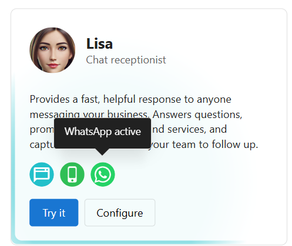
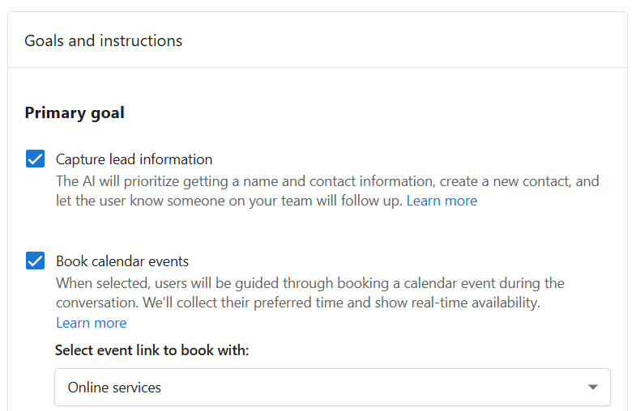

# AI Workforce Overview

## What is the AI Workforce?
The AI Workforce is a collection of virtual employees built into your app to help manage routine customer interactions. Each AI Employee is designed for a specific business task—such as responding to messages, handling phone calls, creating content, or managing reviews.

You can enable, configure, and customize each AI Employee based on your business needs. These assistants work 24/7 to capture leads, answer questions, write content, respond to reviews, and reduce your manual workload so you can focus on growing your business.

## Why is the AI Workforce Important?
Running a business is multifaceted. It is hard to make time to answer every message, manage every call, or update content regularly. Your AI Workforce helps automate these time-consuming tasks without sacrificing quality or responsiveness.

Your AI Workforce can:
- Capture leads and automatically follow-up
- Provide consistent, professional service
- Increase customer satisfaction
- Extend your reach outside of work hours

## Table of Contents
- [What is Included in Your AI Workforce](#what-is-included-in-your-ai-workforce)
- [How to Enable an AI Employee](#how-to-enable-an-ai-employee)
- [How to Configure an AI Employee](#how-to-configure-an-ai-employee)
- [Frequently Asked Questions (FAQs)](#frequently-asked-questions-faqs)

## What is Included in Your AI Workforce?

- [AI Receptionist](./ai_receptionist.md)
- AI Voice Receptionist
- AI Content Creator
- AI Review Manager

## How to Enable an AI Employee

1. In your app, go to `AI` > `AI Workforce`.
2. Browse the list of available AI Employees.
3. Click `Try it` to preview how the employee works.
4. Click `Configure` to customize and activate the employee.
You can activate multiple AI Employees, each performing a unique task.

## How to Configure an AI Employee

Each AI Employee can be customized to fit your brand, desired outcomes and communication preferences. Customization options include:

### Channels
Choose which platforms the AI should respond on:
- Website Chat Widget
- SMS
- WhatsApp
- Voice (for phone receptionists)




You can toggle channels on or off and adjust channel-specific settings.

### Goals and Instructions

Recommended primary goals:

**Capture lead information** – always prompt lead to collect name and contact details (and automatically create a record in your CRM) 

**Book calendar events** – link to a scheduling tool with real-time availability.



You can also write detailed behavior instructions, like:

```markdown
# TONE & PERSONALITY  
Stay friendly and professional.

# SERVICE QUALIFICATION  
Ask what type of service they need.

# BOOKING  
If they want to schedule, link to my booking page.

# CONTACT INFO  
Ask for name, phone, and email before ending the chat.
```

### Frequently Asked Questions (FAQs)

**Do I need to enable all AI Employees?**  
No. You can choose which AI Employees to activate based on your business needs. Each performs a separate function and can be configured independently.

**Can I customize what an AI Employee says?**  
Yes. You can set up detailed behavior using the `Instructions` section and upload FAQs, pricing, and service information to the `Knowledge` section.

**Will the AI capture contact details automatically?**  
Only if the “Capture lead information” goal is enabled. 

**How does the AI book appointments?**  
The AI connects to your calendar and offers available time slots during the conversation. It captures the necessary contact info and confirms the booking with the customer.

**Can I test the AI before going live?**  
Yes. Click the `Try it` button to open a test conversation. You can use this to simulate real customer interactions and refine your configuration.

**How do I know if the AI is working well?**  
Check the `Inbox` and `Anonymous Visitors` regularly to review how the AI responded, which leads were captured, and where improvements may be needed. This is like an in-app audit for all your online information.

**What if the AI gives the wrong answer?**  
Review the conversation and expand the **Source material** to see where the information came from. You can then update your instructions, edit knowledge sources, or remove outdated content.

**Does the AI answer the same way every time?**  
Not always. AI is non-deterministic, meaning responses can vary slightly. This helps the AI adapt to different phrasing and conversation flow.

**Can I deactivate or delete an AI Employee?**  
Yes. You can deactivate any AI Employee from the `AI Workforce` section. This stops it from responding to new conversations.

**Do I need technical knowledge to configure this?**  
No. Most configuration is done through simple forms and toggles. Instructions can be written in plain language or Markdown.

