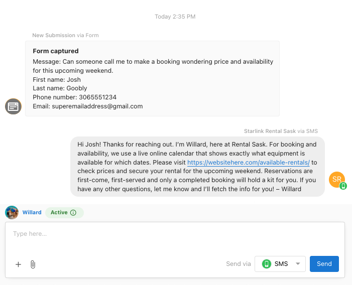

import Link from '@docusaurus/Link';
import { AISparkleIcon, SettingsIcon, CRMIcon } from '@site/src/components/Icons';

  

    <h1 style={{marginTop: 0}}>Build your AI Workforce</h1>
    
Use AI Employees to greet visitors, answer questions, capture leads, and book appointments across chat, SMS, WhatsApp, and phone.

    

      <Link className="button button--primary" to="./ai-workforce/ai_workforce_overview"><AISparkleIcon />&nbsp;Open AI Workforce</Link>
      <Link className="button button--secondary" to="./knowledge-base"><CRMIcon />&nbsp;Knowledge Base</Link>
      <Link className="button button--secondary" to="./ai-capabilities/"><SettingsIcon />&nbsp;Capabilities</Link>
    

  

  

    
  

## Start here

- Go to <AISparkleIcon /> `AI > AI Workforce` to configure your AI Employees
- Review your <SettingsIcon /> `Administration > Business Profile` so your AI has accurate information
- Optional: Connect your calendar in <CRMIcon /> `CRM > My Meetings` for bookings

## Explore

  

    <Link className="card-link" to="./ai-workforce/ai_workforce_overview">
      

        
<h3>AI Workforce</h3>

        

Set up employees, tone, and behavior.

      

    </Link>
  

  

    <Link className="card-link" to="./ai-capabilities/">
      

        
<h3>Capabilities</h3>

        

Enable skills like Q&A, booking, and integrations.

      

    </Link>
  

  

    <Link className="card-link" to="./knowledge-base">
      

        
<h3>Knowledge Base</h3>

        

Provide business-specific information for accurate answers.

      

    </Link>
  

  

    <Link className="card-link" to="./ai-workforce/ai-chat-receptionist">
      

        
<h3>AI Chat Receptionist</h3>

        

Answer web chat, SMS, and WhatsApp automatically.

      

    </Link>
  

  

    <Link className="card-link" to="./ai-workforce/ai-voice-receptionist">
      

        
<h3>AI Voice Receptionist</h3>

        

Answer phone calls 24/7 and capture leads.

      

    </Link>
  

  

    <Link className="card-link" to="./ai-capabilities/creating-custom-capabilities">
      

        
<h3>Custom Capabilities</h3>

        

Connect tools and tailor what your AI can do.

      

    </Link>
  

## FAQs

Where do I enable AI?

Go to <AISparkleIcon /> `AI > AI Workforce` in Business App. Choose the employee you want to use and follow the setup prompts.

How does AI get my business information?

Your Business Profile is included by default. You can add additional knowledge sources in the Knowledge Base. See the [Knowledge Base Overview](./knowledge-base.md).

