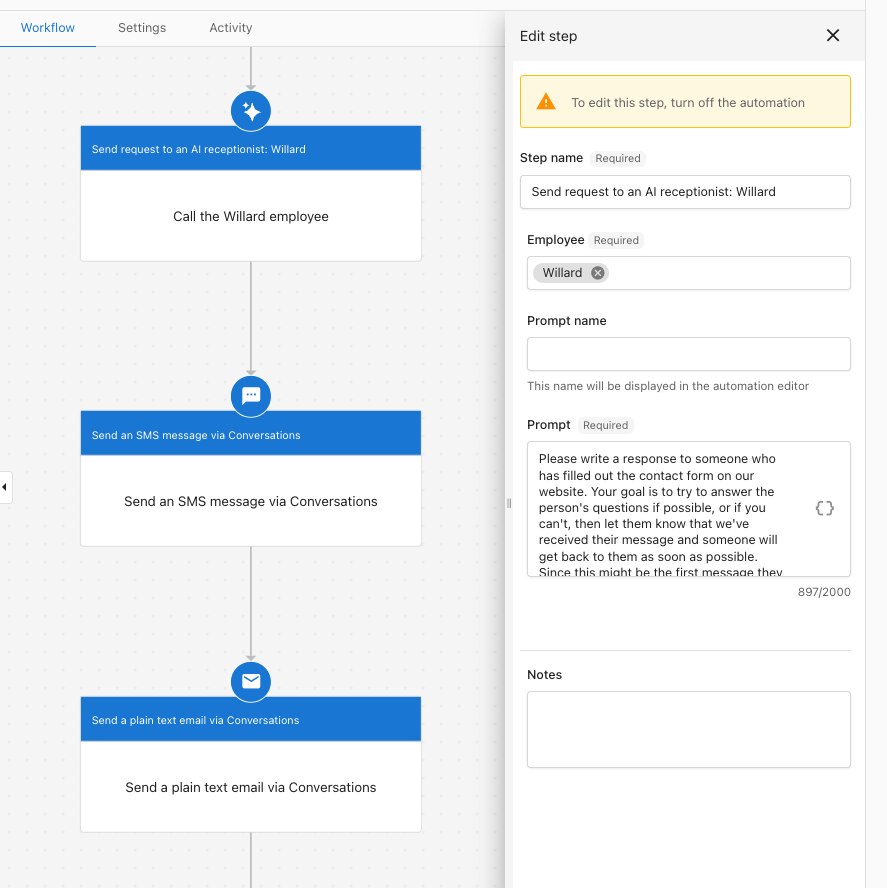

# Call an AI Employee from Automations

This `Automations` feature is called `Call an AI Employee`. This allows you to send a request, or prompt, to an AI Employee and then use the AI's response as part of a workflow.

A template, "Form submission - Auto-reply with AI Chat Receptionist custom message," uses this feature to let the AI Receptionist automatically send a helpful, unique reply to a contact after they submit a form.

## Why is this important?

When a potential customer fills out a form on your website, this automation allows your AI Receptionist to respond to them immediately via SMS and email. The AI can use the context of the form to answer the person's questions directly and confirm that their submission has been received.

## What’s included?

* A automation step: `Call an AI Employee`.
* A automation template: `Form submission - Auto-reply with AI Chat Receptionist custom message`.

## How to use it

To get started, you can use the pre-built template.

### Step 1: Create the Automation

1.  Navigate to `Business App` > `Automations`.
2.  Click `Create automation`.
3.  From the `Automation templates` screen, select the `Form submission - Auto-reply with AI Chat Receptionist...` template.

### Step 2: Customize the Automation

1.  Once the workflow is created, you can customize it.
2.  You can edit the `Send request to an AI receptionist` step to change the `Prompt` that the AI uses to craft its response.
3.  You can also remove the email or SMS steps if you only want the AI to reply to one channel.

:::info
To edit any step in the workflow, the automation must first be turned off.
:::

### Step 3: Enable the Automation

1.  When you are satisfied with your settings, enable the automation.
2.  Ensure the automation is set to run multiple times so it works for every form submission.

## Frequently Asked Questions

Is this automation available in Partner Center?

Yes, the `Call an AI Employee` step is available in Partner Center automations. You can also use the 'Send an SMS message via conversations' action, but sending emails is not available at this time.

How do I find this automation template?

You can find it by going to `Automations`, selecting `Create automation`, and choosing the template named "Form submission - Auto-reply with AI Chat Receptionist custom message".

Can I change the instructions for the AI's response?

Yes. In the automation workflow, you can select the `Send request to an AI receptionist` step to edit the `Prompt`. Here, you can provide different instructions for how the AI should respond.
