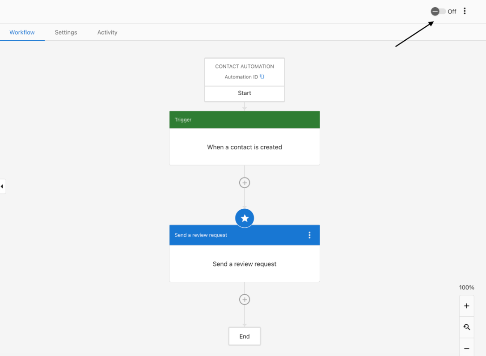

## What are Automation Templates?
Automation templates are pre-built workflows that help you set up common automations, quickly. Templates provide a structured starting point with a trigger, optional conditions, and one or more action steps. You can customize them to suit your specific needs.

Templates are helpful for saving time, ensuring consistency, and guiding you through best-practice automation design. Instead of building a workflow from scratch, templates allow you to:

- Speed up setup and implementation
- Reduce configuration errors
- Start from a proven, structured example
- Modify as needed without needing to know every feature in the builder

## Table of Contents
- [How to Use Automation Templates](#how-to-use-automation-templates)
- [Popular Automation Templates](#popular-automation-templates)
- [Frequently Asked Questions (FAQs)](#frequently-asked-questions-faqs)

## How to Use Automation Templates
1. Navigate to `Business App` > `Administration` > `Automations`
2. Click `Create Automation` in the top right corner
3. Choose a template from the gallery (or search for one by name)

    

4. Review the suggested trigger, conditions, and actions
5. Edit any step to match your business requirements
6. Save and activate your automation

## Popular Automation Templates

### Review Request: Ask Customers for Reviews After Service

**Purpose**  
This template helps you automatically follow up with customers to request a review after a service is completed or a lead is converted. 

**Requirements**  
- For this specific automation, you need to have **Reputation Management Premium** activated on your account  
- **Conversations Pro** is required to send SMS or plain text email

### How to Set Up the Review Request Automation

This workflow can be found by naviating to `Automations` in your side bar. 

**Step 1:** Select `Create Automation.`  
**Step 2:** Choose a trigger to start your workflow. For this example, select `create a contact.` You can also add conditions to specify what you want to trigger.  

**Step 3:** Next, add an action. In this example, the action is `Send a review request`.

**Step 4:** For this specific action you need to have **Reputation Management Premium** activated on the account. Click `Save.` 

**Step 5:** Toggle it on. A modal will pop up with options to select your automation settings.  

**Step 6:** Once you select `Turn On,` you will be prompted to give consent to the automation to complete actions on your behalf. Select `Allow.`

---
