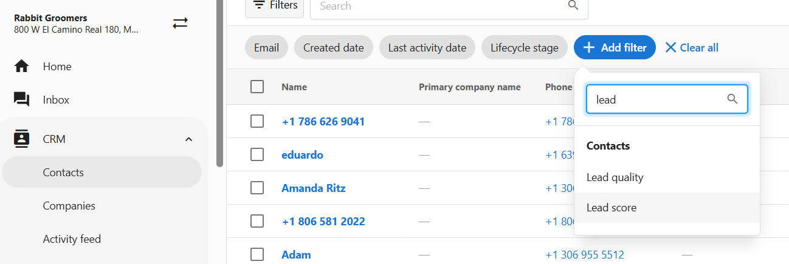

## What is Contact Scoring?
Contact Scoring allows you to assign a numeric score to each contact in your app based on their activity or value to your business. These scores help you track client engagement, prioritize follow-ups, and segment contacts for marketing and service efforts.

Scoring can be updated manually or through integrations. It’s especially useful for identifying top clients, monitoring lead quality, or tailoring communications based on customer interest. The score appears directly on each contact's profile.

## Why is Contact Scoring Important?
Not all contacts are equally engaged or valuable. Without a clear way to track contact quality, it can be hard to focus your time on those most likely to convert, renew, or refer your services.

Contact Scoring helps you:
- Qualify leads based on behavior or attributes
- Identify high-priority clients at a glance
- Inform automated workflows or custom field segmentation

## How to View and Update a Contact Score

1. Go to `Administration` 
2. Select `App Settings`, then click `Score`.
3. This opens the scoring configuration page, where you can view or update contact scores.
5. Enter a new numeric score and click `Save`.

This field is editable by anyone with permission to manage contact records.

## How Contact Scores Are Used

1. Navigate to `Add Filter` within a `Contact` in your CRM. 
2. Add `Lead Score` in the drop down menu to filter by the specific scoring data to do a number of things. You can use contact scores in your app to:

- **Segment contacts** for targeted messaging (e.g., top scorers receive a referral offer)
- **Prioritize follow-ups** by sorting or filtering contacts based on score
- **Track engagement trends** over time for each client

## Frequently Asked Questions (FAQs)

Can I use contact score in automations or integrations?

Yes. The `Score` field can be read or updated via integration tools and APIs.

What kind of values can I use for scoring?

Scores must be numeric. You can define your own range (e.g., 1–10, 0–100) and scoring rules.

Is the score visible to contacts?

No. The contact score is internal to app users only.

