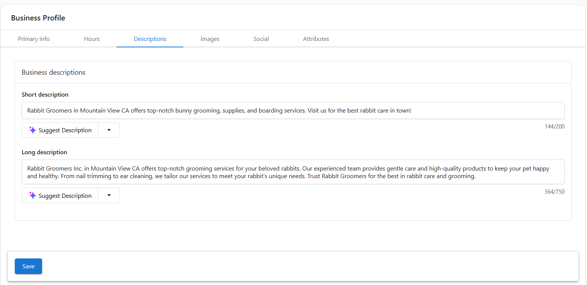

## What is my Business Profile?
Your **Business Profile** allows you to manage your core business information in one central place. This includes your name, location, website, branding, services, social profiles, and operational details.

This profile ensures that your business information is accurate and consistent across listings, reports, lead capture tools, and across all features of your app.

  

    <iframe
      src="https://fast.wistia.net/embed/iframe/jwq88rpson?web_component=true&seo=true"
      title="Business Profile Overview"
      allow="autoplay; fullscreen"
      allowTransparency
      frameBorder="0"
      scrolling="no"
      className="wistia_embed"
      name="wistia_embed"
      width="100%"
      height="100%"
    ></iframe>
  

## Why is my Business Profile Important?
Keeping your Business Profile complete and up to date helps your business:
- Appear accurately in local search and online listings
- Build trust with customers through consistent branding and clear service offerings
- Power tools like lead capture tools, automations, and inbox messaging with the correct business details

## Access the Business Profile

You can open this page by going to **My Business > Business Profile.**

## Keep profile data in sync

Your Business Profile is used by other products in the app when they are active on your account (such as Local SEO or Reputation AI). Editing your profile here updates it everywhere, so you only need to maintain it in one place.

## Primary Info
In the **Primary Info** tab, you can update:

- **Business name** and **common name**
- **Website URL**
- **Primary business category** and additional categories
- **Physical address** with map marker
- **Phone number** (must be formatted internationally)
- **Service area business** toggle

Click `Save` to apply your updates.

These details power your listings. 

## Hours
In the **Hours** tab, you can update:

- **Hours of operation**
- Special hours (like holidays)

## Descriptions
In the **Descriptions** tab, you can add a:

- **Short description** (up to 200 characters)  
  Appears in previews and listings  
- **Long description** (up to 750 characters)  
  Describes your business in more detail  

You can also use the `Suggest Description` button to generate content with the help of AI. Click `Save` to apply your updates.

## Images
Use the **Images** tab to visually represent your brand across applications:

- **Main logo**
- **Secondary logo** (optional)
- **Cover photo**
- **Gallery images** (shared on listings that accept images)

Click `Edit` or `Choose images` to upload or update files. These images help create a trustworthy and professional online presence. Click `Save` to apply your updates.

## Social
In the **Social** tab, you can add links to your active business pages:

- Facebook  
- LinkedIn  
- Twitter  
- Instagram  
- YouTube  
- Pinterest  
- Foursquare  

You can also enter your **Blog or RSS feed URL** to integrate recent content where supported. Click `Save` to apply your updates.

## Attributes

The **Attributes** tab allows you to define specific qualities and services your business offers. These attributes enhance how your business appears on platforms like Google and Bing, and can improve your discoverability in local search.

You can search or scroll through the dropdown to add applicable options for each platform. Once selected, they will be synced to the appropriate listings platform when supported. Click `Save` to apply your updates.

### Examples of Available Attributes

Depending on your business type, you may be able to select attributes such as:

- **Identifies as women-owned**
- **Language assistance**
- **LGBTQ+ friendly**
- **Menu or services link**
- **On-site parking**
- **Wheelchair accessible**
- **Pet-friendly**
- **Curbside pickup**
- **Delivery service**

## Confirm Google Business Profile verification

Use the **Verified** tag in Business App or your Google Business Profile dashboard to confirm verification status. See the FAQ below for detailed steps.

## Frequently Asked Questions (FAQs)

How do I confirm if my Google Business Profile listing has been verified?

If your Google Business Profile is connected in Business App, you will see a **Verified** or **Unverified** tag.

If your Google Business Profile is not connected in Business App, log into your Google Business Profile dashboard to check verification:

1. Log into the Google Business Profile dashboard.
2. Under "Your business on Google," look for a blue check mark (verified) or a red shield (unverified).
3. A blue check mark means the profile is verified. A red shield means verification still needs to be completed.

Why should I complete my Business Profile?

A complete profile improves visibility, enables automation, and powers accurate reporting across all app features.

What happens if I leave a field blank?

Missing information may reduce your visibility in listings and create gaps in reporting or customer-facing tools.

Can I update my Business Profile at any time?

Yes. You can return to this section anytime to make updates as your business evolves.

How often should I review this section?

We recommend reviewing your Business Profile every few months, or whenever key business information changes.

---
