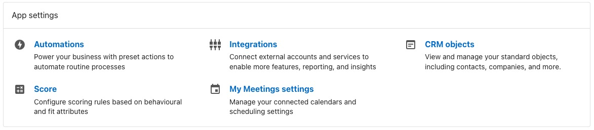
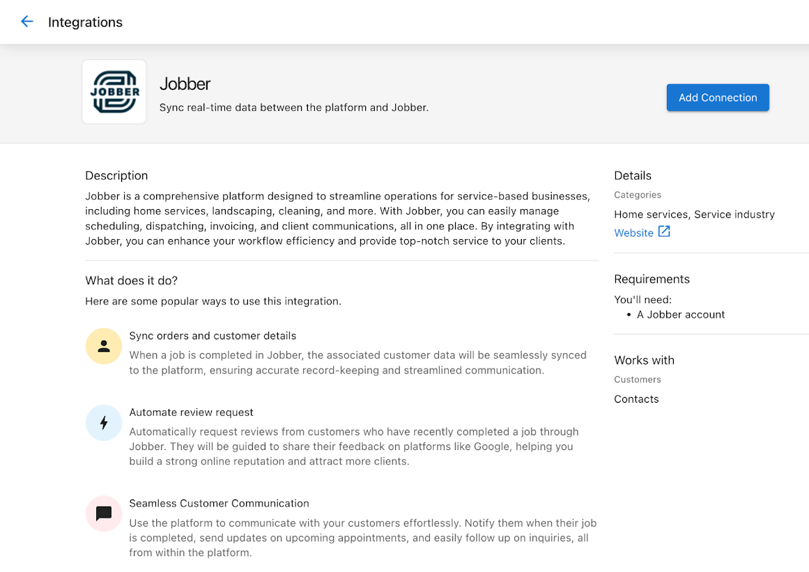
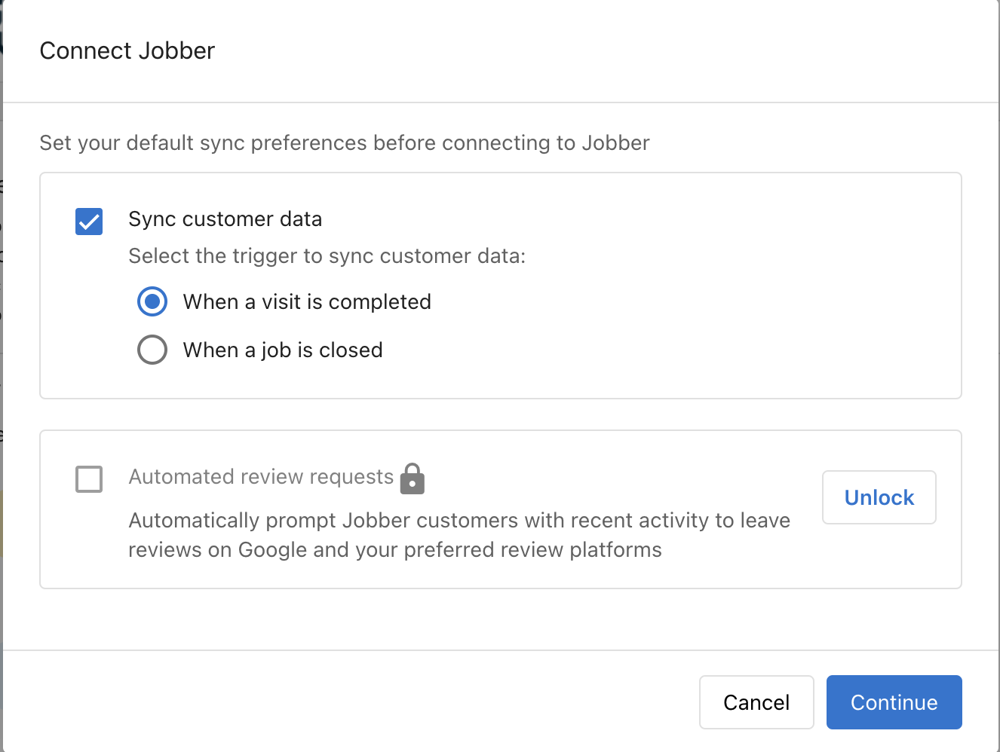
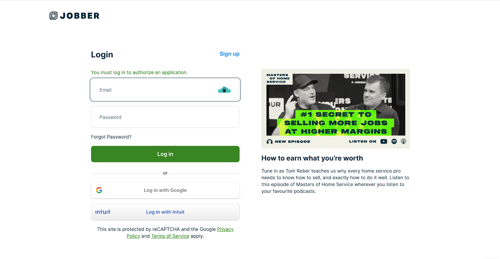
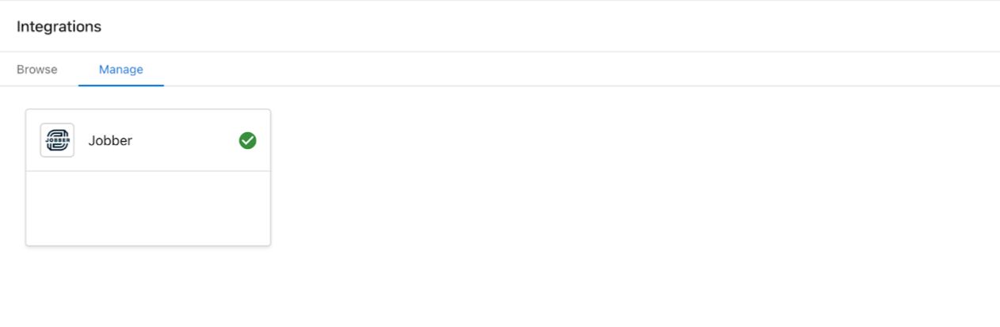
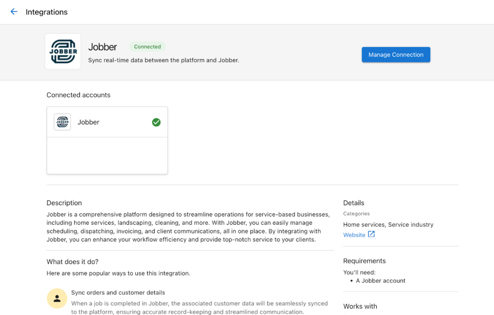

Single Sign-On (SSO) integrations give you direct access to third-party applications. You can connect your accounts with supported applications without requiring separate logins.

## Access the Integrations page

To connect an integration:

1. Navigate to `Administration` → `Integrations`

## Set up a new connection

### Step 1: Find the application

Browse through the available applications on the Integrations page. Each application displays information about its features and benefits.

### Step 2: Click Add Connection

Click the `Add Connection` button to begin the connection process.

### Step 3: Complete the pre-connect form

Depending on the application, you may need to complete a pre-connect form with initial setup information.

### Step 4: Follow the SSO process

Complete the Single Sign-On connection by following the prompts. This typically involves:

- Creating a new account with the third-party service
- Connecting to an existing account
- Providing authorization for data sharing

## Manage connections

### View connected applications

After setup, you can view and manage all connected applications through:

- The `Manage` tab on the Integrations page, which displays connection cards for each integrated application

- The application pages, which display a "Connected" tag

### Connection settings

Click `Manage Connection` on a connected application to access additional configuration options, including:

- Data sync preferences
- Automated review request settings
- Other application-specific settings

## What SSO integrations do

- **Access**: Open third-party tools without a separate login
- **Management**: Manage all connected applications from one interface
- **Data sharing**: Share data automatically between connected applications
- **Passwords**: Use one login instead of a separate password for each platform

## FAQ

How many applications can I connect?

There is no limit to the number of SSO integrations you can connect. Connect as many supported applications as your business needs.

What happens if an SSO connection expires?

Open the integration from `Integrations` → `Manage` and follow the reconnect prompts to reauthorize.

Can I disconnect an integration without losing data?

Yes. Disconnecting stops future syncing but does not delete historical data already imported.

