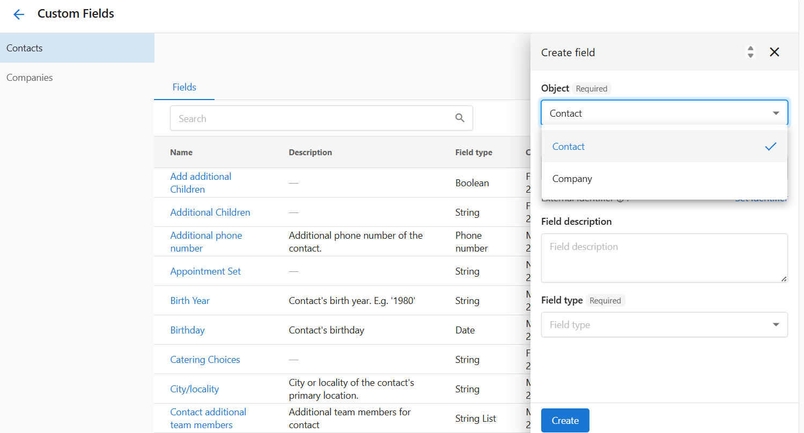

## What are CRM Fields?

CRM Fields allow you to add personalized data fields t your contact and company records in your app. These fields can store extra information that isn’t included in the default setup—such as birthdays, service preferences, or internal tracking notes. You can create and organize fields based on your business needs and the types of information you collect.

This feature is useful for businesses that want to go beyond standard fields like phone number or address. It helps centralize key client or company details directly in your app, so you don’t have to manage separate spreadsheets or systems.

## Why are CRM Fields Important?

Default contact and company records often don’t include everything your business needs to track. For example, you might want to log whether a client has set an appointment, track dietary preferences, or store internal status flags. Without custom fields, this data may be lost or siloed outside your app.

Custom fields let you tailor your system so it works for **your business**, keeping all important client information accessible and organized in one place.

## Table of Contents

- [What's Included with CRM Fields?](#whats-included-with-crm-fields)
- [How to Create a CRM Field](#how-to-create-a-crm-field)
- [Field Types and Options](#field-types-and-options)
- [Managing and Editing CRM Fields](#managing-and-editing-crm-fields)
- [Frequently Asked Questions (FAQs)](#frequently-asked-questions-faqs)

## What's Included with CRM Fields?

- Custom field creation for **Contacts** and **Companies**
- Multiple field types: `String`, `Date`, `Boolean`, `Phone number`, `String List`, and more
- Searchable and editable fields in the Contacts and Companies sections
- Required or optional descriptions for internal clarity
- Full visibility and editing from the custom field manager

:::info
System fields (like company name or phone number) cannot be edited or deleted. Custom fields are fully configurable.
:::

## How to Create a CRM Field

1. In your app, go to `Administration` from the main menu.
2. Select `CRM Fields` under the administration settings.
3. This will take you to the **CRM Fields** page, where you can manage both contact and company fields.
4. Click `Create` to open the new field form.
5. Choose the **Object** (`Contact` or `Company`) the field will apply to.
6. Enter a **Field name** (e.g., “Birthday” or “Preferred contact method”).
7. (Optional) Add a **Field description** to provide internal clarity.
8. Select the **Field type** (e.g., String, Date, Boolean).
9. Click `Create` to save your custom field.

## Field Types and Options

The field type has a significant effect on the type of data that can be stored in the custom field and how the data can be filtered and sorted.

When creating a custom field, you can choose from the following field types:

- **Text** – For general text entries (e.g., address)
- **Number** – Whole numbers only (e.g., number of employees)
- **Decimal number** – Supports decimal values (e.g., review score)
- **Email** – Validated email address input
- **Phone number** – Formatted phone number input
- **Date** – Calendar date only (e.g., birthday)
- **Date and time** – Combined date and time (e.g., next meeting)
- **True or false** – Boolean yes/img/no field

Use `String List` when you want to associate multiple values with a single field (e.g., preferred services).

## Managing and Editing CRM Fields

- All fields appear in the custom field manager under `Contacts` or `Companies`.
- Click any field name to open and edit it.
- You can update the description or field type, but object and identifier may be locked after creation.
- Fields that were added manually can be deleted when no longer needed.

NOTE: System fields (created by default) cannot be modified or deleted. Only custom fields allow full control.

## How Might I use CRM Fields

Some ways you might use custom fields in your app include:

- **Segmenting email lists** by number of visits — for example, sending a "new customer" campaign to contacts with fewer than 3 visits, and a loyalty offer to those with 3+ visits.
- **Tracking birthdays** for contacts so you can automatically send a birthday greeting or coupon.
- **Logging service preferences**, such as favorite haircut style or dietary restrictions for event bookings.
- **Flagging high-value clients** with a VIP true/img/false field to prioritize outreach or provide special offers.
- **Storing secondary contact information**, like an emergency contact name or backup phone number, especially useful in childcare or health-related services.

### Frequently Asked Questions (FAQs)

Can I create fields for both contacts and companies?

Yes. Use the `Object` dropdown during setup to choose where the field should appear.

Are there any limits on the number of custom fields?

There is no strict limit, but adding too many fields may make records harder to manage.

Can I search or filter by custom fields?

Not all views support filtering by custom fields. Check your record view or export options.

What's the difference between `String` and `String List`?

`String` stores a single line of text. `String List` allows multiple values separated by commas or new entries.

Can I edit system fields?

No. System fields like `Company name` are locked and cannot be edited or removed.

What happens if I delete a custom field?

Deleting a field will also delete its data from all records.

Can I use these fields in automation or integrations?

Some integrations may support reading custom field data, but this depends on the system. Use common formats when possible.

Why can't I change the field type after creating it?

Field types affect how data is stored. To change a type, you may need to create a new field.

Is the field identifier editable?

No, it's auto-generated and used for internal system referencing.

