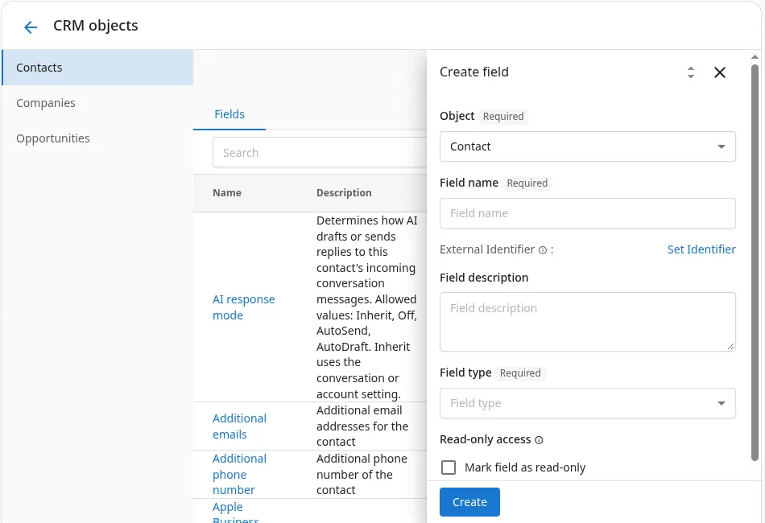
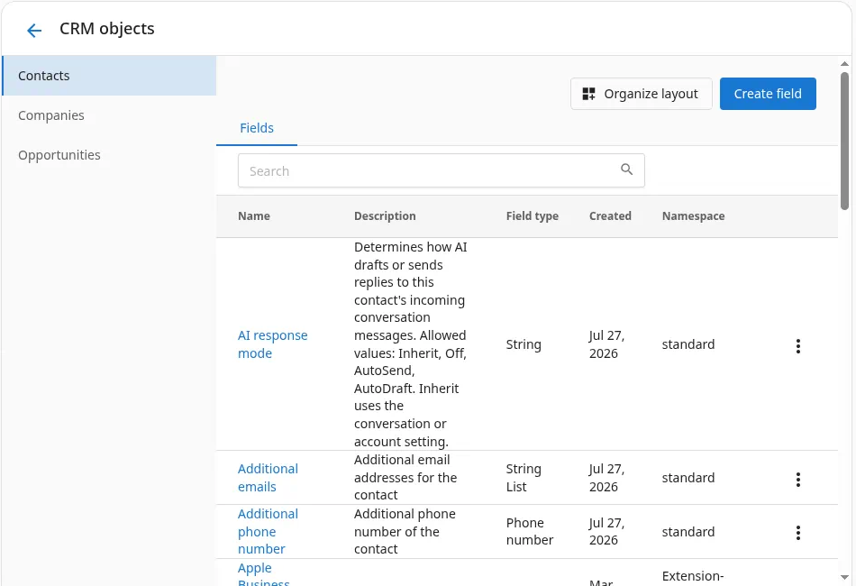

CRM objects house the contacts, companies, and opportunities that power reporting, automations, and conversations in Business App. Custom fields let you add data fields to your contact, company, and opportunity records.

## What are CRM fields?

Custom fields let you add data fields to your contact, company, and opportunity records. These fields can store information that isn't in the default setup, such as birthdays, service preferences, or internal notes. You can create and organize fields based on your business needs.

This feature helps you go beyond standard fields like phone number or address and keep important contact and company details in one place, without separate spreadsheets or systems.

## Why are CRM fields important?

Default contact and company records often don't include everything your business needs to track. You might want to log whether someone has set an appointment, track preferences, or store internal status flags. Custom fields let you tailor the system so it works for **your business**, keeping important information accessible and organized.

## What's included with CRM objects and fields?

- Standard CRM objects: `Contacts`, `Companies`, and `Opportunities`
- Custom field creation for `Contacts`, `Companies`, and `Opportunities`
- Multiple field types: Text, Number, Email, Phone number, Date, Boolean, and more
- Searchable and editable fields on contact, company, and opportunity records
- Full visibility and editing from the CRM objects page (`Fields` tab)

:::info
System fields (like company name or phone number) cannot be edited or deleted. Custom fields are fully configurable.
:::

## Core CRM objects

- **Contacts**: Individual people you communicate with. Support phone, email, SMS, tasks, and marketing lists.
- **Companies**: Businesses, locations, or accounts that own contacts and opportunities.
- **Opportunities**: Pipeline stages for tracking sales deals or projects.

### Create custom objects

Beyond Contacts, Companies, and Opportunities, you can create custom object types that fit your business (e.g. service contracts, equipment assets, project milestones). To create a custom object:

1. Go to `Administration` → `CRM objects`
2. Click `+ Add custom object`
3. Configure the singular and plural names and default fields

You can create up to 3 custom objects per account. See [Custom Objects](../../crm/custom-objects.md) for details. For more on extending records with custom fields, see [CRM Fields](./app_settings_crm_fields.md).

## Contacts and companies

- [Add booking links to contact cards](../../crm/My%20meetings/index.md)
- Use the CRM to manage contacts, companies, and tasks.

## Opportunities and pipeline

- [Automate opportunity management](../../crm/opportunities/automations.md)
- [Sales pipeline configuration](../../crm/opportunities/pipeline-setup.md)

## How to create a CRM field

1. In your app, go to `Administration` from the main menu.
2. Select `CRM objects` under the administration settings.
3. On the CRM objects page, open the `Fields` tab. Use Search to find fields. The list columns are Name, Description, Field type, Created, and Namespace.
4. Click `Create field` to open the new field form.
5. Choose the `Object` (`Contact`, `Company`, or `Opportunity`) the field will apply to.
6. Enter a `Field name` (e.g., "Birthday" or "Preferred contact method").
7. (Optional) Add a `Field description` for internal clarity.
8. Select the `Field type` (e.g., Text, Date, Boolean).
9. Click `Create` to save your custom field.

## Field types and options

When creating a custom field, you can choose from:

- **Text** — General text (e.g., address)
- **Number** — Whole numbers (e.g., number of employees)
- **Decimal number** — Decimal values (e.g., review score)
- **Email** — Validated email
- **Phone number** — Formatted phone number
- **Date** — Calendar date (e.g., birthday)
- **Date and time** — Date and time (e.g., next meeting)
- **True or false** — Boolean yes/no

Use **String List** when you want multiple values in a single field (e.g., preferred services).

## Managing and editing CRM fields

- All fields appear on the CRM objects page under `Contacts`, `Companies`, or `Opportunities` on the `Fields` tab.
- Click any field name to open and edit it, or use the row `⋮` menu and choose `Edit field`.
- After creation, you can update the field description. The object, field name, external identifier, and field type cannot be changed.
- Custom fields you added can be deleted from the row `⋮` menu (`Delete field`) when no longer needed.

:::note
System fields show: "This is a system field. Only field options can be modified." Object, Field name, External Identifier, Field description, and Field type are locked. System fields cannot be deleted.
:::

## Organize how fields appear on records

Creating a field decides what you can store. A field layout decides where it shows up. Group related fields into named sections, reorder them, and hide fields you don't use without losing their data.

To edit a layout, go to `Administration` > `CRM objects`, choose an object, and click `Organize layout`.

See [Field layouts](./field-layouts.md) for the full guide.

## How you might use CRM fields

- **Segment lists** by number of visits (e.g., "new customer" campaign vs loyalty offer).
- **Track birthdays** to send greetings or coupons.
- **Log service preferences** (e.g., favorite style or dietary restrictions).
- **Flag high-value contacts** with a VIP true/false field for prioritized outreach or offers.
- **Store secondary contact info** (e.g., emergency contact or backup phone).

## Forms and lead capture

- [Create lead capture forms](../../crm/forms/index.md)

## Frequently asked questions

Can I create fields for contacts, companies, and opportunities?

Yes. Use the `Object` dropdown during setup to choose `Contact`, `Company`, or `Opportunity`.

Are there any limits on the number of custom fields?

There is no strict limit, but too many fields can make records harder to manage.

Can I search or filter by custom fields?

Not all views support filtering by custom fields. Check your record view or export options.

What's the difference between Text and String List?

Text stores a single line. String List allows multiple values separated by commas or new entries.

Can I edit system fields?

No. System fields like **Company name** are locked and cannot be edited or removed.

What happens if I delete a custom field?

Deleting a field also deletes its data from all records.

Can I use these fields in automation or integrations?

Some integrations may support reading custom field data; use common formats when possible.

Why can't I change the field type after creating it?

Field types affect how data is stored. After creation, the field type and identifier can't be changed. To use a different type, create a new field.

Is the field identifier editable?

No. It's auto-generated and used for internal referencing.

## Tips

- If you use integrations, keep field names consistent so data stays in sync.
- Use lifecycle stages and tags to group contacts before campaigns.
- Keep your team updated on how to use notes and tasks so reporting stays current.
