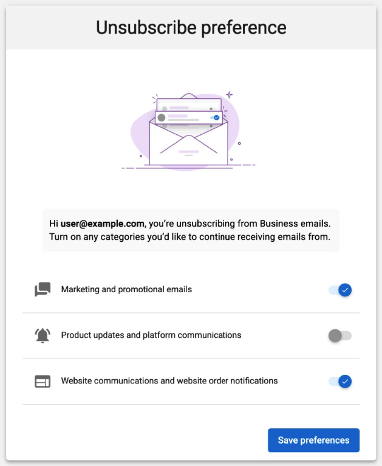

# Email subscription preferences

Your contacts can manage email preferences by category instead of unsubscribing from all non-transactional emails at once. This prevents accidental unsubscribes from blocking important communications like website form submissions, lead notifications, and product updates.

## How it works

Email subscription preferences let contacts choose which types of emails they receive from your business. When a contact opts out of one category, such as marketing, they continue receiving emails in other categories like product notifications and website communications. Transactional emails are always delivered regardless of preference settings.

## Email categories

| Category | What's included |
|:------|:---|
| **Marketing** | Campaigns, newsletters, and promotions |
| **Product notifications** | Platform and product updates |
| **Website communications** | Website messages and order notifications |
| **Transactional** | Account, billing, contact form submissions, and lead notifications |

Transactional emails cannot be disabled. They are required for account management and compliance.

## How the preference page works

When a contact clicks **Unsubscribe** in any eligible email, they are directed to a preference page where they can toggle individual categories on or off.

Contacts can also choose to unsubscribe from all non-transactional emails at once. Changes take effect immediately.

## Resubscription

Contacts can resubscribe using the resubscribe link in a confirmation email or by contacting support.

Consent status syncs to contact records in the CRM within 5–10 minutes of any subscription change.

:::info
Expanded communication consent visibility in the CRM is coming soon.
:::

## Frequently asked questions

Can contacts unsubscribe from billing, password reset, or contact form emails?

No. These are transactional emails and are always delivered. This includes billing confirmations, password resets, and contact form submissions from websites.

What happens if a contact unsubscribes from Marketing only?

They stop receiving promotional and campaign emails but continue to receive product notifications and website communications.

Does this prevent accidental unsubscribes?

Yes. Category-based preferences reduce the risk of losing important communications. Without them, a single unsubscribe blocks all non-transactional email categories.

Does this affect existing unsubscribes?

No. Existing global unsubscribes continue to function normally.

