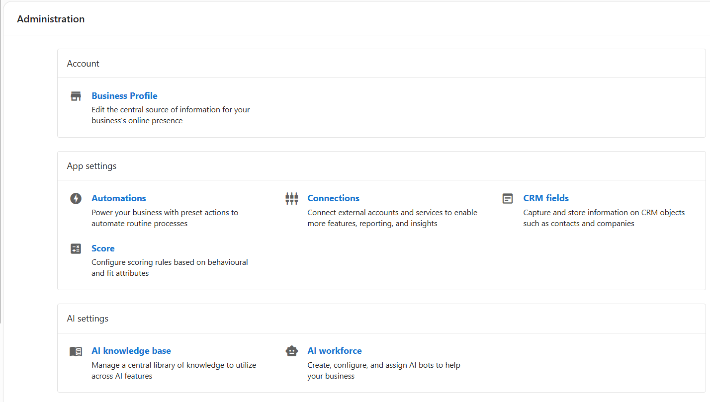

import DocCardList from '@theme/DocCardList';

## What can You Manage in the Administration Section?
The **Administration** section provides access to system-wide configuration tools all in one place. Your dashboard relies on key configurations that determine how leads are captured, communications are handled, and automations are triggered. **The Administration section includes your Business Profile, App Settings, AI Settings, and Conversations Settings.** Everything that lives in the administration section works together to ensure that:
- Your tools are connected and synced correctly
- AI and messaging features are properly configured
- Workflows and communication channels are set-up in a way that steamlines your operations specific to your needs

Keeping these foundational settings aligned improves daily operations and makes your system easier to manage over time.

## Frequently Asked Questions (FAQs)

Can users upload files to the Files page?

No, the files page in Business App > Administration is view and download only.

