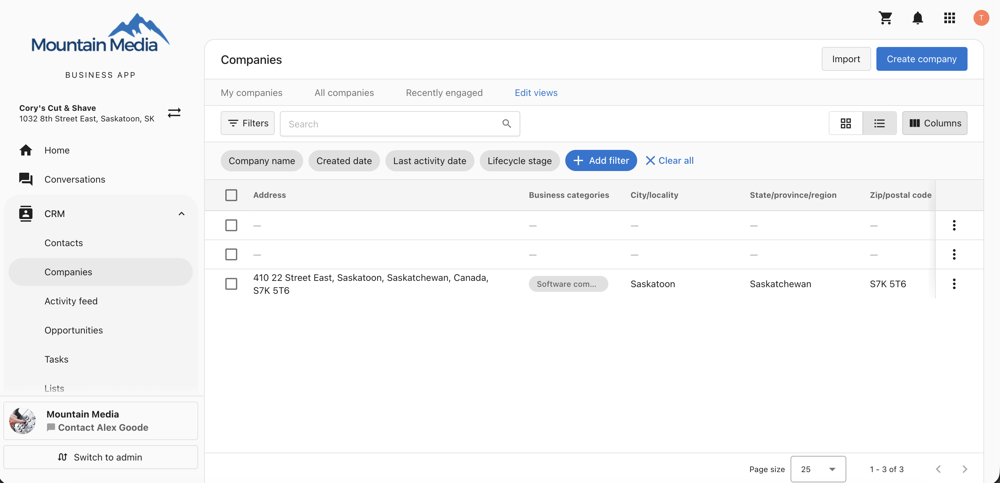
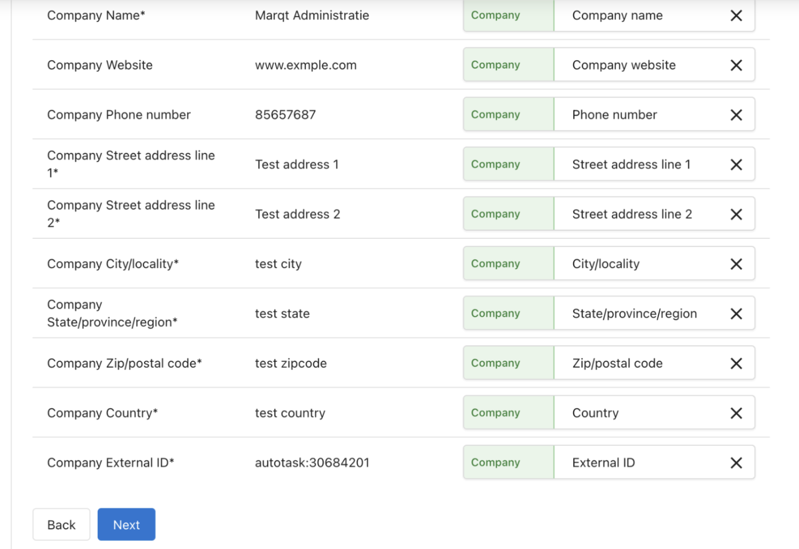
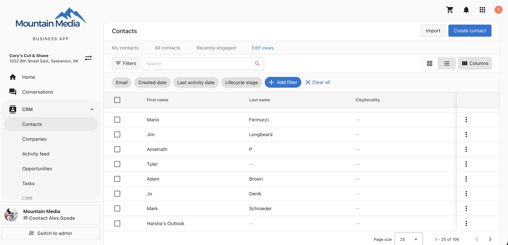
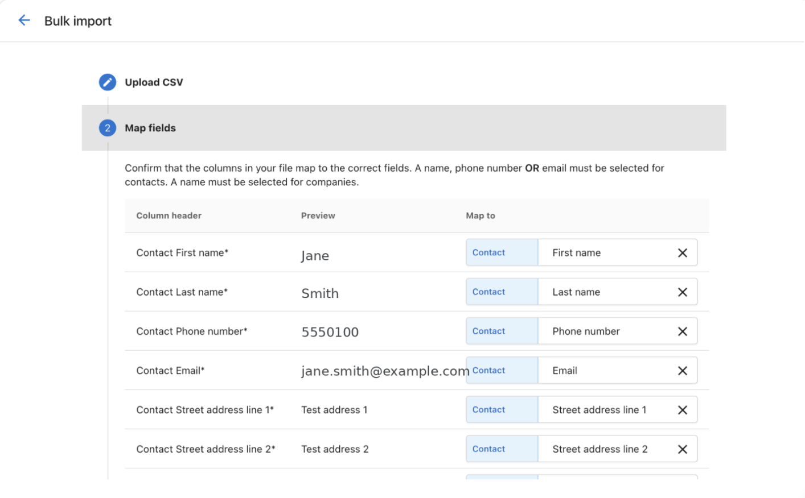
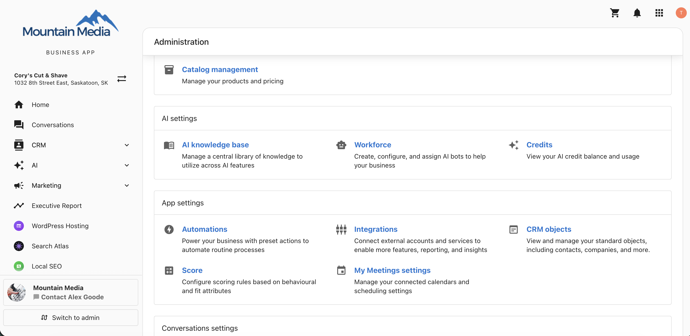
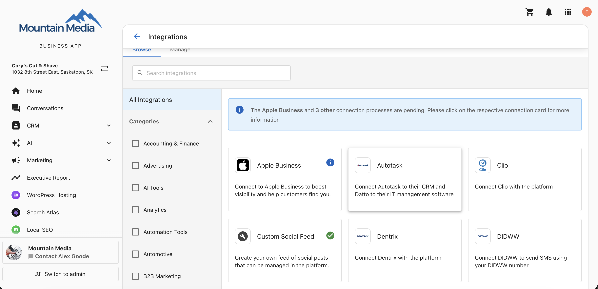
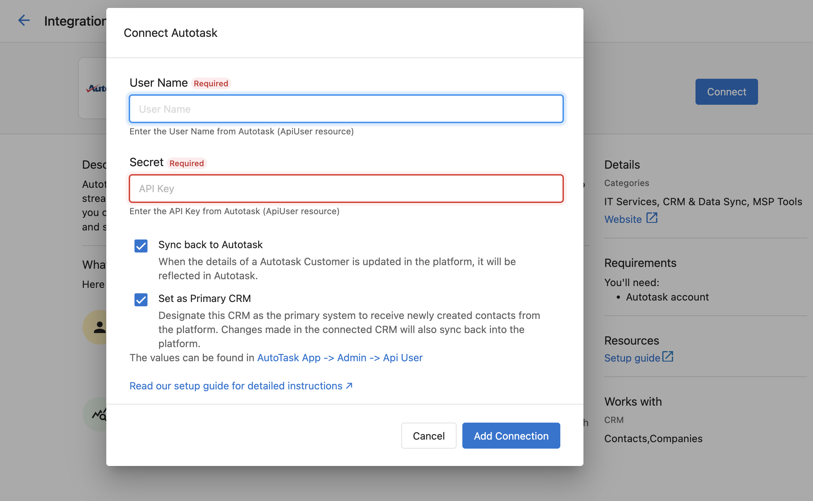
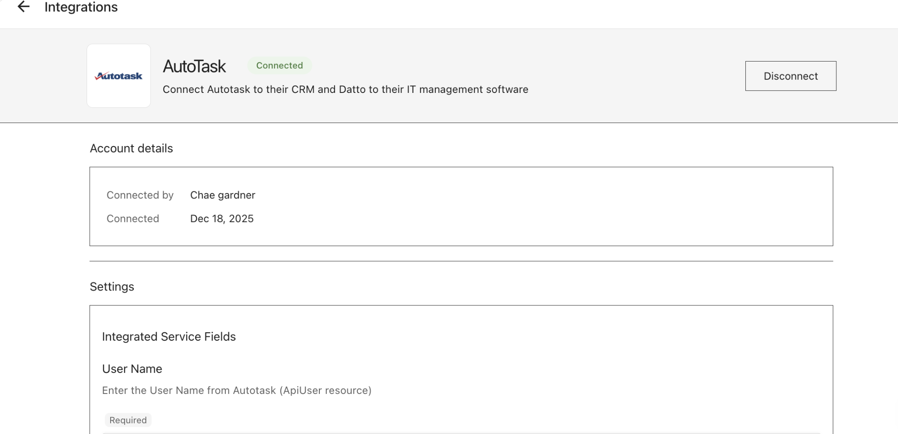
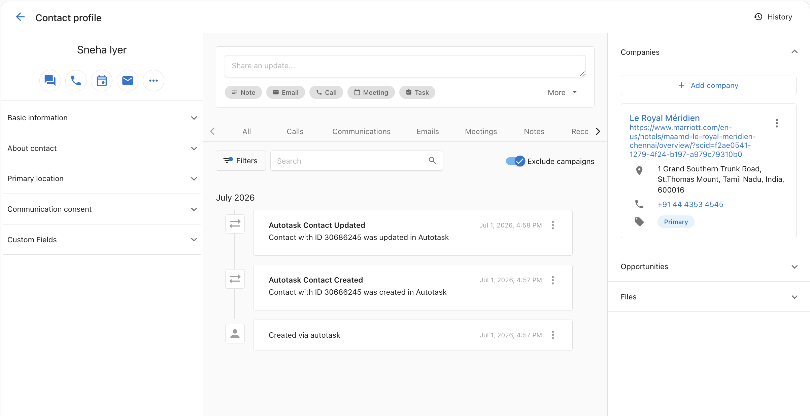

Datto Autotask PSA is a professional services automation platform for managing companies, contacts, and service delivery. Connecting Autotask to Business App keeps your companies and contacts synchronized in real time between both systems, so you do not need to enter data twice or rely on a third-party automation tool.

**Requirements:** An Autotask PSA account and an Autotask API user's username and secret (API key).

## What this integration does

- **Syncs companies**: Business name, phone, email, address, and website sync in both directions.
- **Syncs contacts**: First name, last name, phone, email, address, and company association sync in both directions.
- **Logs every sync event**: Each sync is recorded as a note in the Activity Feed.
- **Protects your records**: Deleting a record in one system does not delete it in the other. An activity note is logged instead.

| Data | Autotask to Business App | Business App to Autotask |
|------|--------------------------|--------------------------|
| Companies | Synced automatically | Synced automatically when **Sync back to Autotask** is enabled |
| Contacts | Synced automatically | Synced automatically when **Sync back to Autotask** is enabled |

## Step 1: Set up permissions in Autotask

Before connecting, create a dedicated security level and API user in Autotask.

### Create a security level

1. Sign in to Autotask.
2. Go to **Admin** → **Account Settings and Users** → **Security** → **Security Levels**.
3. Click **Create New** and clone **Api User (System)**.
4. Name the security level (for example, `Business App API Access`) and save it.

### Enable webhooks

1. Open the security level you just created.
2. Go to the **Other Settings** tab.
3. Enable webhooks and set the maximum limit to at least **5**.
4. Save your changes.

:::warning
Without webhooks enabled, the connection appears active but changes made in Autotask will not sync to Business App. This is the most common cause of sync failures.
:::

### Configure object permissions

1. In the same security level, open the **Companies** tab and enable **Read** and **Write** access.
2. Open the **Contacts** tab and enable **Read** and **Write** access.
3. Save your changes.

### Create the API user

1. Go to **Admin** → **Resources (Human Resources)** → **API User**.
2. Click **Create New**.
3. Enter a **Name** and **Email**.
4. Assign the security level you created.
5. Choose **Integration Vendor** in the **API Tracking Identifier** field.
6. Save, then record the **Username** and **Secret**. You will need both to connect.

## Step 2: Prevent duplicate records

If companies or contacts already exist in both Autotask and Business App, import the Autotask IDs into Business App **before** you connect. Without matching IDs, the sync cannot recognize existing records and creates duplicates.

### Find your Autotask IDs

Open each company or contact in Autotask and locate the ID in the URL bar or in the record detail panel.

### Prepare your company CSV

Create a CSV file with the columns below. The **External ID** column is critical. It links the Business App record to the Autotask record.

The format must be exactly `autotask:{id}`, with no spaces.

| Company Name | Company Website | Phone number | Street address line 1 | City/locality | State/province/region | Zip/postal code | Country | External ID |
|---|---|---|---|---|---|---|---|---|
| Marqt Administratie | www.example.com | 85657687 | 1032 8th Street East | Saskatoon | SK | S7H 0S2 | CA | autotask:30684201 |
| Albany Apple Store | www.albanyapple.com | 55501234 | 123 Main St | Albany | NY | 12207 | US | autotask:29683562 |

### Prepare your contacts CSV

Create a CSV file for contacts following the same format, with `autotask:{id}` as the External ID.

| First name | Last name | Phone number | Email | Street address line 1 | City/locality | State/province/region | Zip/postal code | Country | External ID |
|---|---|---|---|---|---|---|---|---|---|
| Jane | Smith | 5550100 | jane.smith@example.com | 1032 8th Street East | Saskatoon | SK | S7H 0S2 | CA | autotask:30684161 |
| Sneha | Iyer | 4353 4545 | sneha.iyer@example.com | 1 Grand Southern Trunk Road | Chennai | Tamil Nadu | 600016 | India | autotask:30686245 |

### Import the files

1. Go to **CRM** → **Companies** → **Import** and upload the companies CSV.

2. Map the `external_id` column to the **External ID** field, then complete the import.

3. Go to **CRM** → **Contacts** → **Import** and upload the contacts CSV.

4. Map the fields and complete the import. Contacts are associated with companies by company name.

5. Open a few records in your CRM and confirm the `external_id` field contains the `autotask:{id}` value.

:::note
Import companies before contacts so that each contact can be matched to its company.
:::

## Step 3: Connect Autotask

1. Go to **Administration** → **Integrations**.

2. Find the **Autotask** card and click **Connect**.

3. In the **Connect Autotask** dialog, enter:
   - **User Name**: the username of your Autotask API user
   - **Secret**: the API key associated with that user
4. Review the sync settings. Both are selected by default:
   - **Sync back to Autotask**: reflects changes made in Business App back in Autotask. Recommended.
   - **Set as Primary CRM**: designates Autotask as the primary system for newly created contacts.
5. Click **Add Connection**.

:::warning
A 500 error means the credentials are invalid or the API user is disabled. Verify the username and secret in Autotask and re-enter them. Retrying with the same credentials will not resolve the error.
:::

When the connection succeeds, the integration card displays a green **Connected** badge along with the account details and a **Disconnect** button.

## Step 4: Review your settings

After connecting, scroll to **Settings** → **Integrated Service Fields** to update your credentials or change your sync options. Refresh the page to confirm your changes saved.

## Step 5: Verify the sync

Changes sync automatically in the background, so you do not need to keep the page open. Companies sync before contacts.

1. Go to **CRM** → **Companies**.
2. Find a company that came from Autotask.
3. Confirm the name, phone, email, and address are correct.
4. Confirm the associated contacts are linked to the company.

Every sync event is recorded in the contact's Activity Feed, so you can confirm exactly what synced and when.

## Manage the sync direction

To change whether updates flow back into Autotask, adjust the **Sync back to Autotask** setting on the connection page.

## Troubleshooting

| Issue | Cause | Solution |
|-------|-------|----------|
| 500 error when connecting | Invalid credentials or a disabled API user | Verify the username and secret in Autotask, then re-enter them |
| Connected, but nothing syncs | Webhooks are not enabled | Enable webhooks on the security level with a limit of at least 5 |
| Contacts are not appearing | The contact is not linked to a company | Link the contact to a company in Autotask |
| Duplicate records | Autotask IDs were not imported before connecting | Disconnect, clean up the duplicates, bulk import with `external_id`, then reconnect |
| Connection shows "Broken" | Credentials expired or were revoked | Click **Re-authenticate** and enter the credentials again |
| Sync back is not working | The record is missing its Autotask ID | Check whether `autotask-company-id` or `autotask-contact-id` is empty, then use bulk import to add it |

### Clean up existing duplicates

If duplicates have already been created:

1. Disconnect the integration.
2. Merge or delete the duplicate records in your CRM.
3. Prepare CSV files that include the Autotask IDs.
4. Import companies first, then contacts, with the `external_id` values in place.
5. Reconnect the integration. The sync now matches records by `external_id`.

## Frequently Asked Questions (FAQs)

Can I use an automation tool such as Zapier alongside this integration?

This is not recommended. Running both creates duplicate records. Disable any Autotask-related Zaps after you connect this integration.

What happens if I disconnect the integration?

Nothing is deleted. Your records remain in both systems. Reconnecting resumes the sync from where it stopped.

Can I create a contact without a company association?

Business App allows standalone contacts, but Autotask requires every contact to belong to a company. A contact without a company association will not sync to Autotask, and an activity note logs the skip.

How do I fix a contact that is not syncing?

Associate the contact with a company in Business App. Once the relationship exists, the contact becomes eligible for sync on the next cycle.

How fast does data sync?

The sync is webhook-based and typically completes within seconds. If Autotask's API is slow, it can take up to one minute.

Does deleting a record in Autotask delete it in Business App?

No. Deletes are non-destructive. An activity note is created instead.

Can multiple users connect to the same Autotask account?

No. One connection is supported per account. The connection belongs to the account itself, not to the person who set it up.

What if contacts exist in Business App that are not in Autotask?

Contacts with matching email addresses are matched during the sync. For the rest, use bulk import to add the Autotask IDs before you connect.

Is my data secure?

Yes. The integration communicates directly between the two APIs, with encrypted transit and no third-party intermediaries.

Why is the sync broken after I changed my credentials?

Your API credentials may have expired. Check the integration card for a **Broken** status and click **Re-authenticate** to enter the new credentials.

