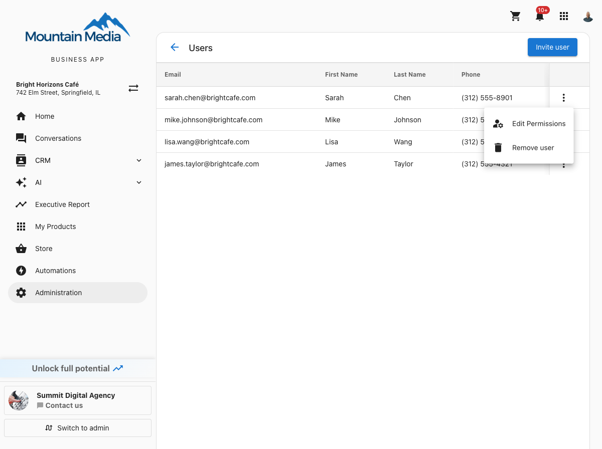
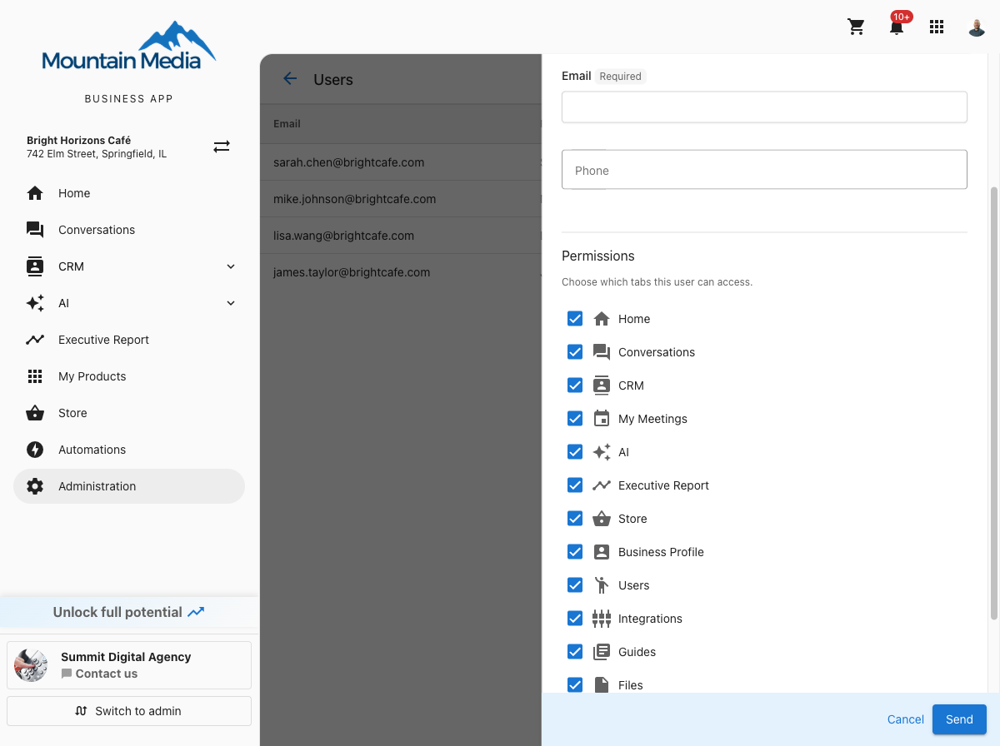

The **Users** page lets you manage who has access to your Business App. You can view all current users, invite new team members, set permissions for each person, and remove users who no longer need access.

To open this page, go to `Administration` > `Users`.

## View users

The Users page displays a table of everyone who has access to your Business App. Each row shows the user's:

- **Email**
- **First Name**
- **Last Name**
- **Phone**

Each row also has an actions menu (three dots) with options to **Edit Permissions** or **Remove user**.

## Invite a user

1. On the **Users** page, click **Invite user**.
2. In the **Add team member** sidebar, fill in the following fields:
   - **First name** (optional)
   - **Last name** (optional)
   - **Email** (required)
   - **Phone** (optional)
3. Under **Permissions**, choose which tabs this user can access. All tabs are selected by default. Uncheck any tabs you do not want this user to see.
4. Click **Send**.

The invited user receives a welcome email with instructions to access your Business App. If a user with that email address is already associated with your business, you receive an error message.

## Edit permissions

You can change which tabs a user can access at any time.

1. On the **Users** page, find the user you want to update.
2. Click the actions menu (three dots) on that user's row.
3. Select **Edit Permissions**.
4. Check or uncheck tabs to adjust what this user can see.
5. Click **Save**.

Changes take effect immediately.

:::info
The tabs available in the permissions list match the tabs configured for your Business App. If a tab does not appear in the list, it is not enabled for your account.
:::

## Remove a user

1. On the **Users** page, find the user you want to remove.
2. Click the actions menu (three dots) on that user's row.
3. Select **Remove user**.
4. In the confirmation dialog, review the user's name and click **Remove user** to confirm.

:::info
Removing a user cannot be undone. The user immediately loses access to your Business App. If you need to restore their access, you must invite them again.
:::

## Frequently Asked Questions (FAQs)

Where do I find the Users page?

Go to `Administration` > `Users`. The URL ends with `administration/users` after your business ID.

What happens when I invite a user?

The user receives a welcome email with instructions to set up their account and access your Business App. They appear in the users table once the invitation is sent.

What are permissions?

Permissions control which tabs a user can see in Business App. For example, you can give a team member access to **Conversations** and **CRM** but hide **Store** and **Automations**. You set permissions when inviting a user and can update them at any time from the actions menu.

Can I edit a user's information after inviting them?

You can edit a user's permissions at any time. To update a user's profile details (such as name or phone number), the user can update their own information through their account settings.

What is the difference between a user and a contact?

A **user** is someone who can log in to your Business App and use its features. A **contact** is a person stored in your CRM (such as a customer or lead) who does not have access to Business App. These are separate systems — removing a contact does not remove a user, and vice versa.

Can I re-invite a user I previously removed?

Yes. After removing a user, you can invite them again by clicking **Invite user** and entering their email address. They receive a new welcome email.

Is there a limit to how many users I can add?

No. You can invite as many team members as you need.

Are user changes tracked anywhere?

Yes. When a user is added or removed, it is automatically logged in your CRM activity feed — on both the company record and the contact record. The log includes who performed the action and which account it was for.

