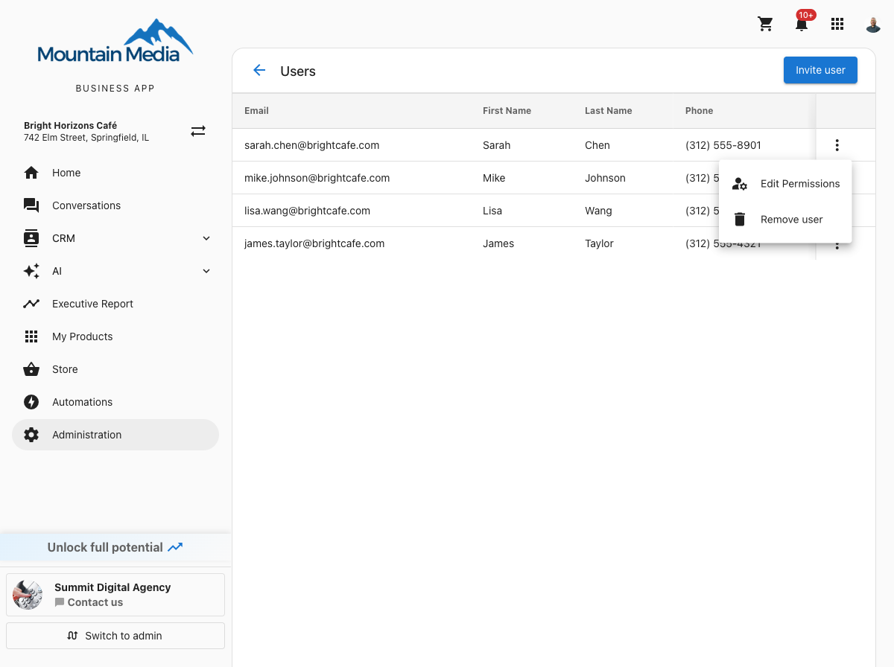
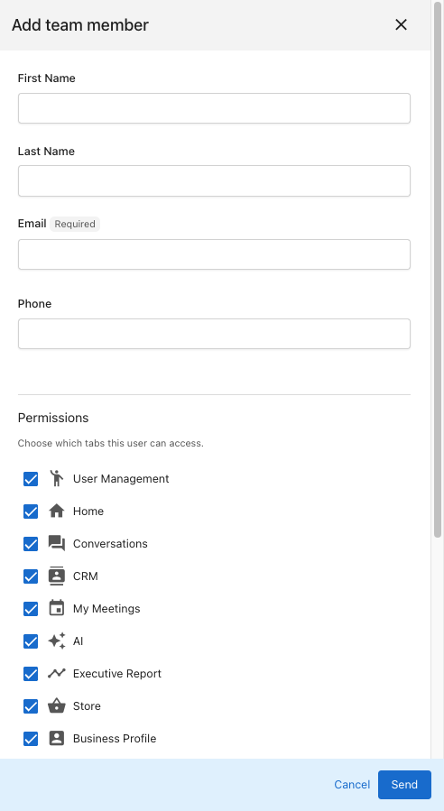

The `Users` page lets you manage who has access to your Business App. You can view all current users, invite new team members, control which tabs and apps each person can see, and remove users who no longer need access.

To open this page, go to `Administration` → `Users`.

## Who can manage users

To invite team members or change someone's permissions, you need access to the `User Management` tab. If you do not have it, the `Invite user` button does not appear and the `Edit permissions` option is hidden from the actions menu.

Everyone can open the actions menu on their own row to update their own contact details, even without `User Management` access.

## View users

The Users page displays a table of everyone who has access to your Business App. Each row shows the user's profile image and:

- `Email`
- `Name`
- `Phone`

Each row also has an actions menu (three dots) with options to `Edit contact info`, `Edit permissions`, or `Remove user`.

Results load 25 at a time. You can change the page size to 50 or 100 at the bottom of the table, so the list stays responsive even for businesses with a large number of users.

## Invite a user

1. On the `Users` page, click `Invite user`.
2. In the `Add team member` sidebar, fill in the following fields:
   - `First name` (optional)
   - `Last name` (optional)
   - `Email` (required)
   - `Phone` (optional)
3. Under `Permissions`, choose what this user can access. Everything is selected by default. Uncheck anything you do not want this user to see.
4. Click `Send`.

The permissions list scrolls; the full set of what you can grant is described in [Set permissions](#set-permissions) below.

The email address must be a valid email format, and it is the only required field. The invited user receives an email with instructions to access your Business App.

If the email address belongs to someone who already has an account elsewhere, they are added to your business using their existing account rather than a new one. If that person is already a user on this business, you receive an error message instead and no changes are made.

:::note
The `Permissions` section only appears if you have permission to manage users. If it is not shown, the invite still works and the new user is created with access to everything.
:::

## Set permissions

Permissions control what a team member sees when they log in. Checking an item makes it visible to that user; unchecking it removes their access.

There are three kinds of permission, all set in the same list:

### Tabs

Each checkbox in the main list corresponds to one tab in Business App. The list only shows tabs that are turned on for your business, so what you see may be a subset of the following:

| Permission | What it controls |
|---|---|
| `Home` | The home dashboard |
| `Conversations` | Inbox and messaging |
| `CRM` | Contacts, companies, and other CRM records |
| `My Meetings` | Meeting scheduling |
| `AI` | AI features and settings |
| `Executive Report` | The executive report |
| `Store` | The product store |
| `Business Profile` | Business information and branding |
| `User Management` | This page — inviting, editing, and removing users |
| `Integrations` | Connected accounts and data sources |
| `Guides` | The content library |
| `Files` | Uploaded and shared files |
| `Projects` | Project and fulfillment tracking |
| `Invoices` | Invoices |
| `Orders` | Orders |
| `Recommendations` | Recommended next steps |
| `Automations` | Automation workflows |
| `My Products` | The list of apps your business has |
| `Administration` | The Administration section |

### Apps

If your business has apps, they appear as an indented list underneath the `My Products` checkbox, each with its own checkbox. Use these to give a team member access to some apps but not others.

Only apps your business currently has appear in the list, sorted by name. Expired trials are excluded.

:::note
`My Products` acts as a parent for the apps beneath it. Unchecking `My Products` clears every app checkbox at the same time. Recheck `My Products` and then select the individual apps you want that person to keep.
:::

### Payments

If payments are enabled for your business, a `Payments` checkbox appears at the bottom of the list. It controls whether the user can manage payment settings and billing. This one is not a tab — it is a standalone permission, and it is on by default for every user.
The invited user receives an email inviting them to set a password and sign in. The email also summarizes the work already completed for their business. If a user with that email address is already associated with your business, you receive an error message.

## Edit permissions

You can change what a user can access at any time.

1. On the `Users` page, find the user you want to update.
2. Click the actions menu (three dots) on that user's row.
3. Select `Edit permissions`.
4. Check or uncheck tabs, apps, and `Payments` to adjust what this user can see.
5. Click `Save`.

Changes take effect immediately. Only the items you changed are saved, so a user who has never had their permissions restricted keeps full access to everything you did not touch.

:::info
The items available in the permissions list match what is configured for your Business App. If something does not appear in the list, it is not enabled for your account.
:::

:::note
You cannot remove your own access to the `User Management` or `Administration` tabs. Those checkboxes are disabled when you edit your own permissions, which prevents you from accidentally locking yourself out.
:::

## Edit a user's profile

If you have `User Management` access, you can update another team member's contact details on their behalf, including their name, email, and phone number.

1. On the `Users` page, find the user whose information you want to update.
2. Click the actions menu (three dots) on that user's row.
3. Select `Edit contact info`.
4. In the sidebar, update any of the following fields:
   - `First name`
   - `Last name`
   - `Email`
   - `Phone`
5. Click `Save`.

Changes take effect immediately. You can also update your own email address, name, and phone number directly from your account settings.

## Remove a user

1. On the `Users` page, find the user you want to remove.
2. Click the actions menu (three dots) on that user's row.
3. Select `Remove user`.
4. In the confirmation dialog, review the user's name and click `Remove user` to confirm.

:::info
Removing a user cannot be undone. The user immediately loses access to your Business App. If you need to restore their access, you must invite them again.
:::

## Frequently Asked Questions (FAQs)

Where do I find the Users page?

Go to `Administration` → `Users`. The URL ends with `administration/users` after your business ID.

Why can't I see the Invite user button?

The `Invite user` button only appears if you have access to the `User Management` tab. Ask someone who manages users at your business to give you that access, or to send the invitation for you.

What happens when I invite a user?

The user receives an email inviting them to set a password and sign in. Alongside the sign-in link, the email summarizes the work already completed for your business — the same summary that appears on the [Home page](/business-app/ai-home-cards). They appear in the users table once the invitation is sent.

What are permissions?

Permissions control what a user can see in Business App. You can hide whole tabs, such as `Store` or `Automations`; you can hide individual apps under `My Products`; and where payments are enabled, you can control access to `Payments`. You set permissions when inviting a user and can update them at any time from the actions menu.

Why does the permissions list look different for different businesses?

The list only shows what is turned on for your business. Tabs that are not enabled for your account never appear, and the app checkboxes reflect the apps your business currently has.

How do I give someone access to only one app?

Leave `My Products` checked, then uncheck every app underneath it except the one you want them to use. Unchecking `My Products` itself clears all of the apps at once and hides the tab entirely.

Can I lock myself out by editing my own permissions?

No. When you edit your own permissions, the `User Management` and `Administration` checkboxes are disabled so you cannot remove them from yourself. Another user with `User Management` access can still change them for you.

I invited someone but got a message that their permissions could not be set. What now?

The invitation itself succeeded and the user has been added, but the permission settings were not applied, so they currently have access to everything. Find them in the users table, select `Edit permissions` from the actions menu, and set their permissions again.

Can I invite someone who already uses Business App for another business?

Yes. If the email address already has an account, that account is added to your business rather than a new one being created. They can switch between businesses after signing in. If they are already a user on this business, you receive an error and nothing changes.

Can I edit a user's information after inviting them?

Yes. If you have `User Management` access, you can update another team member's contact details, including their name, email, and phone number, by selecting `Edit contact info` from the actions menu on their row. You can also update their permissions at any time. Team members can also edit their own profile details from their account settings.

What is the difference between a user and a contact?

A **user** is someone who can log in to your Business App and use its features. A **contact** is a person stored in your CRM (such as a customer or lead) who does not have access to Business App. These are separate systems: removing a contact does not remove a user, and vice versa.

Can I re-invite a user after removing them?

Yes. After removing a user, you can invite them again by clicking `Invite user` and entering their email address. They receive a new invitation email.

Is there a limit to how many users I can add?

No. You can invite as many team members as you need.

Are user changes tracked anywhere?

Yes. When a user is added or removed, it is automatically logged in your CRM activity feed, on both the company record and the contact record. The log includes who performed the action and which account it was for.

