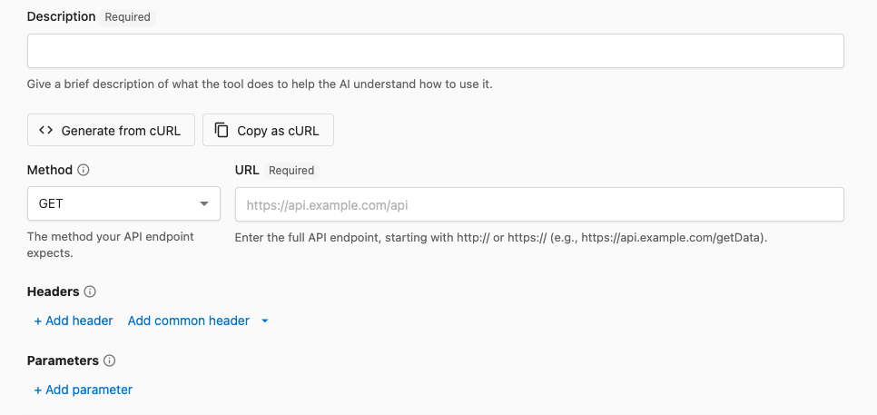
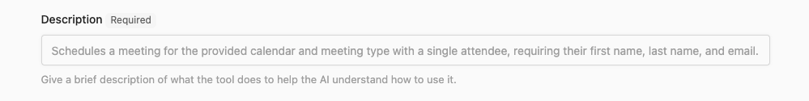
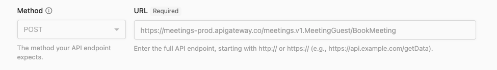
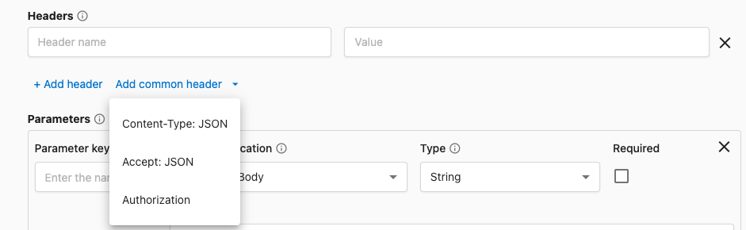
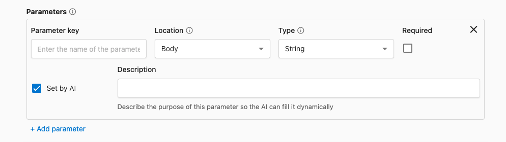
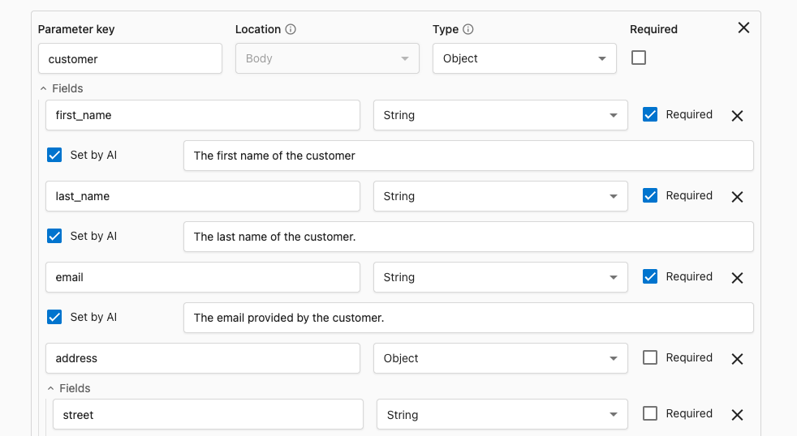
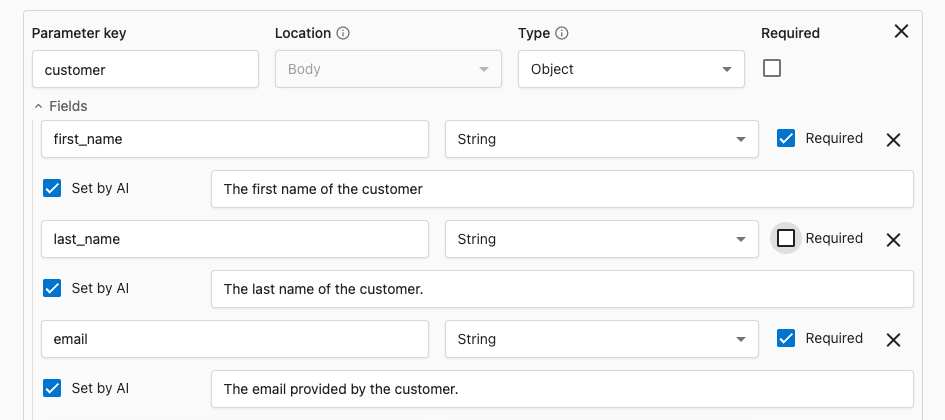
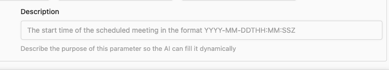
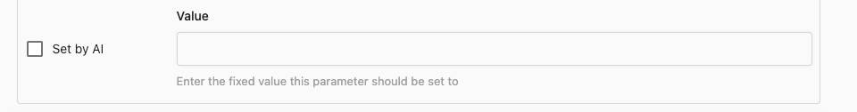

Tools enable your AI Employees to interact with external systems, retrieve real-time information, and automate workflows across different platforms. Understanding how Tools work is essential for building powerful AI capabilities that go beyond simple conversation.

## What are Tools?

A **Tool** is a function or API that an AI Employee can use. Tools connect AI to software systems for:

- Real-time data retrieval
- Automated actions across platforms
- Dynamic responses based on external information

> **Example:** An AI receptionist for a handyman service uses a weather API Tool when booking "gutter cleaning anytime this week" to check if outdoor conditions are suitable before confirming appointments.


### APIs and Tools

Tools and APIs work together to enable AI Employees to interact with software systems. While APIs provide the raw functionality to connect systems, Tools provide the intelligence layer that tells AI when and how to use those APIs effectively.

**APIs** provide functionality; **Tools** instruct AI how to use APIs by defining:
- When to use the API
- How to format requests
- Authentication handling

## Tool components

Every Tool consists of four key components that tell the AI Employee how to use the API. These components do *not* require extensive understanding of code, but you will need to reference the API documentation to fill them in correctly.



### Description

The description is a short sentence that tells AI when to use the Tool and what it accomplishes. By being specific about triggers and business outcomes, you help AI understand when to use the Tool and what to expect in the response.

> **Example:** "Use before booking outdoor appointments to check the weather conditions for safety."



### Method & URL

The specific API endpoint (web address) and HTTP method that tells the API what action to perform. 



| Method | Standard purpose | Example use case |
|--------|----------------|------------------|
| **GET** | Retrieve resources | Looking up customer information |
| **POST** | Create new resources | Creating a new customer |
| **PUT/PATCH** | Update existing resources | Updating customer information |
| **DELETE** | Remove resources | Deleting a customer |

:::info
The method and URL you use are determined by the API creator. While knowing the common methods and their purposes will help you understand how to set-up a Tool and confirm it's accurately configured, you will need to refer to the API documentation for the specific method and URL to use.
:::

### Headers

Headers provide essential metadata for API requests, including authentication and content type information. They are sent with every API call and ensure secure, properly formatted communication.

**Common headers include:**
- `Authorization: Bearer YOUR_API_KEY` - Proves your identity and permissions
- `Content-Type: application/json` - Specifies the data format being sent



### Parameters

Parameters define the specific data sent to the API. There are a number of fields you will need to fill in to configure a parameter so that AI can use it correctly, but many of the, do not require extensive understanding of code.



#### Parameter location

Tools support sending data to the API in two locations: **Body** and **Query**. Choose the location that matches the API's documentation. 

| Location | What it means | Typical use | Example |
|----------|----------------|-------------|---------|
| **Body** | Included in the request payload | Most POST/PUT/PATCH requests | JSON body like `{ "email": "user@example.com" }` |
| **Query** | Appended to the URL as a query string | Filtering, paging, searching | `/contacts?limit=25&sort=createdAt` |

#### Parameter type 

The Parameter Type is the expected data type for the parameter. This helps ensure that the value sent to the API is in the correct format and that AI is able to fill it in correctly. Tools support the main fundamental data types in modern REST or JSON-based APIs as seen in the table below.

| Type | What the API expects | Example value | Notes |
|------|----------------------|---------------|-------|
| **String** | Text | `"hello world"` |
| **Number** | Decimal/float | `12.5` | For prices, measurements |
| **Integer** | Whole number | `42` | For counts, IDs when numeric |
| **Boolean** | True/false | `true` | Feature flags, toggles |
| **Enum** | One of allowed strings | `"open"` | Define the allowed options |
| **Object** | Key/value structure | `{ "id": "123", "name": "Acme" }` | Add fields below the parameter |
| **Array** | Ordered list | `["a", "b"]` or `[{...},{...}]` | Choose the item type (String, Object, etc.) |

:::note Filling in Object and Array Parameters
For Objects and Arrays, you'll be prompted to define the inner structure so AI can fill each field correctly. Fields inside of the Object or Array are filled out similarly to how you would fill in a regular parameter.


:::

#### Parameter required checkbox

The Required checkbox is used to indicate whether the parameter is required for the API to function correctly. If the parameter **is** required, AI will always use this Tool with a filled out value. 

Some APIs require certain parameters to be filled out in order to function correctly. Always check the API documentation to confirm if a parameter is required so that you can configure the parameter correctly.


:::tip Requiring parameters for consistent behavior
While a parameter may **not** be required for the API to function correctly, you can make it required for consistent behavior in your AI Employee. 
:::

:::info Required parameters in Objects and Arrays
While Objects and Arrays might not be required by the API, if they are present they themselves might have required fields. For example, an order might not be required to include a customer, but the customer Object itself might require fields like a name or email address.

This behavior is supported by leaving the "Object" or "Array" marked as not required, but having the required fields themselves marked as required.


:::


#### Parameter description

The Parameter Description tells AI what the parameter is and how to fill it in. This can include:
- where the value comes from (user message, conversation context, etc.)
- validation rules and format requirements (e.g. "must be a valid email address", "must be a number between 1 and 100", etc.)
- fallback instructions for missing information

An example of a detailed parameter description might be:
``` 
"The appointment date requested by the user. It should be in the format YYYY-MM-DD. You may need to ask the user for the date if it's not provided."
```


#### Parameter set by AI toggle

While you will often want AI to fill in the parameter value dynamically based on the conversation context, there are times when you will want to set a fixed value. You can do this by toggling the "Set by AI" checkbox to off.

With `Set by AI` toggled off, you will need to fill in the `Value` field with the fixed value you want to use.



| Type | Description | Example |
|------|--------------|----------|
| Set by AI | Dynamic values that come from the user or conversation context | "The appointment date requested by the user. It should be in the format YYYY-MM-DD. You may need to ask the user for the date if it's not provided." |
| Fixed value | API-required constants, feature switches, or default modes | `"2025-01-01"` |

## When to build custom tools

Create custom Tools when AI Employees need to:
- Check real-time inventory or product availability
- Schedule appointments in external calendars
- Look up order status from e-commerce platforms
- Access customer account information
- Integrate with specialized business systems
- Automate workflows specific to your industry

:::tip Ready to Build?
Now that you understand what Tools are and how they work, follow our step-by-step tutorial to build your first custom Tool: [Building Custom Tools](./building-custom-tools)
:::

