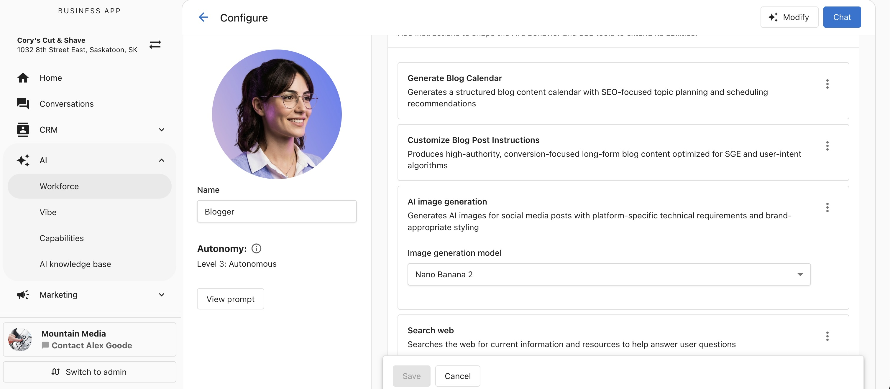
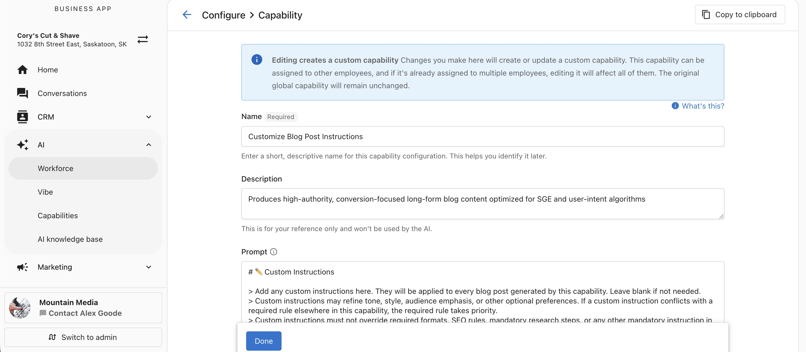
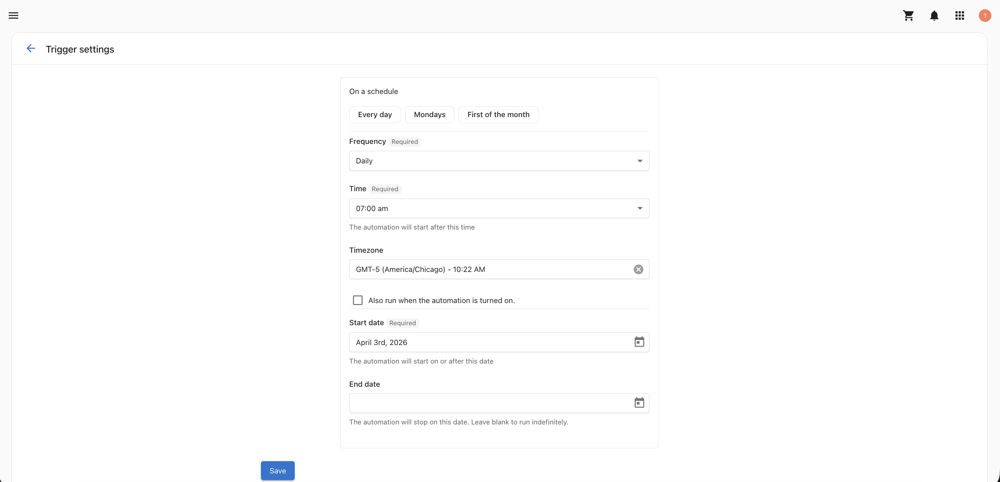
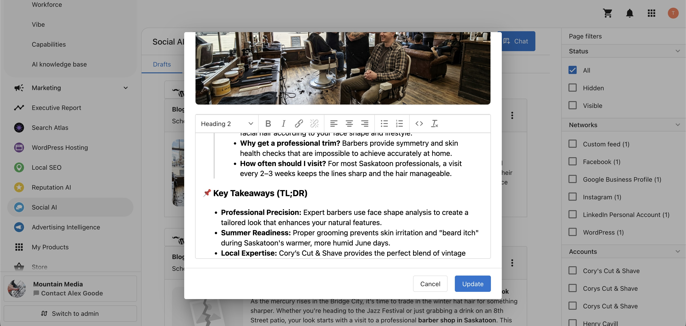
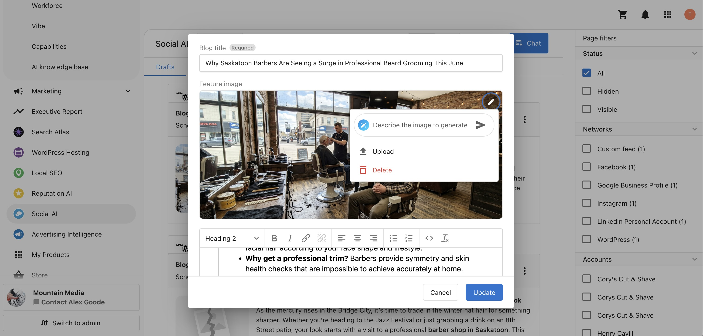

The **AI Blogger** is an AI employee that runs your blogging program autonomously. It generates a complete blog calendar on a schedule you define, writes long-form SEO-optimized posts, sources or generates featured images, and drafts, schedules, or publishes directly to WordPress.

You can also work with it conversationally at any time: draft new posts, refine existing content, reschedule, or delete posts through a natural language chat interface inside Business App.

The AI Blogger is available in the **Social AI Premium** edition for single-location businesses. Blog publishing requires a connected **WordPress** site.

## Why is the AI Blogger important?

Publishing consistent, search-optimized blog content takes time and editorial discipline that's hard to sustain alongside day-to-day work. Without a system to run your blogging program, you may encounter:

- Long gaps between posts that hurt search visibility and audience trust
- Time spent researching topics, writing, and sourcing images for every post
- Content that isn't structured for Google Snippets and AI Overviews
- Drafts that never make it to the schedule or to WordPress

The AI Blogger addresses these challenges by automating the full content lifecycle — from topic research and writing to image generation and WordPress publishing — on a schedule you control, while still letting you review and refine every post.

## What's included with the AI Blogger?

- **Automated blog calendar generation**: Generate a complete blog calendar automatically on a schedule you define, using the Blog Calendar Generation trigger
- **Long-form SEO-optimized posts**: Produce posts of up to 1,450–1,550 words optimized for SEO, Google Snippets, and AI Overviews by default
- **Image sourcing and generation**: Generate WordPress-optimized featured images with AI, or source royalty-free images from Pexels and Pixabay
- **Direct WordPress publishing**: Draft, schedule, or publish posts directly to a connected WordPress site
- **Conversational post management**: Edit, reschedule, and delete drafts and scheduled posts through chat, without leaving Business App
- **Notifications**: Receive email and in-app notifications when the AI drafts or schedules posts

## How to set up the AI Blogger

### Core requirements

Ensure your setup includes:

- Social AI Premium edition access
- A connected WordPress site under integrations
- A single-location business profile

### Step 1: Set up your AI Blogger profile

While the AI Blogger can start working with minimal configuration, setting up its profile helps ensure it represents your brand accurately and is easy to identify within your AI Workforce.

1. Go to `AI > AI Workforce`
2. Click `Configure` on the AI Blogger
3. Name your AI and upload an identifying image

This helps you recognize the AI Blogger during configuration and when reviewing its activity.

### Step 2: Understand capabilities

The AI Blogger is released with seven core capabilities that cover the full content lifecycle. Each capability is fully editable and can be configured to match how you want the AI to research, write, illustrate, and publish your posts. You can also add custom capabilities using **+ Add Capability**.

| Capability | What it does |
| --- | --- |
| **Generate Blog Calendar** | Controls what the AI publishes — goal, total posts, blog length, image source, networks, cadence, posting time, and save behavior |
| **Customize Blog Post Instructions** | Controls how each post is written — structure, SEO/AEO optimization, brand guardrails, localization, and a hard stop on invented promotions |
| **AI Image Generation** | Generates WordPress-optimized featured images using your chosen AI model (Nano Banana 2 or GPT Image 1.5) |
| **Web Search** | Searches for trending customer questions, industry data, and current news to ground each post in fresh, factual content |
| **Find Royalty-Free Images** | Sources royalty-free images from Pexels and Pixabay when AI image generation is not selected or has reached its limit |
| **List Integration Connections** | Fetches your active blog platform connections so the AI publishes only to connected WordPress sites |
| **Manage Blog Posts** | Publishes posts to WordPress and lets you list, edit, reschedule, and delete drafts and scheduled posts conversationally |

Click any capability to open and edit it. For example, the **Customize Blog Post Instructions** capability controls how each post is written:

### Step 3: Add knowledge sources

Add relevant knowledge base content to help the AI Blogger write accurate, on-brand posts. This can include information about your products, services, audience, and brand voice. For a complete guide, see the [Knowledge Sources section in the AI Workforce Overview](./ai_workforce_overview.md).

### Step 4: Configure the Blog Calendar Generation trigger

The trigger controls when the AI runs autonomously.

| Setting | Options | Default |
| --- | --- | --- |
| **Frequency** | Every day, a specific day of the week, or a specific day of the month | — |
| **Time** | Any time of day | 9:00 AM |
| **Time zone** | Any time zone | Business configured time zone (falls back to Chicago if not set) |
| **Start date** | Date the trigger begins | — |
| **End date** | Date the trigger stops | — |

### Step 5: Configure the Generate Blog Calendar capability

When the trigger fires, the AI reads these settings to build and publish the calendar.

| Setting | Description | Default |
| --- | --- | --- |
| **Goal** | What each post should achieve | Rank #1 for Google Snippets/AI Overviews while reading like a deeply researched, human-written blog |
| **Total posts** | Number of blog posts to generate per run | 1 |
| **Blog length** | Short (500–600 words), Medium (1,000–1,100 words), or Long (1,450–1,550 words) | Long |
| **Images** | Image source — AI-generated or Stock | AI-generated |
| **Networks** | Which WordPress connection to publish to | Active Networks (first active WordPress connection found) |
| **Cadence** | How far out posts are scheduled — accepts natural language (e.g., "next week", "the next 30 days") | Next week |
| **Posting time** | What time posts go live — accepts a specific time or a preference (e.g., "9 AM", "best time") | Best time |
| **Save as** | Draft, Scheduled, or Published | Schedule |

:::note
**Save as = Published** publishes immediately on every run and is not recommended for a future calendar — use **Schedule** instead.
:::

### Step 6: Start using the AI Blogger

Save your configuration, and the AI Blogger runs automatically on your defined schedule. Each run generates the calendar, writes the blog post, attaches the featured image, and drafts, schedules, or publishes it per your settings.

You can also chat with the AI Blogger at any time to generate a new post or calendar on demand, independent of the trigger schedule.

## Managing posts after generation

### Editing post text

- **Conversationally** — chat with the AI Blogger to update any draft or scheduled post (e.g., "Update Tuesday's draft to mention our new spring promotion")
- **Manually** — click the **kebab menu (⋮)** on any post to open the post editor, then use the **AI Assist panel** for AI-powered rewrites

### Editing the featured image

Click the **kebab menu (⋮)** on any post, select **Edit**, and use the **AI Image Assist panel** to regenerate or refine the featured image.

### Deleting posts

- **Conversationally** — ask the AI Blogger to delete the post in chat
- **Manually** — click the **kebab menu (⋮)** on the post and select **Delete**

### Scheduling drafts

Drafts can be moved directly to the schedule from the Business App post list — no need to log into WordPress.

## Recommended models

| Use case | Recommended model |
| --- | --- |
| Written content generation | Gemini Flash Latest |
| Image generation | Nano Banana 2 |

## Notifications

When the AI Blogger drafts or schedules posts, you receive an **email notification** and an **in-app notification** in Business App. To disable either, click the **bell icon** inside the AI Blogger and turn off the relevant notification type.

## Frequently Asked Questions

Which edition includes the AI Blogger?

The AI Blogger is available in the Social AI Premium edition.

Which blog platforms are supported?

WordPress is supported. Connect your WordPress site under integrations before running the AI Blogger.

What happens if I have multiple WordPress connections?

The AI Blogger uses the first active WordPress connection found. Posts are not duplicated across multiple WordPress sites.

What is the difference between Save As Draft, Schedule, and Published?

- **Draft** — posts are saved for your review before anything goes live. Use this for full editorial control.
- **Schedule** — posts are queued to publish automatically on the planned calendar date. Recommended for autonomous publishing.
- **Published** — posts go live immediately when the AI run completes. Not recommended for a future calendar.

How long are the blog posts?

Blog length is configurable: Short (500–600 words), Medium (1,000–1,100 words), or Long (1,450–1,550 words). Long is the default — optimized for ranking in Google Snippets and AI Overviews.

What happens if the AI image generation limit is reached?

The AI Blogger automatically falls back to Find Royalty-Free Images (Pexels and Pixabay) when the AI image generation limit is reached.

Will the AI Blogger ever invent promotions or pricing I haven't shared?

No. The Customize Blog Post Instructions capability includes a built-in hard stop that prevents the AI from fabricating discounts, offers, or pricing the business has not communicated.

Does the AI Blogger check for duplicate content?

Yes. The AI Blogger automatically checks for content duplication against previous months to avoid repeating topics.

Can I run the AI Blogger manually outside of the schedule?

Yes. You can chat with the AI Blogger at any time to generate a new post or calendar on demand, independent of the trigger schedule.

What language are the blog posts written in?

The Customize Blog Post Instructions capability includes localization rules that align each post with your business's region and language. Adjust the localization settings in that capability to change the language or regional focus.

Why does the AI generate different content each run?

The AI Blogger operates in a reasoning mode — before generating, it weighs your configured instructions, your business knowledge, and trending customer questions surfaced through web search. Because it factors in fresh search intent on every run, output varies from run to run rather than repeating a fixed template.

