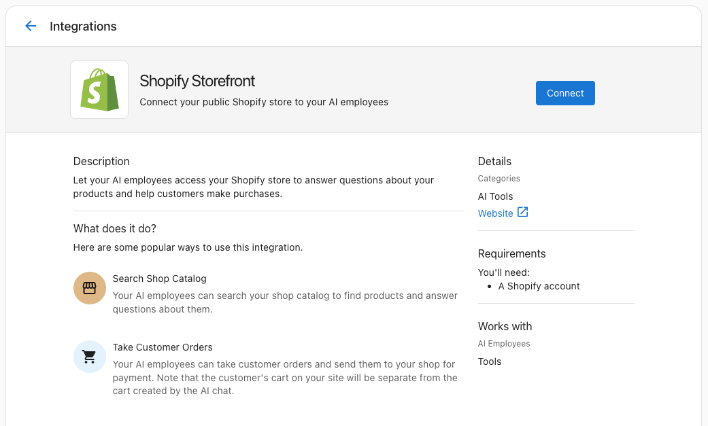
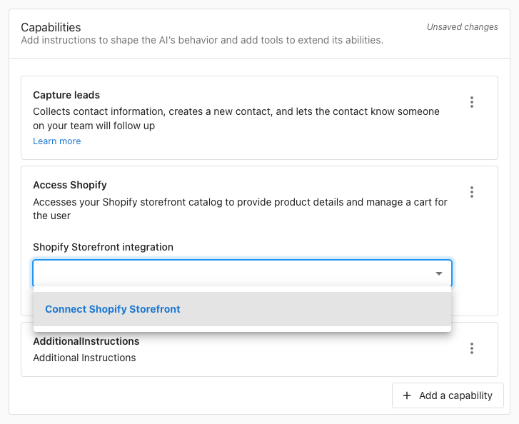

import {AISparkleIcon} from '@site/src/components/Icons'
import {ChatUserMessage, ChatAIMessage} from '@site/src/components/ChatBubble' 
import Tabs from '@theme/Tabs';
import TabItem from '@theme/TabItem';
import Head from '@docusaurus/Head';

By connecting the AI Chat Receptionist with your Shopify Storefront, customers will be able to interact with your store directly on any channel your AI Chat Receptionist is working on, such as web chat, SMS, Facebook Messenger, Instagram DMs, WhatsApp, or phone calls.

**In this guide, you will enable your AI Receptionist to:**
- Search and find products
- Respond to frequently asked questions
- Update and create customer carts as well as create checkout links

### Why is connecting the AI Receptionist with Shopify important?

When a customer connects with your business—whether through web chat, SMS, social messaging apps, or even a phone call—they often know what they’re looking for but may struggle to find it quickly. The Shopify integration allows your AI Receptionist to handle these inquiries seamlessly across every supported channel. Customers can ask general or detailed questions and receive helpful, personalized responses that guide them to the right products or key details, no matter where the conversation starts.

:::tip
This guide focuses on the AI Chat Receptionist, but the Shopify Storefront integration works across all AI Employees (including AI Voice Receptionist). No manual tool creation is required.
:::

## Prerequisites & Setup

Getting started is simple! All you need to have ready is:

| What you need | Where to find it | Notes |
|---------------|------------------|-------|
| **Your Shopify Storefront URL** | Shopify Admin (or in the address bar when you visit your store) | The `https` portion of your storefront URL is required |
| **Business App admin access** | Business App | Required to manage Connections and AI Workforce |

---

## Step 1: Connect your Shopify Storefront

1. In Business App, go to `Administration` → `Integrations` and select `Shopify Storefront`.
2. Click `Connect` and enter your Shopify Storefront URL.

Once connected, the Shopify Storefront integration makes the "Access Shopify" Capability and multiple Tools available to your AI Employees using Shopify's Model Context Protocol (MCP) servers.

## Step 2: Enable Shopify actions for your AI Receptionist

1. Navigate to <AISparkleIcon /> `AI` → `AI Workforce`.
2. Select your AI Employee and click `Configure`.
3. Under the `Capabilities` tab, find the "Access Shopify" Capability and ensure the URL for your connected Shopify Storefront is shown in the drop-down menu.

## Step 3: Optional prompt tips

While the "Access Shopify" Capability works out of the box without further configuration, you might want to include instructions in your AI Employee's `Purpose` or in an additional Custom Capability to help format the Shopify responses consistently.

Examples of instructions you might include are:
- only share one product at a time unless the user asks for more
- always share a picture of the product using markdown links on web chat
- if no results are found, suggest related categories or popular items

## FAQ: Connecting the AI Receptionist with Shopify

### Integration & Setup

Can I use this Shopify integration with other AI Employees besides the Chat Receptionist?

Absolutely! While this guide focuses on the AI Chat Receptionist, the Custom Capability and tools you create here work with any AI Employee, including your [AI Voice Receptionist](/business-app/ai/ai-workforce/ai-voice-receptionist). 

This means customers can ask about products through phone calls, SMS, WhatsApp, or any other channel your AI Employees support. The same Shopify product data will be available regardless of how customers choose to interact with your business. 

Can I connect other e-commerce platforms besides Shopify?

Yes! This guide is specific to Shopify, but you can create similar integrations with any e-commerce platform that offers an API—including WooCommerce, BigCommerce, Magento, or custom-built stores.

 The [Custom Capabilities framework](../ai-capabilities/creating-custom-capabilities) allows you to connect to virtually any system that has an API. You can also explore other pre-built integrations in [Integrations](../../administration/connections/) or create workflows with external platforms using [Zapier](../../automations/zapier.md).

### AI & Knowledge Questions

How does the Shopify integration work with my AI's Knowledge Base?

The Shopify integration provides real-time product data using Shopify's Model Context Protocol (MCP) server, while your [Knowledge Base](/business-app/ai/knowledge-base) contains static business information. These work together perfectly:

**Shopify MCP provides:** Live product availability, current prices, product descriptions, storefront FAQs, etc.  
**Knowledge Base should include:** Shipping policies, return information, size guides, care instructions, warranty details

Your AI will use the Shopify Storefront integration to answer "Do you have this product?" and the Knowledge Base to answer "How does a medium t-shirt fit?" For best results, ensure your [Knowledge Sources](/business-app/ai/ai-workforce/ai_workforce_overview#knowledge-sources) include comprehensive product and policy information to complement the real-time data.

What if customers ask about Shopify-related questions the API can't answer?

Great question! The Shopify Storefront integration detailed storefront data, but customers often need additional information. If the below information is *not* shared on your Shopify store, you should add it to your [Knowledge Base](/business-app/ai/knowledge-base):

- Shipping costs and delivery times
- Return and exchange policies  
- Size charts and fitting guides
- Product care instructions
- Warranty information
- Payment methods accepted
- Order tracking and customer service contacts

This ensures your AI can provide complete, helpful answers by combining real-time product data with your business policies and procedures.

### Channel & Communication Questions

Can customers use this Shopify integration through SMS or WhatsApp?

Yes! The Shopify Storefront integration works across all communication channels supported by your AI Employees. Customers can search for products, update carts, and more through:

- [Web chat](/business-app/conversations/conversations-ai-web-chat-overview)
- [SMS messaging](/business-app/conversations/conversations-send-receive-sms) (Conversations Pro required)
- [WhatsApp](/business-app/conversations/conversations-whatsapp-overview)
- Phone calls (with [AI Voice Receptionist](/business-app/ai/ai-workforce/ai-voice-receptionist))
- [Facebook Messenger](/business-app/conversations/conversations-setup-facebook-messenger)
- [Instagram DMs](/business-app/conversations/conversations-setup-instagram)

 The same product information will be available regardless of how customers choose to contact you. See [Conversations Overview](../../conversations/) for a complete list of supported channels.

How do product recommendations appear in different conversation channels?

Your AI will adapt product recommendations to each communication channel:

**Web Chat & Messaging:** Products appear with clickable links, formatted descriptions, and prices  
**SMS/WhatsApp:** Simplified text format with product names, prices, and shortened URLs  
**Voice Calls:** Spoken product names, prices, and descriptions 

 Your AI automatically optimizes the presentation for each channel. For more details on channel setup, see [Conversations Overview](../../conversations/).

 :::note
 You are welcome to write custom prompts to create more specific formatting for each channel, but note that the Shopify Storefront integration is designed to work out of the box with no additional configuration.
 :::

### Advanced Configuration Questions

How can I track which products customers are asking about most?

You can monitor product inquiry patterns through several methods:

 1. **Conversation Reviews:** Check the [Conversations](../../conversations/) tab to see which products customers mention most frequently

2. **AI Explanation Feature:** Click "Explanation" on AI responses to see exactly which tools were called and what products were searched

3. **Automation Tracking:** Set up [automations](../../automations/index.md) to log product inquiries or notify your team about trending searches

This data helps you understand customer demand, optimize your inventory, and identify opportunities for targeted marketing campaigns.

### Business Process Questions

What happens when a customer wants to purchase a product the AI recommends?

The Shopify Storefront allows your AI Employee to add products to a customer's cart and then send a link to the customer to checkout. 

:::note
This cart will be a different cart than the one that is visible if the customer is already browsing your store on a different device.
:::

Can I customize the AI's response when products are out of stock?

Yes! You can customize out-of-stock responses by creating an additional Custom Capability and adding it to your AI Employee. Consider these approaches:

**Immediate alternatives:** "That item is currently unavailable, but we have [similar product] in stock."  
**Restock notifications:** "I can have our team notify you when it's back in stock."  
**Substitute suggestions:** "Based on your interest, you might also like [alternative products]."

See [Creating Custom Capabilities](../empower-your-ai-employee-custom-capabilities.md) for prompt customization best practices.

### Technical & Troubleshooting Questions

Can I test this integration before making it live to customers?

Absolutely! Use these testing methods:

**AI Employee Testing:** Use the "Try it" button in [AI Workforce](/business-app/ai/ai-workforce/ai_workforce_overview) to test your AI Employee with sample product questions

**Tool Testing:** Review the "Explanation" feature in conversations to see raw API calls and responses

**Channel Testing:** Test across different channels using the methods described in [AI Chat Receptionist setup](./index.md#test-the-ai-chat-receptionists-responses) and [AI Voice Receptionist testing](../ai-voice-receptionist.md#test-and-monitor-your-ai-voice-receptionist)

Always test thoroughly before enabling the capability for customer-facing interactions.

export const faqSchema = {
  '@context': 'https://schema.org',
  '@type': 'FAQPage',
  mainEntity: [
    {
      '@type': 'Question',
      name: 'Can I use this Shopify integration with other AI Employees besides the Chat Receptionist?',
      acceptedAnswer: {
        '@type': 'Answer',
        text: 'Absolutely! While this guide focuses on the AI Chat Receptionist, the Custom Capability and tools you create here work with any AI Employee, including your AI Voice Receptionist. This means customers can ask about products through phone calls, SMS, WhatsApp, or any other channel your AI Employees support. The same Shopify product data will be available regardless of how customers choose to interact with your business.',
      },
    },
    {
      '@type': 'Question',
      name: 'Can I connect other e-commerce platforms besides Shopify?',
      acceptedAnswer: {
        '@type': 'Answer',
        text: 'Yes! This guide is specific to Shopify, but you can create similar integrations with any e-commerce platform that offers an API, including WooCommerce, BigCommerce, Magento, or custom-built stores. The Custom Capabilities framework allows you to connect to virtually any system that has an API. You can also explore other pre-built integrations in Integrations or create workflows with external platforms using Zapier.',
      },
    },
    {
      '@type': 'Question',
      name: "How does the Shopify integration work with my AI's Knowledge Base?",
      acceptedAnswer: {
        '@type': 'Answer',
        text: "The Shopify integration provides real-time product data using Shopify's Model Context Protocol (MCP) server, while your Knowledge Base contains static business information. Shopify MCP provides live product availability, current prices, product descriptions, and storefront FAQs. Your Knowledge Base should include shipping policies, return information, size guides, care instructions, and warranty details. Your AI uses the Shopify Storefront integration to answer 'Do you have this product?' and the Knowledge Base to answer 'How does a medium t-shirt fit?' Ensure your Knowledge Sources include comprehensive product and policy information to complement the real-time data.",
      },
    },
    {
      '@type': 'Question',
      name: "What if customers ask about Shopify-related questions the API can't answer?",
      acceptedAnswer: {
        '@type': 'Answer',
        text: "Great question! The Shopify Storefront integration delivers detailed storefront data, but customers often need additional information. If shipping costs and delivery times, return and exchange policies, size charts and fitting guides, product care instructions, warranty information, payment methods accepted, or order tracking and customer service contacts are not shared on your Shopify store, add them to your Knowledge Base. This ensures your AI can provide complete, helpful answers by combining real-time product data with your business policies and procedures.",
      },
    },
    {
      '@type': 'Question',
      name: 'Can customers use this Shopify integration through SMS or WhatsApp?',
      acceptedAnswer: {
        '@type': 'Answer',
        text: 'Yes! The Shopify Storefront integration works across all communication channels supported by your AI Employees. Customers can search for products, update carts, and more through web chat, SMS messaging (Conversations Pro required), WhatsApp, phone calls with the AI Voice Receptionist, Facebook Messenger, and Instagram DMs. The same product information is available regardless of how customers choose to contact you.',
      },
    },
    {
      '@type': 'Question',
      name: 'How do product recommendations appear in different conversation channels?',
      acceptedAnswer: {
        '@type': 'Answer',
        text: 'Your AI adapts product recommendations to each communication channel. In web chat and messaging, products appear with clickable links, formatted descriptions, and prices. In SMS and WhatsApp, responses use simplified text with product names, prices, and shortened URLs. In voice calls, the AI shares spoken product names, prices, and descriptions. The AI automatically optimizes the presentation for each channel.',
      },
    },
    {
      '@type': 'Question',
      name: 'How can I track which products customers are asking about most?',
      acceptedAnswer: {
        '@type': 'Answer',
        text: 'You can monitor product inquiry patterns through several methods. Review the Conversations tab to see which products customers mention most frequently. Use the AI Explanation feature to see which tools were called and what products were searched. Set up automations to log product inquiries or notify your team about trending searches. These insights help you understand customer demand, optimize inventory, and identify opportunities for targeted marketing campaigns.',
      },
    },
    {
      '@type': 'Question',
      name: 'What happens when a customer wants to purchase a product the AI recommends?',
      acceptedAnswer: {
        '@type': 'Answer',
        text: 'The Shopify Storefront allows your AI Employee to add products to a customer\'s cart and then send a link to the customer to check out. This cart is separate from the cart a customer might be using while browsing your store on a different device.',
      },
    },
    {
      '@type': 'Question',
      name: "Can I customize the AI's response when products are out of stock?",
      acceptedAnswer: {
        '@type': 'Answer',
        text: "Yes! You can customize out-of-stock responses by creating an additional Custom Capability and adding it to your AI Employee. Consider offering immediate alternatives, promising restock notifications, or suggesting substitute products. Follow the Custom Capabilities best practices to tailor the prompts.",
      },
    },
    {
      '@type': 'Question',
      name: 'Can I test this integration before making it live to customers?',
      acceptedAnswer: {
        '@type': 'Answer',
        text: 'Absolutely! Use the "Try it" button in AI Workforce to test your AI Employee with sample product questions. Review the Explanation feature in conversations to inspect raw API calls and responses. Test across different channels using the AI Chat Receptionist and AI Voice Receptionist setup guides. Always test thoroughly before enabling the capability for customer-facing interactions.',
      },
    },
  ],
};

<Head>
  <script
    type="application/ld+json"
    dangerouslySetInnerHTML={{ __html: JSON.stringify(faqSchema) }}
  />
</Head>
