## What is the AI Reputation Specialist?

The AI Reputation Specialist is an AI-powered assistant that helps you manage and analyze customer feedback at scale. It can automatically respond to reviews using predefined rules and knowledge, and allows you to explore reviews and Net Promoter Score (NPS) data through a conversational interface.

## Why is the AI Reputation Specialist important?

Customer reviews and NPS feedback affect reputation, trust, and buying decisions. Managing this feedback manually can be inconsistent and time-consuming as volume increases.

Without automation, you may encounter:

- Delayed or missed responses
- Inconsistent tone across platforms
- Limited insight into recurring issues
- Difficulty analyzing large volumes of feedback

The AI Reputation Specialist addresses these challenges by automating responses and providing structured analysis.

## What’s included with the AI Reputation Specialist?

- Automatically generate responses to customer reviews using AI
- Apply custom rules and knowledge base content to guide review responses
- Auto-respond to reviews on Google Business Profile (GBP) and to customers who recommend on Facebook.
- Chat with and analyze all customer reviews and NPS feedback
- Identify sentiment trends, common themes, and key insights across feedback data

## How to set up the AI Reputation Specialist

### Core requirements

Ensure your setup includes:

- Premium edition access
- Connected Google Business Profile and/or Facebook
- Reviews or NPS data available in the system

### Step 1: Set up your AI Reputation Specialist profile

While the AI Reputation Specialist can start working with minimal configuration, setting up its profile helps ensure it represents your brand accurately and is easy to identify within your AI Workforce.

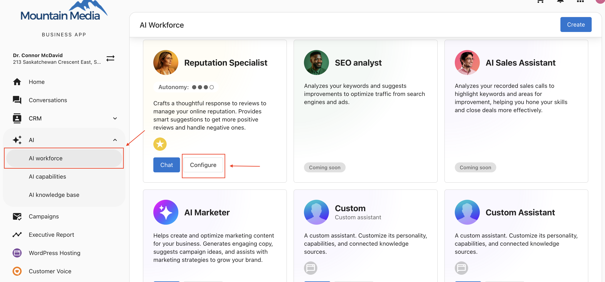

1. Go to `AI > AI Workforce`
2. Click `Configure` on the AI Reputation Specialist
3. Name your AI and upload an identifying image

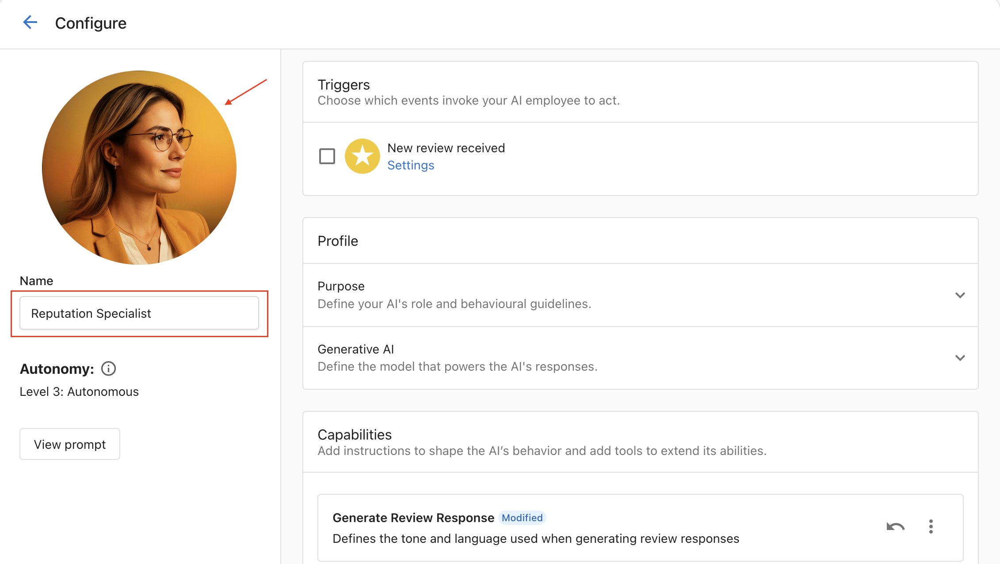

This helps you recognize the AI during configuration and activity monitoring.

### Step 2: Understand capabilities

Before enabling automation, it’s important to understand that the AI Reputation Specialist is released with two core capabilities. Each capability serves a different purpose and can be enabled or disabled independently based on your needs.

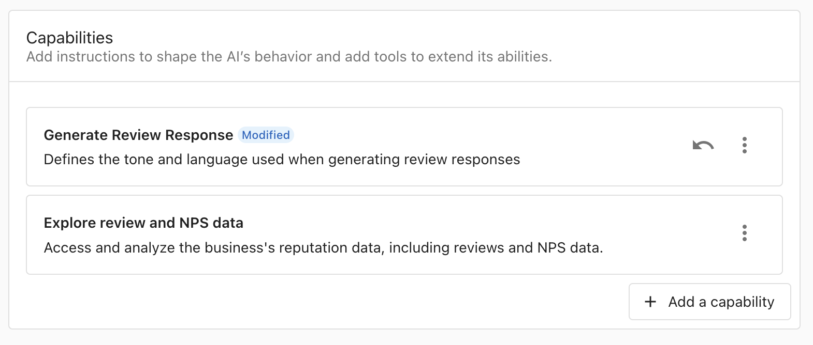

#### Generate review responses

The Generate Review Response capability allows the AI Reputation Specialist to automatically read and respond to customer reviews.

To view and configure this capability, click on Generate Review Response in the Capabilities section.

- Reads and replies to customer reviews automatically
- Uses a configurable prompt to guide response tone and content

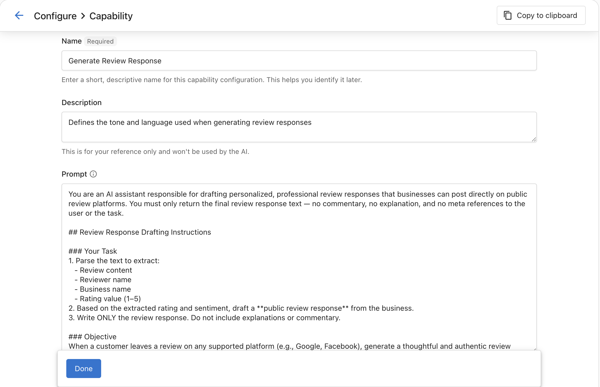

:::note
We recommend reviewing the default prompt to ensure it aligns with your brand and policies. Update the prompt if necessary before enabling auto review responses.
:::

#### Explore reviews & NPS data

The Explore Reviews & NPS Data capability allows you to analyze customer reviews and NPS feedback using conversational AI.

- Analyzes customer feedback using a chat interface
- Surfaces sentiment, themes, and insights
- Uses a predefined prompt to structure analysis

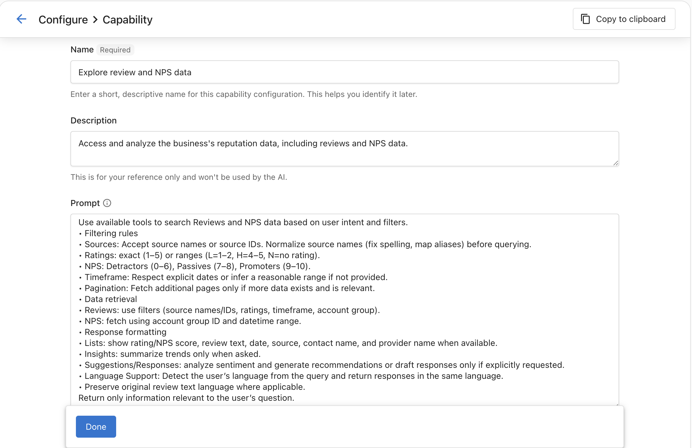

:::note
You can enhance this prompt by adding response formatting or analysis preferences, but avoid removing the default instructions to ensure accurate data access and results.
:::

### Step 3: Add knowledge sources

Add relevant knowledge base content to guide accurate and on-brand responses. This step is required before enabling automatic review replies.

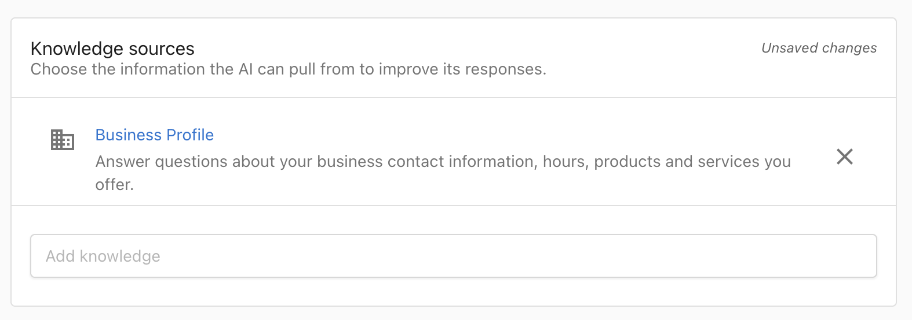

### Step 4: Configure trigger settings

Trigger settings define when and how the AI Reputation Specialist responds to customer reviews.

In the Trigger section, you will see a Settings link that allows you to control the conditions under which review responses are generated.

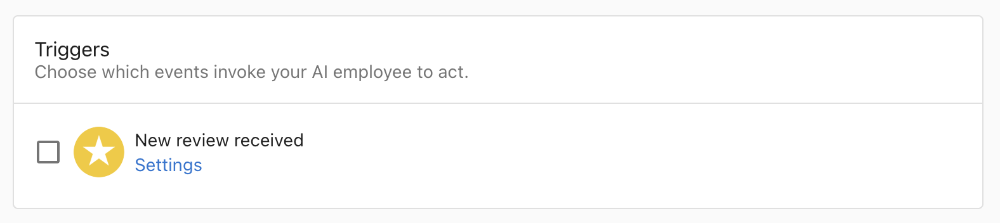

1. Open `Trigger > Settings`
2. Configure the following:

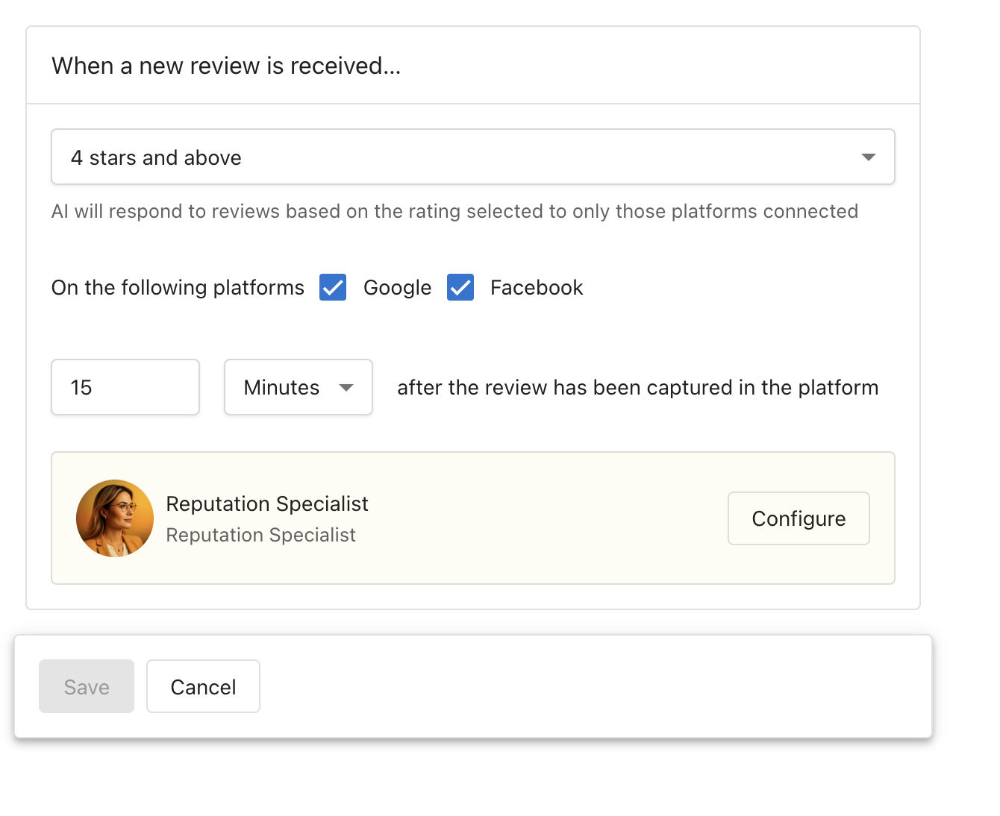

- **Star Ratings**: Select which ratings to respond to (default: 4 stars and above)
- **Platforms**: Choose Google Business Profile and/or Facebook
- **Response Delay**: Set wait time before auto-responding (default: 15 minutes)

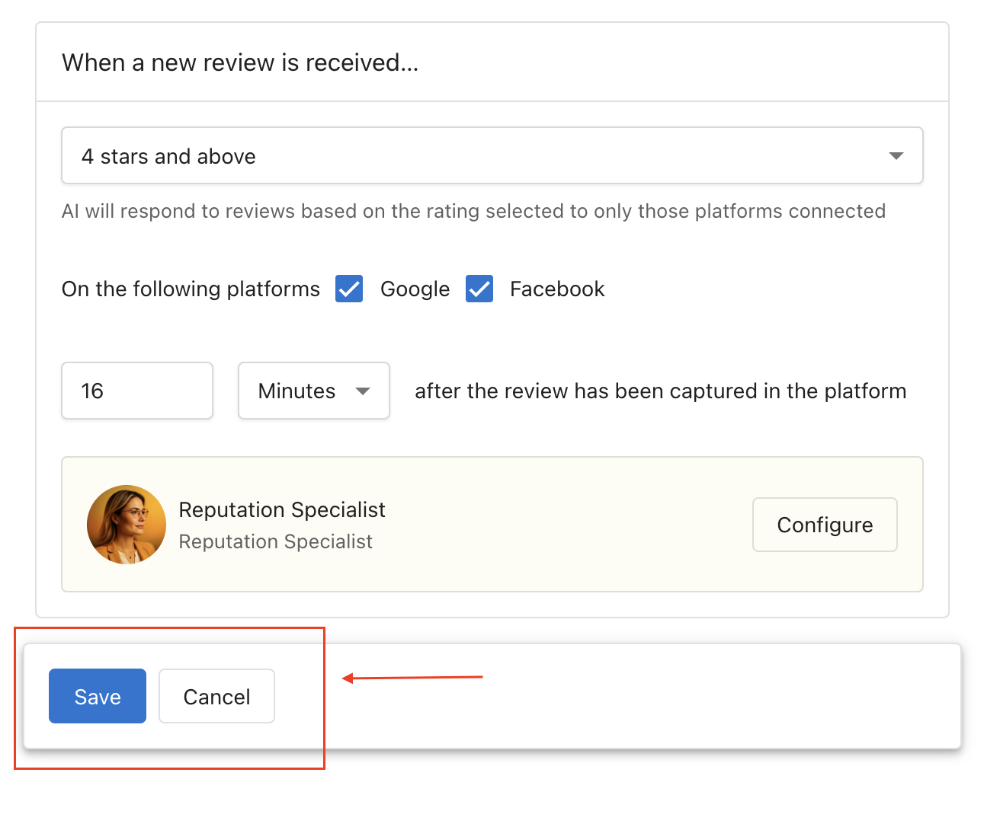

Click `Save` to apply your settings.

### Step 5: Enable the trigger

1. In the `Trigger` section, enable the `New review received` checkbox
2. Click `Save` to confirm the configuration

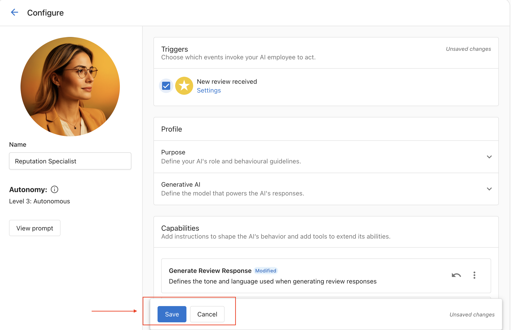

This activates auto responses for new reviews based on your settings.

### Step 6: Explore reviews & NPS data

The Explore Reviews & NPS Data capability allows you to chat with your reputation data to gain insights from customer reviews and NPS feedback.

Use the conversational interface to:

- Ask questions about customer sentiment
- Find themes across feedback
- Track changes over time
- Discover what customers value or dislike

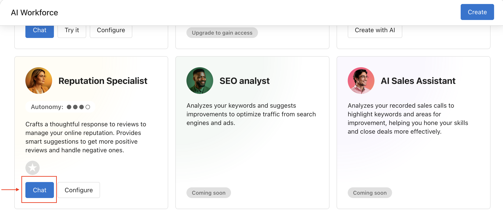

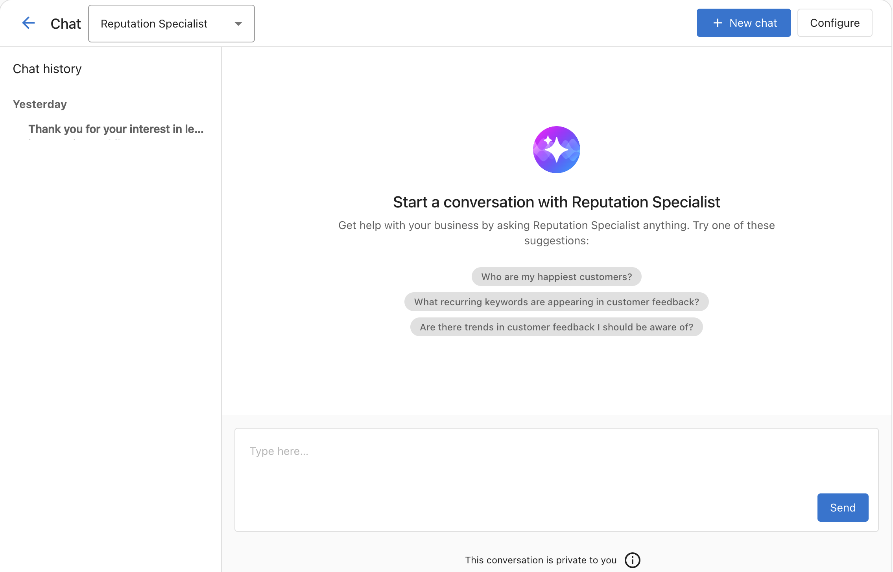

## Frequently Asked Questions (FAQs)

Which editions support the AI Reputation Specialist?

The AI Reputation Specialist is available only in the Premium edition.

Which review platforms are supported for auto responses?

Auto responses are supported for Google Business Profile and Facebook recommendations.

Do I need to enable both capabilities to use auto review responses?

No. Only the `Generate Review Response` capability is required. The `Explore Reviews & NPS Data` capability is optional.

Why isn’t the AI responding to new reviews?

Check the following:

- The `New review received` trigger is enabled
- The review matches the star rating configuration
- The review is from a supported platform
- The configured delay has elapsed

Does the AI Reputation Specialist support multiple languages?

Yes. It reads the review language and responds in the same language.

Will the AI respond to historical reviews?

No. It only responds to reviews received after the trigger is enabled.

Can the AI analyze reviews without responding?

Yes. Enable only the `Explore Reviews & NPS Data` capability to use analysis features without posting responses.

