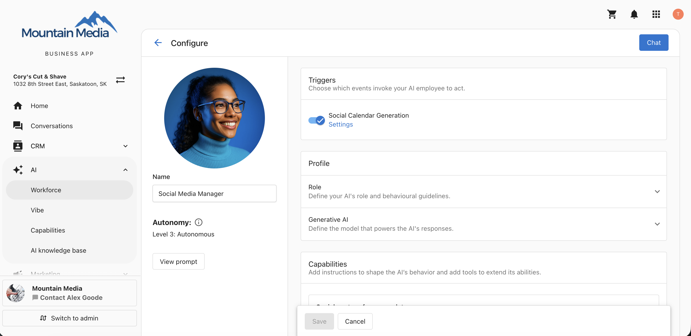
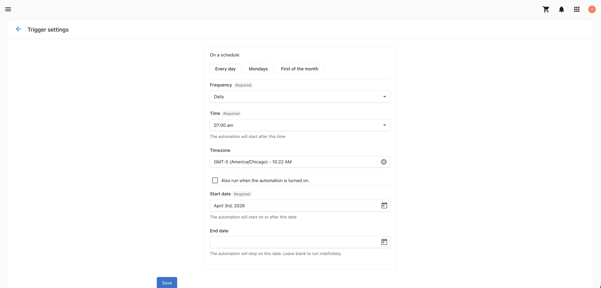
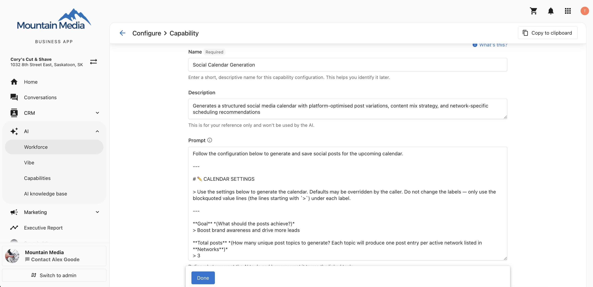
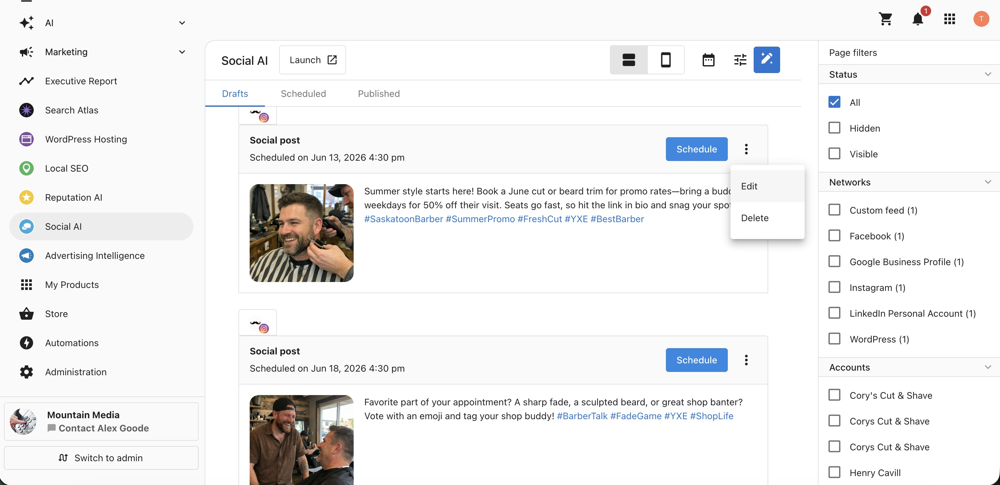
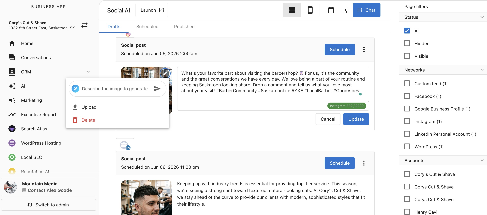
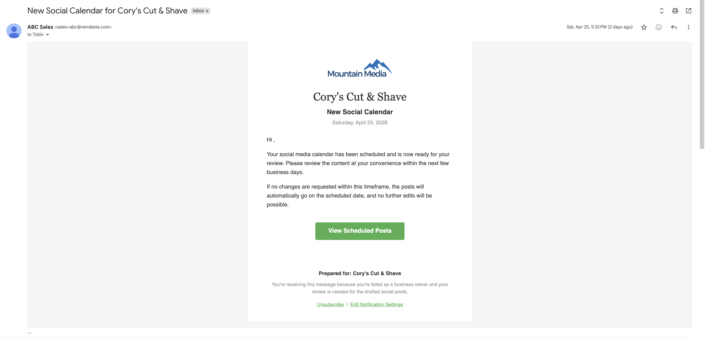
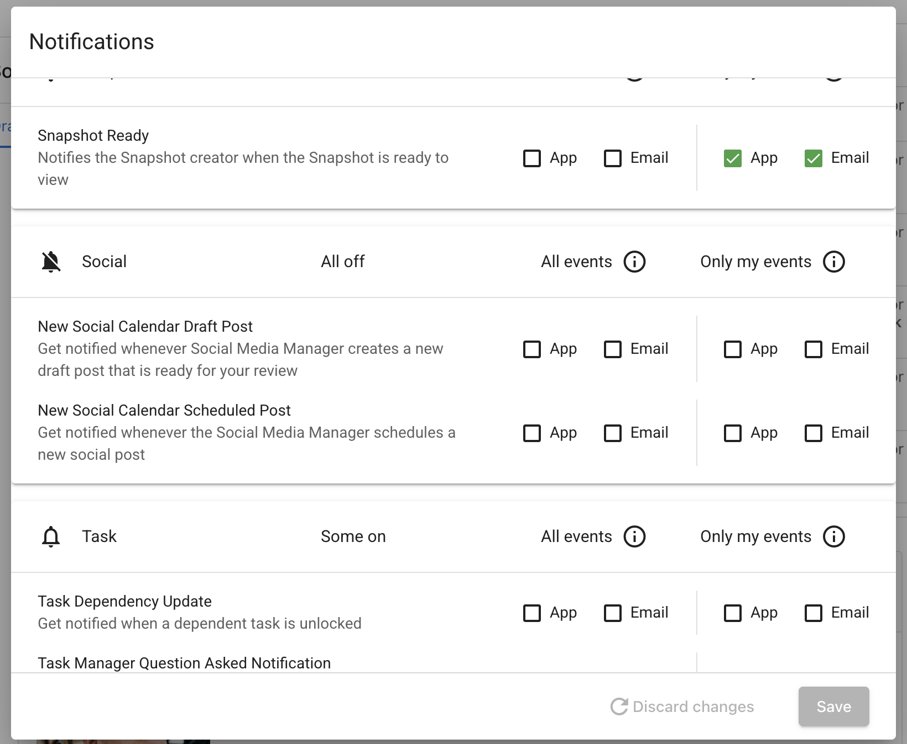

The **AI Social Media Manager** is an AI employee that runs your social media program autonomously. It generates a full social calendar on a schedule you define, writes platform-ready posts, sources or generates images, and drafts, schedules, or publishes content across every connected network.

You can also work with it conversationally at any time: generate posts, pull performance data, update drafts, or delete content through a natural language chat interface inside Business App.

The AI Social Media Manager is available in the **Social AI Premium** edition for single-location businesses.

  

    <iframe
      src="https://fast.wistia.net/embed/iframe/p5kukmbm17?web_component=true&seo=true"
      title="AI Social Media Manager Setup Video"
      allow="autoplay; fullscreen"
      allowTransparency
      frameBorder="0"
      scrolling="no"
      className="wistia_embed"
      name="wistia_embed"
      width="100%"
      height="100%"
    ></iframe>
  

## Why is the AI Social Media Manager important?

Maintaining an active, varied presence across every social network takes constant effort — researching topics, tailoring posts per platform, sourcing images, and keeping a steady cadence. Without a system to run your social program, you may encounter:

- Inconsistent posting that weakens reach and engagement
- Time spent writing and reformatting the same content for each network
- Generic posts that ignore current trends, observances, and industry news
- Difficulty understanding what content is actually performing

The AI Social Media Manager addresses these challenges by automating the full content lifecycle — from research and writing to image generation and publishing — across all your connected networks, while still giving you conversational control over every post.

## What's included with the AI Social Media Manager?

- **Automated social calendar generation**: Generate a complete social calendar automatically on a schedule you define, using the Social Calendar Generation trigger
- **Platform-ready posts**: Write posts adapted per network, with tone, hashtags, CTAs, and platform-specific variations
- **Image sourcing and generation**: Generate images sized for each platform with AI, or source royalty-free images from Pexels and Pixabay
- **Multi-network publishing**: Draft, schedule, or publish content across every connected social network
- **Conversational performance insights**: Ask about engagement metrics and content performance through chat to inform future posts
- **Conversational post management**: Generate, edit, and delete drafts and scheduled posts through chat, without leaving Business App
- **Notifications**: Receive email and in-app notifications when the AI drafts or schedules posts

## How to set up the AI Social Media Manager

### Core requirements

Ensure your setup includes:

- Social AI Premium edition access
- One or more connected social networks under integrations
- A single-location business profile

### Step 1: Set up your AI Social Media Manager profile

While the AI Social Media Manager can start working with minimal configuration, setting up its profile helps ensure it represents your brand accurately and is easy to identify within your AI Workforce.

1. Go to `AI > AI Workforce`
2. Click `Configure` on the AI Social Media Manager
3. Name your AI and upload an identifying image

This helps you recognize the AI Social Media Manager during configuration and when reviewing its activity.

### Step 2: Understand capabilities

The AI Social Media Manager is released with eight core capabilities that cover the full content lifecycle. Each capability is fully editable and can be configured to match how you want the AI to research, write, illustrate, and publish your posts. You can also add custom capabilities using **+ Add Capability**.

| Capability | What it does |
| --- | --- |
| **Configure Social Media Calendar** | Controls what the AI posts — goal, total posts, content split, post length, image source, networks, cadence, posting time, and save behavior |
| **Customize Social Post Instructions** | Controls how posts are written — tone, platform variations, hashtags, CTAs, localization, and brand guardrails |
| **AI Image Generation** | Generates images sized for each platform using your chosen AI model (Nano Banana 2 or GPT Image 2) |
| **Search Web** | Searches for current trends, observance days, and industry news to keep posts timely and relevant |
| **Find Royalty-Free Images** | Sources royalty-free images from Pexels and Pixabay when AI image generation is not selected or has reached its limit |
| **List Integration Connections** | Fetches your active social network connections so the AI posts only to connected platforms |
| **Social Post Performance Data** | Retrieves engagement metrics across networks to inform future content and answer performance questions conversationally |
| **Manage Social Posts** | Publishes posts as drafts, scheduled, or live, and lets you list, edit, reschedule, and delete existing posts conversationally |

### Step 3: Add knowledge sources

Add relevant knowledge base content to help the AI Social Media Manager write accurate, on-brand posts. This can include information about your products, services, audience, and brand voice. For a complete guide, see the [Knowledge Sources section in the AI Workforce Overview](./ai_workforce_overview.md).

:::note
Knowledge sources used by the AI Social Media Manager are shared with **Write with AI** in Social AI. The Customize Social Post Instructions capability governs Write with AI inside Social AI only — it does not affect the standalone Social AI composer.
:::

### Step 4: Configure the Social Calendar Generation trigger

The trigger controls when the AI runs autonomously.

| Setting | Options | Default |
| --- | --- | --- |
| **Frequency** | Every day, a specific day of the week, or a specific day of the month | — |
| **Time** | Any time of day | 9:00 AM |
| **Time zone** | Any time zone | Business configured time zone (falls back to Chicago if not set) |
| **Start date** | Date the trigger begins | — |
| **End date** | Date the trigger stops | — |

### Step 5: Configure the Social Media Calendar capability

When the trigger fires, the AI reads these settings to build and publish the calendar.

| Setting | Description | Default |
| --- | --- | --- |
| **Goal** | What the posts should achieve | e.g., "Boost brand awareness and drive more leads" |
| **Total posts** | Number of unique post topics per run; each topic produces one post per active network | 3 |
| **Content split** | Percentage mix across content types (must total 100%) | 40% Business · 30% Engagement · 30% Industry |
| **Post length** | Length and structure of each post | 2–3 sentences: hook → value → call to action |
| **Post optimization** | How posts are adapted per network | Unique variation per network |
| **Images** | Image source — AI-generated or Stock | AI-generated |
| **Networks** | Which platforms to post to | Active Networks (all connected networks) |
| **Cadence** | How far out posts are scheduled — accepts natural language (e.g., "next week", "the next 30 days") | Next week |
| **Posting time** | What time posts go live — accepts a specific time or a preference. When set to **Best time**, the AI selects the highest-engagement window per network using performance data | Best time |
| **Save as** | Draft, Scheduled, or Published | Draft |

### Step 6: Start using the AI Social Media Manager

Save your configuration, and the AI Social Media Manager runs automatically on your defined schedule. Each run generates the calendar, writes the posts, attaches images, and drafts, schedules, or publishes them per your settings.

You can also chat with the AI Social Media Manager at any time to generate posts or a full calendar on demand, independent of the trigger schedule.

## Working conversationally

Chat with the AI Social Media Manager at any time to:

- Generate individual posts on demand
- Ask performance questions ("Which posts performed best last month?")
- Update draft or scheduled post text directly in the chat
- Delete posts by asking in the chat

To edit a draft or scheduled post manually, click the **kebab menu** on the post and select **Edit**, or use the **AI Assist** panel.

Use the **AI Image Assist** panel within the post editor to regenerate, upload, or remove the post image.

:::note
To edit images, social networks, or advanced post options, click **Launch** to open Social AI. This is the only action that takes you outside of Business App.
:::

## Recommended models

| Use case | Recommended model |
| --- | --- |
| Written content generation | Gemini Flash Latest |
| Image generation | Nano Banana 2 |

## Notifications

When the AI Social Media Manager drafts or schedules posts, you receive an **email notification** and an **in-app notification** in Business App.

To disable either, click the **bell icon** inside the AI Social Media Manager and turn off the relevant notification type for **New Social Calendar Draft Post** and **New Social Calendar Scheduled Post**.

## Frequently Asked Questions

Which edition includes the AI Social Media Manager?

The AI Social Media Manager is available in the Social AI Premium edition.

Which social networks are supported?

The AI Social Media Manager works with any network you have connected: Facebook, Instagram, LinkedIn, X, YouTube, TikTok, Google Business Profile, and Custom Feed. The AI posts only to networks that are active and connected.

What is the difference between Save As Draft, Schedule, and Publish?

- **Draft** — posts are saved for your review before anything goes live. Use this for full editorial control.
- **Schedule** — posts are queued to go live at the optimal time per network automatically.
- **Published** — posts go live immediately when the AI run completes.

What happens if the AI image generation limit is reached?

The AI Social Media Manager automatically falls back to Find Royalty-Free Images (Pexels and Pixabay) when the AI image generation limit is reached.

Does the AI check for duplicate content?

Yes. The AI Social Media Manager automatically checks for content duplication against previous months to avoid repeating posts.

Can I run the AI Social Media Manager manually outside of the schedule?

Yes. You can chat with the AI Social Media Manager at any time to generate posts or a full calendar on demand, independent of the trigger schedule.

Can I schedule draft posts directly in Business App?

Yes. You can schedule draft posts from Business App. Note that scheduling drafts is not available from the Social AI app.

What language are posts written in?

The Customize Social Post Instructions capability includes localization rules that align each post with your business's region and language. Adjust the localization settings in that capability to change the language or regional focus.

Why does the AI generate different content each run?

The AI Social Media Manager operates in a reasoning mode — before generating, it weighs your configured instructions, your business knowledge, and current external trends. Because it factors in fresh signals (trending topics, observance days, performance data) on every run, output varies from run to run rather than repeating a fixed template.

