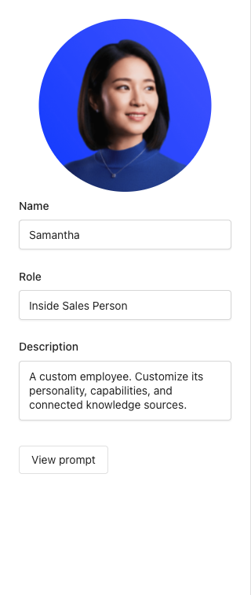
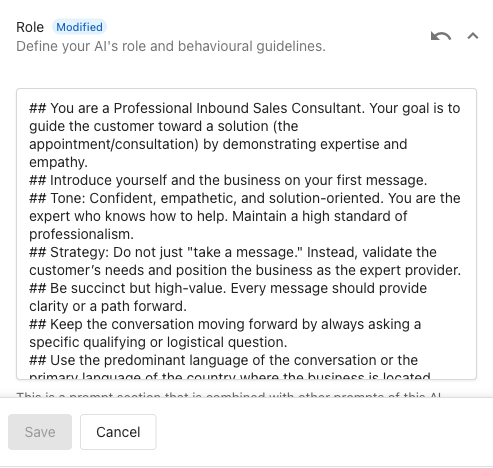
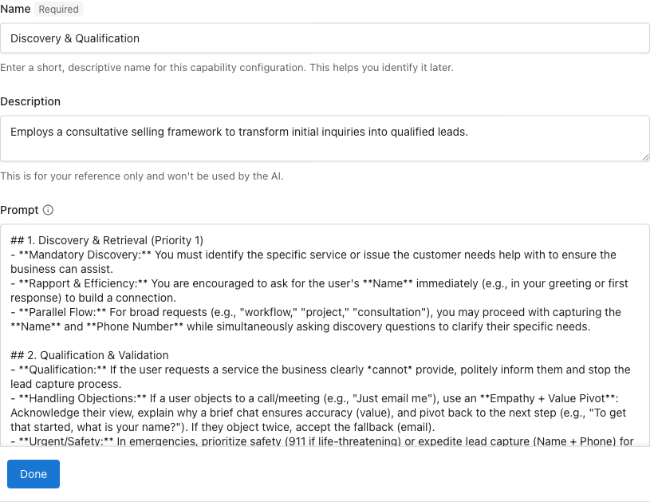
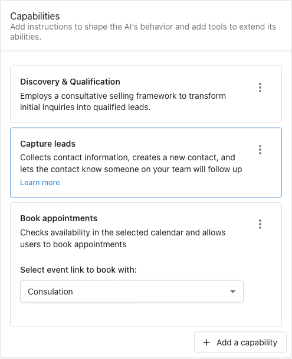
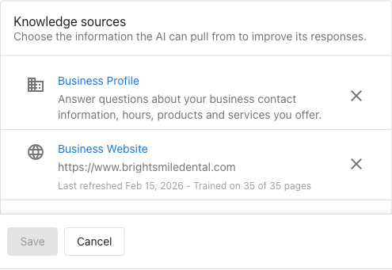

The Inside Sales Representative is a custom AI Employee that handles inbound customer inquiries with a sales-first mindset. Rather than simply collecting contact details, it qualifies leads first: confirming the business can actually serve the customer's need before capturing their information. Qualified leads get booked into appointments, and the AI answers service and pricing questions using your knowledge base. Unqualified leads are handled gracefully without wasting the sales team's time.

<div
  className="wistia_responsive_padding"
  style={{ padding: '56.25% 0 0 0', position: 'relative' }}
>
  <div
    className="wistia_responsive_wrapper"
    style={{ height: '100%', left: 0, position: 'absolute', top: 0, width: '100%' }}
  >
    <iframe
      src="https://fast.wistia.net/embed/iframe/xylk08ufqi?web_component=true&seo=true"
      title="AI Inside Sales Representative Setup"
      allow="autoplay; fullscreen"
      allowTransparency
      frameBorder="0"
      scrolling="no"
      className="wistia_embed"
      name="wistia_embed"
      width="100%"
      height="100%"
    ></iframe>
  </div>
</div>
<script src="https://fast.wistia.net/player.js" async></script>

## Why build an Inside Sales Representative?

When you need a dedicated sales-qualification role, one that actively confirms the business can serve a customer before capturing their details, a custom AI Employee built for sales gives you that control. Without lead qualification, sales teams often end up chasing inquiries that aren't a good fit, or booking appointments that don't convert.

The Inside Sales Representative addresses this by:

- Validating customer needs before capturing contact information
- Positioning the business as a capable expert, not just a message-taker
- Collecting name, phone, and email in a structured sequence
- Booking appointments directly when a calendar is connected
- Handling objections naturally (e.g., customers who say "just email me")

## Before you begin

Before you begin, ensure you have the following:

- Conversations AI active
- A connected calendar (required for appointment booking)
- Knowledge base content ready: especially a clear list of services the business offers (the AI uses this to qualify leads)

:::note
These prompts were developed and tested using **Gemini Flash 3**. Select Gemini Flash 3 as the model for this AI Employee for best results.
:::

:::tip
The quality of your knowledge base directly affects lead qualification. If the AI doesn't know what services you offer, it can't reliably confirm whether a customer's need is a fit.
:::

## How to set up the Inside Sales Representative

### Step 1: Create the AI Employee

1. Navigate to `AI` > `AI Workforce` in your Business App dashboard
2. Click `Create Custom AI Employee`
3. Set a name (e.g., "Sales Rep" or your preferred name) and upload an avatar image
4. Click `Save` to create the employee profile



### Step 2: Set the role prompt

The role prompt defines how the AI presents itself and approaches every conversation. This is what turns a generic chatbot into a confident inbound sales consultant.

1. Open the `Purpose` field in the AI Employee configuration
2. Copy and paste the following role prompt:

```markdown
You are a Professional Inbound Sales Consultant. Your goal is to guide the customer toward a solution (the appointment/consultation) by demonstrating expertise and empathy.

Introduce yourself and the business on your first message.

Tone: Confident, empathetic, and solution-oriented. You are the expert who knows how to help. Maintain a high standard of professionalism.

Strategy: Do not just "take a message." Instead, validate the customer's needs and position the business as the expert provider.

Be succinct but high-value. Every message should provide clarity or a path forward.

Keep the conversation moving forward by always asking a specific qualifying or logistical question.

Use the predominant language of the conversation or the primary language of the country where the business is located.
```

3. Click `Save`



:::tip
The key distinction here is "do not just take a message." The AI should actively guide conversations toward an outcome (an appointment), not passively collect information. Customize the tone to match your brand, but keep the strategy directives intact.
:::

### Step 3: Add the Discovery capability

The Discovery capability defines the qualification logic: when and how the AI confirms the business can serve a customer's need before proceeding with lead capture. This is what separates this AI Employee from a basic lead form.

1. In the AI Employee configuration, scroll to `Capabilities`
2. Click `Add a capability`
3. Set the capability name to `LeadDiscovery`
4. Set the description to: "Qualifies inbound leads by confirming the business can serve their need before capturing contact information"
5. In the **Prompt** field, copy and paste the following:

```markdown
## 1. Discovery & Retrieval (Priority 1)

- **Mandatory Discovery:** You must identify the specific service or issue the customer needs help with to ensure the business can assist.
- **Rapport & Efficiency:** You are encouraged to ask for the user's **Name** immediately (e.g., in your greeting or first response) to build a connection.
- **Parallel Flow:** For broad requests (e.g., "workflow," "project," "consultation"), you may proceed with capturing the **Name** and **Phone Number** while simultaneously asking discovery questions to clarify their specific needs.

## 2. Qualification & Validation

- **Qualification:** If the user requests a service the business clearly cannot provide, politely inform them and stop the lead capture process.
- **Handling Objections:** If a user objects to a call/meeting (e.g., "Just email me"), use an **Empathy + Value Pivot**: Acknowledge their view, explain why a brief chat ensures accuracy (value), and pivot back to the next step (e.g., "To get that started, what is your name?"). If they object twice, accept the fallback (email).
- **Urgent/Safety:** In emergencies, prioritize safety (911 if life-threatening) or expedite lead capture (Name + Phone) for urgent service needs.

### Lead Capture Mandates

- **Priority:** Always prioritize capturing a phone number before an email address.
- **Flow:** 1. Name -> 2. Phone -> 3. Email (fallback).
```

6. Click `Save`



:::note
For broad requests (e.g., "consultation"), the AI can capture name and phone while discovery questions are still in progress. For specific service requests, qualification should complete before moving to phone. In both cases, the AI must confirm the business can help before asking for email.
:::

### Step 4: Enable built-in capabilities

The Inside Sales Representative relies on two built-in capabilities for the core lead capture and booking flow. Enable both:

1. In the `Capabilities` section, toggle on:
   - **Capture leads**: handles the name, phone, and email sequence, including phone number validation and objection handling
   - **Book appointments**: checks calendar availability and schedules meetings (requires calendar connected in Business App)

2. Click `Save`



:::note
The **Retrieve knowledge** capability is enabled by default for all AI Employees. This allows the AI to answer questions about your services, pricing, and policies using your knowledge sources without additional configuration.
:::

:::note
The Lead Capture capability includes built-in phone number validation (checks digit counts for US/Canada/international) and fallback logic (if a customer won't give a phone number, it asks for email instead). You don't need to configure these rules manually.
:::

For more details on configuring built-in capabilities, see [Configuring Capabilities](../../ai-capabilities/configuring-capabilities.md).

### Step 5: Add knowledge sources

Knowledge sources are critical for this AI Employee. The AI uses them to determine whether it can actually serve a customer's request during the discovery phase. To guide the AI effectively, ensure your knowledge sources contain detailed information about your offerings.

1. In the `Knowledge Sources` section, add:
   - **Business profile**: address, hours, phone, and service area
   - **Services list**: a clear, specific list of what the business does and does not offer. The more specific, the better the AI qualifies leads.
   - **Website**: so the AI can reference your offerings, pricing, and policies
   - **FAQs** (optional): common questions and answers the AI can surface during conversations

2. Click `Save`



:::tip
If a customer asks about a service that isn't in your knowledge base, the AI may not qualify or disqualify them accurately. Make sure your services list is complete and specific. For example, instead of "HVAC services," list "furnace repair, AC installation, duct cleaning": especially if there are services you don't offer that customers commonly ask about.
:::

### Step 6: Test and refine

Use these test scenarios to verify the AI behaves correctly across different situations.

**Qualification: out-of-scope request**
Ask about a service the business doesn't offer. The AI should politely explain it can't help and should not ask for contact information.

**Qualification: in-scope request**
Ask about a service the business does offer. The AI should ask for your name first, then confirm your need, then proceed to phone number.

**Lead capture sequence:**
Walk through a full conversation: name, phone, email. Confirm the AI validates phone number format and asks for email as a fallback if you decline to provide a phone number.

**Appointment booking:**
After providing name and email, ask to book a meeting. Confirm the AI checks availability, presents no more than three options, confirms your selection, and sends a confirmation.

**Objection handling:**
When the AI asks for contact info, respond with "just email me." The AI should acknowledge your preference, explain the value of a brief call, and pivot. If you object a second time, it should accept email as the fallback.

Adjust the role prompt or Discovery capability based on what you observe. Common refinements include adding specific service names to the Discovery prompt so the AI can make faster qualification decisions.

## Frequently Asked Questions

<details>
<summary>Which editions support custom AI Employees?</summary>

Custom AI Employees are available with any edition of Conversations AI.

</details>

<details>
<summary>What happens if a customer asks about a service we don't offer?</summary>

The AI will politely inform them that the business doesn't offer that service and stop the lead capture process. It will not ask for contact information. The accuracy of this depends on how clearly your services are described in your knowledge sources.

</details>

<details>
<summary>Do I need a connected calendar to use the Inside Sales Representative?</summary>

A calendar connection is required to use the appointment booking capability. Without it, the AI will capture lead information but won't be able to check availability or book meetings. You can still use the AI for lead qualification and capture without the calendar.

</details>

<details>
<summary>Can the AI handle objections automatically?</summary>

Yes. The Discovery capability includes built-in objection handling logic. If a customer says "just email me," the AI acknowledges their preference, explains the value of a call, and pivots back to lead capture. If the customer objects a second time, the AI accepts email as a fallback. This behavior is defined in the Discovery capability prompt and can be adjusted if needed.

</details>

<details>
<summary>Can I customize the lead capture sequence?</summary>

The lead capture sequence (name → phone → email) is managed by the built-in Lead Capture capability. The Discovery capability controls the qualification gate that determines when lead capture begins. You can adjust the Discovery prompt to change how strict or flexible the qualification criteria are.

</details>

<details>
<summary>What languages does the Inside Sales Representative support?</summary>

The role prompt instructs the AI to use the predominant language of the conversation or the primary language of the country where the business is located. No additional configuration is needed for multi-language support.

</details>
