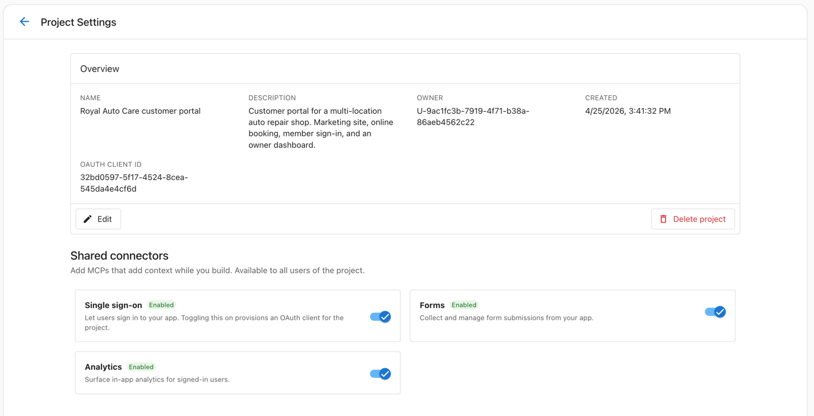

# Connectors

Connectors let your Vibe-built app do real work, not just look like it could. Each connector is a thin layer over a Business App service: instead of mocking a contact form or hardcoding a fake login button, the generated UI hooks into the live platform feature behind it. You ask for the behavior in plain English; the supervisor agent activates the connectors that are turned on for your project.

There are five connectors today:

- [Single sign-on](./single-sign-on.md) — let your customers sign in with their existing account.
- [Forms](./forms) — capture form submissions from your app.
- [Analytics](./analytics.md) — surface in-app metrics for signed-in users.
- [CRM](./crm.md) — read contacts, pipeline deals, and accounts from your CRM.
- [Supabase](./supabase.md) — connect your app to a Supabase database.

## Enabling a connector

Connectors are managed per project. You can access them two ways: from the projects list, click **Configure** on the project card; or inside a project, click **+** in the chat box and select **Connectors**. Toggle a connector on to make it available to every prompt in the project; toggle it off to remove it from the supervisor agent's options.

When a connector is **enabled**, the supervisor agent can wire your generated UI into the underlying service automatically. When a connector is **disabled**, prompts that would normally activate it fall back to mocked or static behavior — useful when you want to design without committing to live integrations yet.

Some connectors do extra setup the first time you turn them on. Single sign-on, for example, provisions an OAuth client for the project the moment you enable it. The connector page calls this out for each one.

## Combining connectors

Most realistic apps use more than one connector. You don't need to declare them separately — describe the full app and Vibe activates whichever ones are turned on:

> Build a customer portal for a multi-location HVAC business. Marketing landing page, contact form on the landing, members area with sign-in showing service history, and an owner dashboard with bookings per location and weekly revenue. Use a clean professional theme.

That single prompt activates Forms (contact), Single sign-on (members area), and Analytics (owner dashboard). The supervisor agent identifies which connector each part of the request needs and wires the UI accordingly.

## Next Steps

- [Forms](./forms) — Capture contact form and lead submissions from your app
- [Single sign-on](./single-sign-on.md) — Gate a members area with existing customer accounts
- [Analytics](./analytics.md) — Surface multi-location metrics for signed-in users
- [CRM](./crm.md) — Build contact directories, pipeline views, and account management tools
- [Prompting Library](../prompting-library.md) — Ready-made prompts for each connector
