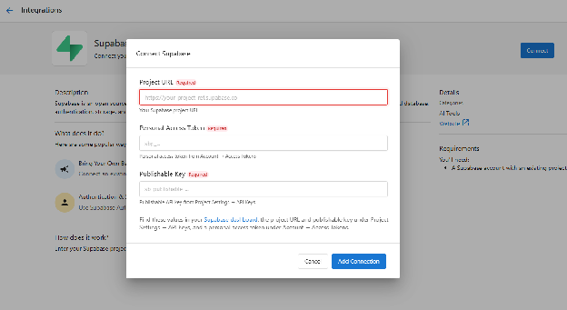
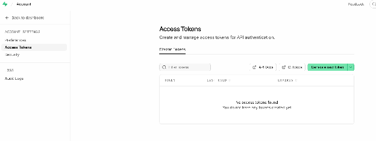

# Supabase Backend

Connect your Supabase project to Vibe so the app it builds runs against your actual database, authentication, and storage, not placeholder data.

When you link a Supabase project, Vibe builds directly against your real schema and data. The generated app is fully wired to your Supabase backend from the start, so there is no extra configuration step to connect it later.

You don't build tables or write backend logic in Supabase yourself. Describe what you want in your prompts, and Vibe creates and manages the database schema for you.

## What you get

When you connect Supabase to Vibe, your project gains:

- **Real database access**: Vibe builds against your actual tables and relationships, not mock data.
- **Authentication**: Your app uses Supabase Auth, including any existing users and sign-in flows. Combined with Row Level Security, each signed-in user's own data stays separate from everyone else's, for example, one user's saved work never shows up for another.
- **Storage**: File uploads and assets connect to your Supabase Storage buckets.

Because Vibe uses your own Supabase credentials, you stay in control of your data and access rules at all times.

:::caution
Your Publishable Key is safe to use in your app's front-end code only when Row Level Security (RLS) is turned on for your tables, with policies configured to control who can access which rows. Without RLS, that key can expose more of your data than you intend.
:::

## Before you begin

If you don't already have a Supabase project, sign up for a free account at supabase.com and create a new project. Then gather these three values:

- **Project URL**: In your Supabase project dashboard, go to **Integrations**, then select **Data API**. On the **Overview** tab, check the **API URL** field. It looks like `https://[your-project-ref].supabase.co`. You can also find it by clicking `Connect` on your project dashboard.
- **Publishable Key**: In your Supabase project dashboard, go to **Settings**, then select **API Keys**. On the **Publishable and secret API keys** tab, your key is listed under **API Key**. It starts with `sb_publishable_...`.
- **Personal Access Token**: Click your profile avatar in the top-right corner of any Supabase page, then select **Account**, then **Access Tokens**. Click `Generate new token`, name it, and copy it immediately. Supabase only shows it once.

## Connect your Supabase project

1. In Business App, go to **Administration**.
2. Under **App settings**, select **Integrations**.
3. On the Integrations page, select the **AI Tools** category in the left sidebar.
4. Select **Supabase** from the list of integrations.
5. Click `Connect`.
6. In the **Connect Supabase** dialog, enter your **Project URL**, **Personal Access Token**, and **Publishable Key**.

7. Click `Add Connection`.

Once connected, enable the Supabase connector in your Vibe settings to start building against your project.

:::note
Supabase automatically pauses free-tier projects after 7 days of inactivity. If your app suddenly can't reach your database, open your Supabase project dashboard and check whether it needs to be resumed. You can unpause a project from the dashboard within 90 days of it pausing; after that it can't be restored, though your data stays available for download. Upgrading your Supabase project to a paid plan prevents automatic pausing.
:::

:::tip
Generating a Personal Access Token takes you to your Supabase account's Access Tokens page, where you can see and manage every token you've created.

:::

## Secrets and API keys

When your Vibe app needs a Supabase API key, Vibe shows you exactly which secret to add and links directly to the right page in your Supabase dashboard. Your keys go into your project's environment, never into the chat. If a required key is missing, your app surfaces a clear error message instead of failing silently.
