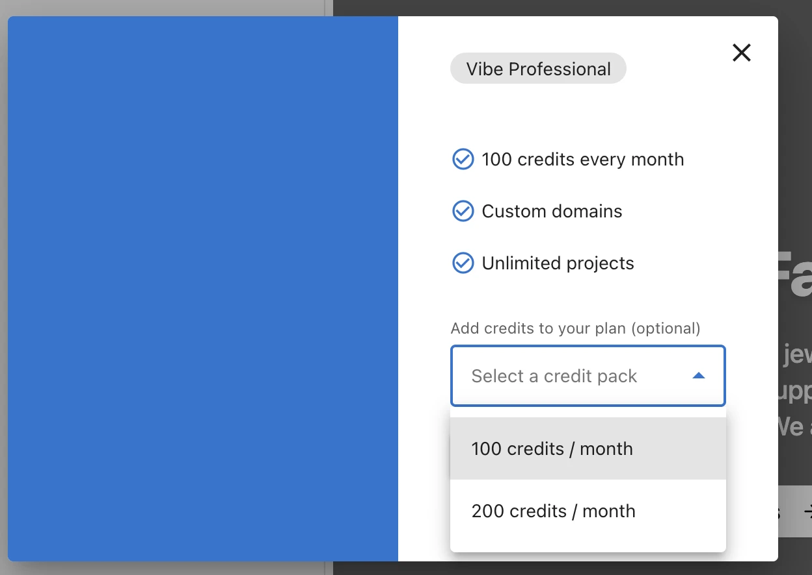

# Credits

Vibe uses credits to measure AI activity. Your subscription includes a credit allowance per billing period, and you can purchase additional credit packs when you need more.

## How Credits Work

Activity in Vibe — generating applications, editing pages, and running builds — consumes credits. Each Vibe subscription includes a monthly credit allowance that resets each billing period.

The amount of credits an action uses depends on its size:

| Action | Credit cost |
|--------|-------------|
| Large edit or full site generation | ~5 credits |
| Small edit | 0.5–1 credit |

Credits are tied to the account they were issued to and cannot be transferred to other accounts.

When your included credits are used up, Vibe prompts you to purchase additional credits before you can continue building.

<!-- screenshot needed: credit usage indicator / prompt when credits run out -->

## Credit Allowances by Plan

<!-- TODO: Verify plan credit allowances and credit pack costs before publishing. 
     Transcript said 250/month but UI showed 100/month — confirm with Jesse which is correct.
     Also confirm credit pack pricing (100/month and 200/month add-ons shown in screenshot). -->

| Plan | Monthly credits |
|------|----------------|
| Professional | 100 |

## Purchasing More Credits

You can buy additional credit packs directly in Business App through the self-checkout flow. From the same flow, you can upgrade your subscription to the Professional plan, which includes a higher credit allowance and unlocks additional features like [custom domains](./guides/custom-domain.md).

