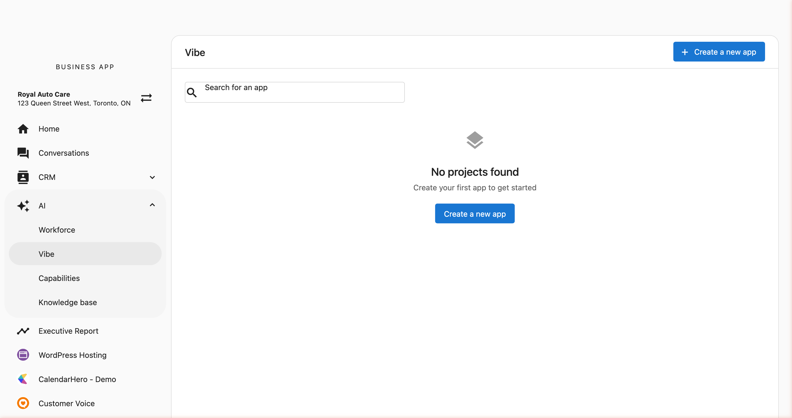
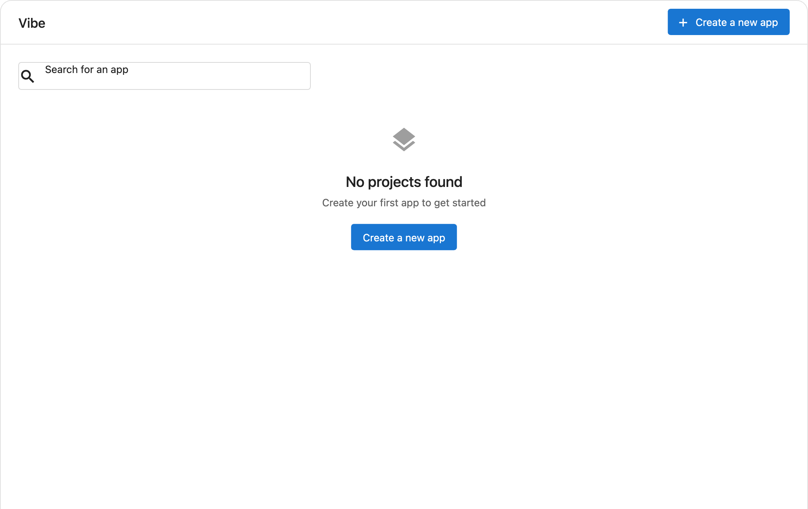
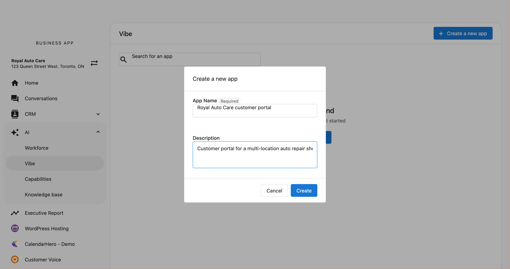
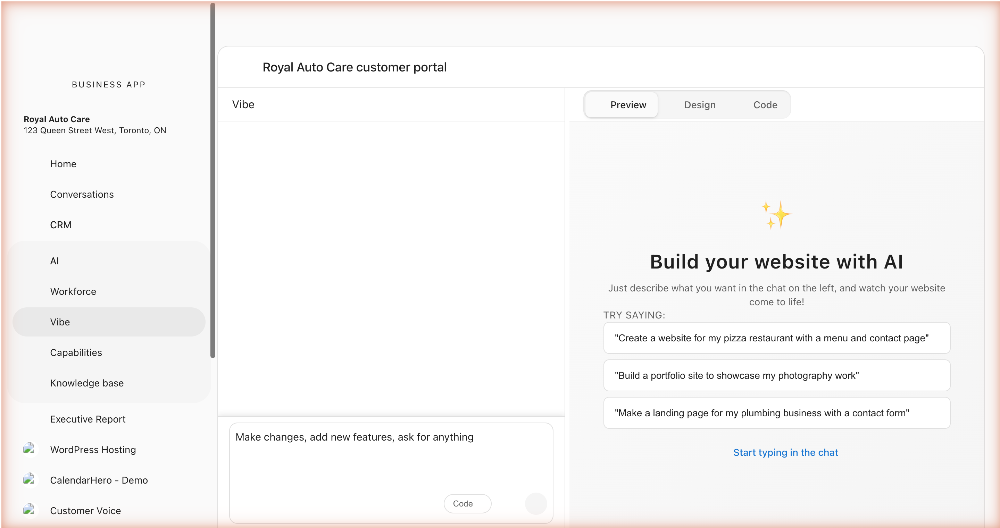
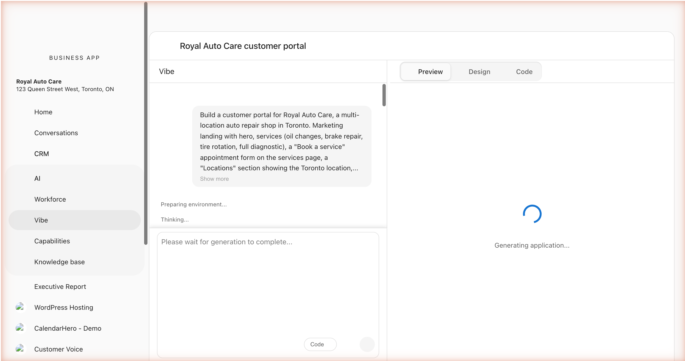
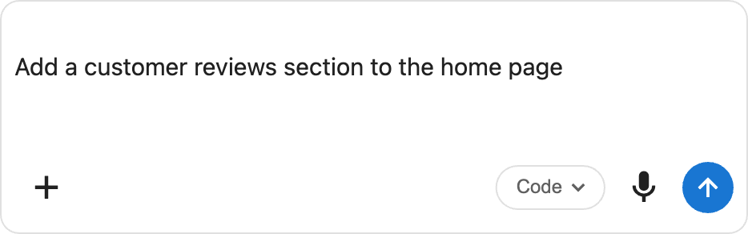
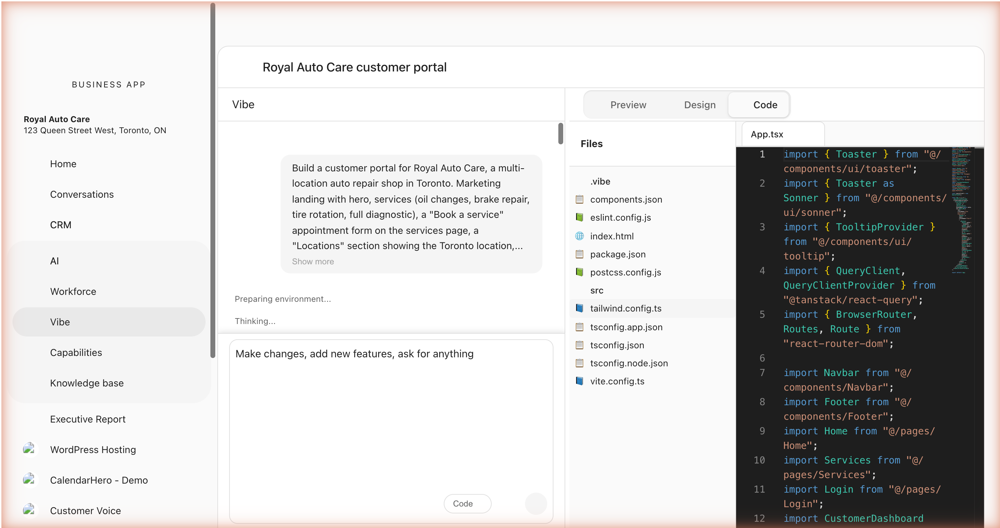

# Getting Started

This guide walks you through creating your first application with Vibe.

## Step 1: Open Vibe in Business App

Vibe lives in Business App alongside your other AI tools.

1. Sign in to Business App.
2. From the location switcher, choose the location you want to build for.
3. In the left sidebar, click **AI**.
4. Click **Vibe**.

You see your Vibe project list. If this is your first time, the list is empty and invites you to create your first app.

## Step 2: Create a New Project

Once you're in Vibe, you'll see a project list. Click **+ Create a new app** to create your first application.

Give your project a name and an optional description, then click **Create**.

## Step 3: Write Your First Prompt

After creating your project, you'll land in the Vibe editor. This is where you build your application through conversation.

The editor has three main areas:

- **Chat Panel** (left) — Where you describe what you want
- **Preview** (center) — A live preview of your application
- **Mode Tabs** (top) — Switch between Preview, Design, and Code views

Type your first prompt in the chat input at the bottom of the chat panel. Here are some good starting prompts:

### Example First Prompts

**A landing page:**
> Build a modern landing page for a coffee shop called "Bean & Brew". Include a hero section with a tagline, a menu section with coffee drinks and prices, an about section, and a contact form at the bottom.

**A multi-page site:**
> Create a website for a yoga studio called "Still Point Yoga". Include a home page with class schedule, an instructors page with bios and photos, a pricing page with membership tiers, and a contact page with a form.

**A portfolio site:**
> Build a personal portfolio website for a photographer. Include a full-screen hero image, a gallery grid with hover effects, an about page, and a contact page with a form.

Press **Enter** or click the send button to submit your prompt.

## Step 4: Watch Vibe build

After you submit your prompt, Vibe runs through a consistent sequence you can follow in the chat:

1. **Preparing environment** — Vibe spins up a sandbox for your project.
2. **Thinking** — Vibe internalizes your request and works out the architecture.
3. **Applying theme and generating images** — Vibe sets the visual style you described and creates any imagery the design needs.
4. **Editing files** — Each component, page, and configuration file streams in as Vibe writes it. You see entries like "Editing Navbar.tsx", "Editing Home.tsx", and "Editing OwnerDashboard.tsx" appear in real time.
5. **Validating** — Vibe takes a screenshot of the result, checks the design, and runs a build to surface errors.
6. **Checking for errors** — If anything is broken, Vibe fixes it before declaring the run finished. See [Error handling and troubleshooting](./guides/troubleshooting.md) for how the auto-fix layers work.
7. **Completed** — A `COMPLETED` block appears at the bottom of the conversation with collapsible "Architecture & Navigation" and "Files" details.

The chat auto-scrolls to follow new events as they arrive. If you scroll up to read older context, follow-tail pauses; scroll back near the bottom and it resumes.

## Step 5: Iterate and Refine

Your first generation is just the starting point. Use follow-up prompts to refine your application:

> Change the hero background to a dark gradient and make the tagline larger

> Add a testimonials section between the menu and contact sections

> Make the navigation sticky and add a mobile hamburger menu

Each prompt builds on the current state of your application. Vibe understands the context of what's already been built and makes targeted changes.

## Understanding the Interface

### Chat Panel

The chat panel shows your conversation history with Vibe. Each exchange shows:

- **Your message** — What you asked for.
- **Vibe's response** — Streamed inline as the work happens: clarifying questions (when needed), status events as files are written, and a `COMPLETED` block at the end with collapsible details for the architecture and the files that changed.
- **Inline screenshots** — When Vibe captures a reference site or runs a visual check, the screenshot appears inline in the status row.
- **Feedback buttons** — Thumbs up/down to rate each generation.

### Chat Input

At the bottom of the chat panel, you find:

| Control | Description |
|---------|-------------|
| **Text input** | Type your prompt here. Press Enter to send, Shift+Enter for a new line. Paste a URL in the input to clone a reference site (see [Cloning a reference site](./guides/clone-from-url.md)). |
| **+ (image)** | Attach screenshots or mockups to show Vibe what you want. |
| **Mode selector** | Pick the generation mode for the next prompt. |
| **Microphone** | Record voice input. Vibe transcribes your speech into a prompt. |
| **Send** | Submit the prompt to Vibe. |

### Preview, Design, and Code Modes

Use the tabs at the top to switch between views:

- **Preview** — Live preview of your built application
- **Design** — Visual editor for themes, colors, and element-level edits. See [Visual Editor](./guides/visual-editor.md).
- **Code** — File explorer and code editor to view or manually edit source files

### Toolbar

The top-right toolbar provides:

- **Refresh** — Reload the preview.
- **Fullscreen** — Expand the preview to full screen.
- **Download** — Download a complete archive of your project: full source, all assets, and the git history of every checkpoint.
- **Checkpoints** — Browse and restore previous versions of your project.

## Tips for New Users

- **Start simple** — Begin with a clear, focused prompt. You can always add complexity in later iterations.
- **Be specific** — Instead of "make it look better," try "increase the padding around cards to 24px and add a subtle shadow."
- **Iterate in small steps** — Make one or two changes per prompt rather than rewriting the whole application.
- **Use images** — If you have a design mockup, attach a screenshot to show Vibe what you're going for.
- **Paste a URL** — If a website you like is closer to your target than words can describe, paste its URL and Vibe will clone the look and structure as a starting point.
- **Read the COMPLETED block** — The collapsible "Architecture & Navigation" and "Files" details show what shipped. After a big change, expanding them is the fastest way to confirm Vibe interpreted your prompt the way you meant it.

## Next Steps

- [Prompting Guide](./guides/prompting.md) — The principles behind effective prompts.
- [Prompting library](./guides/prompting-library.md) — Concrete prompts you can paste, organized by intent.
- [Cloning a reference site](./guides/clone-from-url.md) — Start from an existing site by pasting its URL.
- [Visual Editor & Themes](./guides/visual-editor.md) — Customize colors and styles, and click elements in design mode to edit them precisely.
- [Planning](./guides/plan-mode.md) — How Vibe sequences your generation: plan, build, validate, fix, complete.
- [Connectors](./guides/connectors/index.md) — Wire your app into Forms, Single sign-on, and Analytics.
- [Image generation](./guides/image-generation.md) — Produce hosted images on demand from your prompts.
- [Error handling and troubleshooting](./guides/troubleshooting.md) — How auto-fix works and what to do when it doesn't.
