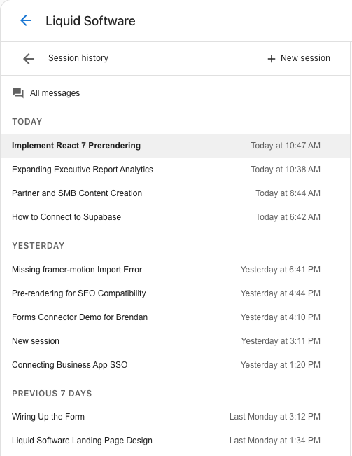
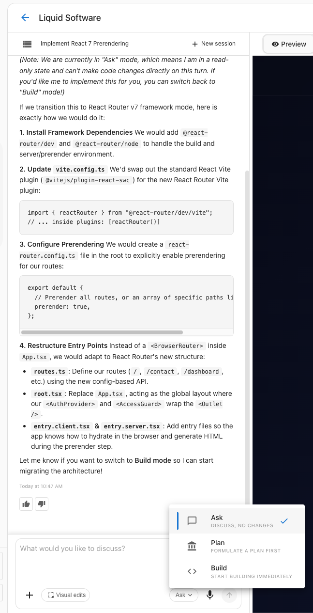

## What are Sessions and Ask mode?

A session lets you hold a focused discussion with the AI about a specific topic or objective. Each session keeps its context isolated from other work in the same project, so the AI stays focused on the goal you're working toward. When you finish one objective, you can create a new session to start fresh on the next without losing anything — all messages across every session remain visible in the **All messages** area, located directly beneath the session selector.

Ask mode introduces an interactive, back-and-forth discussion format inside a session. Instead of committing to a plan or a build immediately, you can use Ask mode to brainstorm ideas and shape your thinking first. When you're ready to execute, the context and mutual understanding you've built in Ask mode automatically carries forward as you switch to plan or build mode.

## Why are Sessions and Ask mode important?

- **Prevent context cross-contamination**: When you manage multiple objectives in one continuous conversation, important context can get mixed together or lost. Sessions keep each goal isolated so the AI is only working with what's relevant.
- **Never lose your history**: Creating a new session doesn't erase past work. Every message from every session in a project stays visible in the **All messages** area.
- **Brainstorm before you build**: Ask mode lets you think through an idea interactively before shifting into execution — no need to repeat yourself when you switch modes.
- **Seamless transition from strategy to creation**: The understanding you build in Ask mode automatically carries forward into plan or build mode, so you move from conversation to creation without starting over.

## What's included?

- **Session selector**: Create a new session or switch between existing sessions directly from the Vibe interface.
- **All messages area**: Located beneath the session selector, this area shows the complete message history for every session in the project.
- **Ask mode**: An interactive chat mode for back-and-forth discussion and brainstorming before execution.
- **Mode switching**: Switch from Ask mode to plan or build mode when you're ready — the context you built in Ask mode carries forward automatically.

## How to use Sessions and Ask mode

### Create a new session

1. Sign in to Business App.
2. From the location switcher, choose the location you want to build for.
3. In the left sidebar, click **AI** > **Vibe**.
4. Use the session selector to create a new session.

### Review your message history

To review messages from previous sessions, click the **All messages** area beneath the session selector. All project messages are visible here regardless of which session they belong to.

### Use Ask mode

1. In the Vibe chat input, select **Ask** from the mode selector.
2. Type your message and engage in a back-and-forth discussion with the AI.
3. When you're ready to build, switch the mode selector to **Plan** or **Build**. The context from your Ask conversation carries forward automatically.

## Frequently Asked Questions

What is a session?

A session is a focused discussion with the AI about a specific topic or objective. Sessions isolate context so you can work toward one goal at a time without other conversations interfering.

What happens to my messages when I create a new session?

Nothing is deleted. All messages from every session in a project remain fully visible in the **All messages** area beneath the session selector.

When should I create a new session?

Create a new session when you're moving on to a new objective. This keeps the AI focused on your current goal rather than drawing from the context of a previous one.

What is Ask mode?

Ask mode is an interactive, back-and-forth chat format that lets you brainstorm and refine ideas before committing to a plan or build. It's designed for exploring ideas rather than executing them.

How is Ask mode different from Plan or Build mode?

Ask mode is for discussion and brainstorming. Plan and Build modes are for executing — generating a plan and writing code. Use Ask mode to shape your thinking first, then switch to Plan or Build when you're ready to create.

Does my Ask mode conversation carry over when I switch to Plan or Build?

Yes. The context and understanding built during an Ask mode conversation automatically carries forward when you switch to Plan or Build mode, so you don't need to repeat yourself.

Do I need to activate anything to use Sessions and Ask mode?

Vibe must be activated in the marketplace for your account before you can access these features.

Where is the session selector?

The session selector is available in the Vibe interface. The **All messages** area, which shows the full history for your project, is located directly beneath it.

