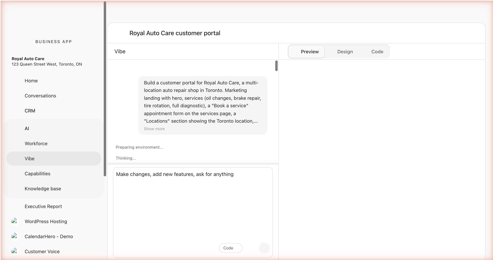

# Introduction to Vibe

:::warning Beta feature
Vibe is currently available to trusted testers only. If you're interested in early access, contact your account representative.
:::

Vibe is an AI-powered application builder. Describe what you want in plain English, and Vibe generates a fully functional React application — complete with components, routing, styling, and a live preview.

## What is Vibe?

Vibe turns natural language prompts into real, deployable web applications. Instead of writing code from scratch, you describe what you want to build and Vibe's multi-agent AI system handles the rest:

- **Planning** — Every generation starts with a structured plan that drives the rest of the run. The plan is captured in the `COMPLETED` block at the end so you can confirm Vibe interpreted your request correctly.
- **Generation** — Writes React components, pages, and styling, with type and build errors caught and fixed automatically as it goes.
- **Building** — Compiles the application and verifies it runs cleanly. Errors that survive the build trigger an auto-fix pass.
- **Preview** — Shows you the result in a live preview that updates as changes are made.

The entire process streams in real time, so you can watch your application take shape as the AI works.

## Key Features

### Chat-Based Development
Describe what you want in the chat panel. Vibe interprets the request and generates or modifies the application. Send follow-up messages to refine the result. Vibe's chat supports multiple languages, including French, Spanish, German, Italian, Czech, Chinese, Japanese, and Korean.

### Planning
Every generation produces a structured plan that drives the run. The plan, the architecture, and the file list are captured in the `COMPLETED` block at the end of each run so you can verify what was built. See [Planning](./guides/plan-mode.md).

### Cloning a reference site
Paste a URL and Vibe captures the screenshot, branding, layout, and content of that page, then scaffolds a faithful clone you can refine. The captured colors become a custom theme automatically. See [Cloning a reference site](./guides/clone-from-url.md).

### Visual Editor & Themes
Switch to Design mode to browse pre-built color themes, toggle between light and dark mode, and make targeted edits by clicking elements in the preview. When you click an element, Vibe gets exact source context (file, line, JSX tag, classes), so any change you ask for lands precisely on the element you selected. See [Visual editor and themes](./guides/visual-editor.md).

### Clarifying Questions
When your request is ambiguous, Vibe pauses and asks before going further. Questions arrive as structured prompts — pick a chip, confirm yes or no, or type a one-line answer. The conversation resumes the moment you respond.

### Multi-Modal Input
Attach images to your prompts to show Vibe what you want. Use the microphone button to dictate your changes using voice — Vibe transcribes your speech into a prompt.

### Connectors
Vibe wires your generated app into live platform features. The Forms connector captures submissions, the Analytics connector surfaces multi-location dashboards, and the Single sign-on connector gates a members area against your customers' existing accounts. See [Connectors](./guides/connectors/index.md).

### Image generation
Vibe produces hosted brand-quality images on demand whenever your prompt asks for them — no setup required. See [Image generation](./guides/image-generation.md).

### Code Editor
Switch to Code mode to view and edit the generated source code directly. Browse the file tree, open files in tabs, and make manual edits that sync with the preview.

### Checkpoints
Vibe automatically creates checkpoints as you iterate. You can view diffs between versions and restore previous states if needed.

## How It Works

When you send a prompt, Vibe's orchestrator coordinates multiple AI agents:

1. **You describe** what you want in the chat panel.
2. **Clarification** — If the request is ambiguous, Vibe asks structured questions before continuing.
3. **Planning** — A planning agent produces a structured plan describing the architecture, navigation, and which files will be touched.
4. **Generation** — A generation agent writes the code file by file, applying the theme, generating images, and editing components in real time. Type-check and build verification run continuously to catch and fix issues.
5. **Validation** — Vibe takes a screenshot of the rendered preview and runs a build check; anything broken is auto-fixed before the run finishes.
6. **Preview** — The live preview updates as soon as the build is clean.
7. **Iteration** — You review the result and send follow-up prompts to refine it. Runtime errors in the preview trigger an auto-fix banner.

All of this happens through a streaming interface — status updates, file changes, screenshots, and the live preview update in real time.

## Tech Stack

Applications built with Vibe use:

- **React 18+** with TypeScript
- **Vite** for fast builds
- **Tailwind CSS** for styling
- **shadcn/ui** component library (50+ pre-built components)
- **Lucide** icons

## Frequently Asked Questions

Do I need coding experience to use Vibe?

No. You describe what you want in plain English and Vibe handles the code. If you want to make manual edits, Code mode gives you direct access to the source files.

Can I start from an existing website?

Yes. Paste any URL into the chat input and Vibe captures the page's screenshot, branding, layout, and content, then scaffolds a clone you can refine. See [Cloning a reference site](./guides/clone-from-url.md).

What if Vibe misunderstands my request?

When a prompt is ambiguous, Vibe pauses and asks clarifying questions before generating. If the result isn't what you wanted, send a follow-up prompt to correct it or restore a previous checkpoint.

How do I undo a change I don't like?

Vibe creates checkpoints automatically as you iterate. Open the Checkpoints panel from the toolbar to view diffs and restore any previous version.

What languages can I use in the chat?

Vibe's chat supports multiple languages, including French, Spanish, German, Italian, Czech, Chinese, Japanese, and Korean.

## Next Steps

- [Getting Started](./getting-started.md) — Create your first app and learn the basics
- [Prompting Guide](./guides/prompting.md) — Write prompts that get better results
- [Cloning a Reference Site](./guides/clone-from-url.md) — Scaffold an app from any URL
- [Visual Editor & Themes](./guides/visual-editor.md) — Apply themes and edit elements visually
- [Planning](./guides/plan-mode.md) — Understand how Vibe plans before it builds
- [Image Generation](./guides/image-generation.md) — Generate hosted images in your app
- [Connectors](./guides/connectors/index.md) — Wire your app into forms, analytics, and sign-on
- [Prompting Library](./guides/prompting-library.md) — Ready-made prompts for common use cases
- [Troubleshooting](./guides/troubleshooting.md) — Fix common errors and unexpected behavior
