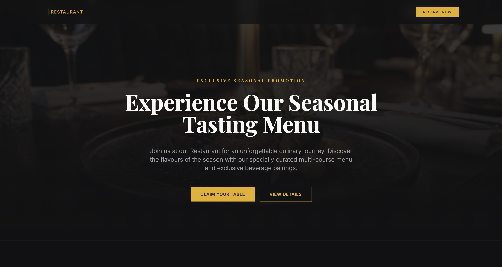
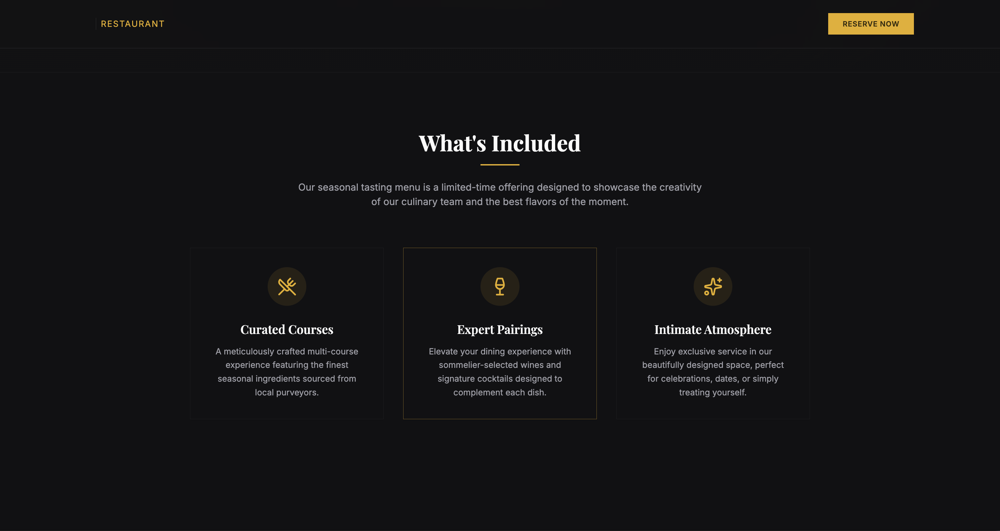
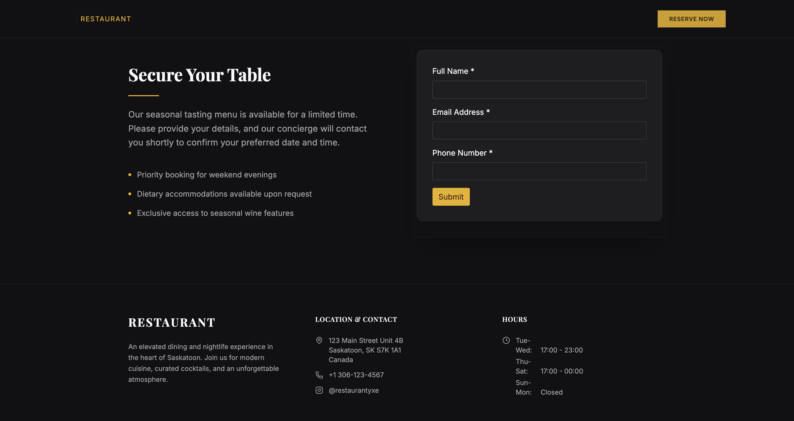

# Campaign Landing Page with Lead Capture

A seasonal promotion, a new service launch, a limited-time offer — these usually mean scrambling for a developer, a designer, or both. This use case shows how to build a polished campaign landing page in one prompt, using your business's own information and a built-in lead capture form.

## The prompt

> Build a landing page for a seasonal promotion. Use my business information for the details. Include a hero section with a generated image and a headline about the promotion, a short section highlighting what's included, and a lead capture form at the bottom that collects name, email, and phone number. Keep the design clean and professional.

## What Vibe built

From that single prompt, Vibe produced a three-section landing page:

- A **hero section** with an AI-generated background image, a promotion label, a headline, supporting copy, and two call-to-action buttons
- A **"What's Included" section** with three feature cards, each with an icon, title, and description pulled from the business's known services
- A **lead capture form** titled "Secure Your Table" — two columns, with supporting copy and bullet points on the left and name, email, and phone fields on the right
- A **footer** auto-populated with the business's address, phone number, social handle, and hours of operation — no manual entry required

## What made this work

**Business Knowledge did the heavy lifting on details.** The footer — address, hours, contact info — was auto-populated from the Business Profile without any additional prompting. The phrase "use my business information" is enough to trigger this. You don't need to set anything up.

**The generated image matched the tone.** The hero background is a Vibe-generated image, not a stock photo or placeholder. The prompt's instruction to "keep the design clean and professional" carried through to the image style.

**The Forms connector wired itself automatically.** Because the prompt asked for a lead capture form, the Forms connector activated and routed submissions to Business App's Forms backend. Leads appear in the same place as any other form submission — no separate setup needed.

## Tips for this use case

**Make the promotion specific in a follow-up.** The initial prompt produces a general seasonal promotion. Once the structure is there, refine it:

> Update the headline and copy to promote our summer roof inspection special — $99 for a full inspection, booked before July 31st.

**Iterate on the hero image.** The first generated image is a starting point. If it doesn't match the business's feel, ask for a regeneration with a more specific description:

> Regenerate the hero image — I want an outdoor summer scene with warm afternoon light, no people, landscape orientation.

**Add urgency to the form section.** The default output is clean but neutral. A quick follow-up prompt can sharpen the call to action:

> Add a "Limited availability" badge near the form heading and change the submit button text to "Claim My Spot."

**This is a natural fit for the clone-from-URL feature.** If a competitor's landing page has a layout you like, paste that URL first to capture the structure, then refine from there. The lead capture form and business information will work the same way regardless of the starting point.

