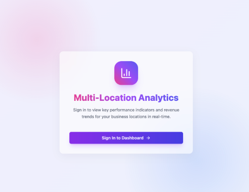
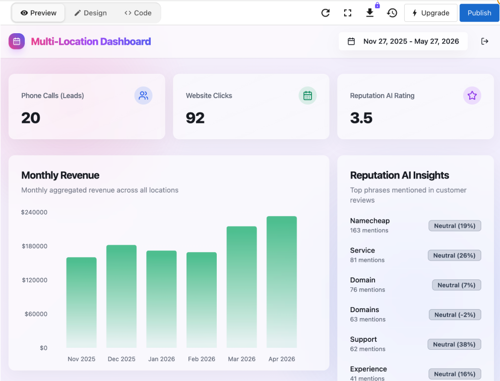
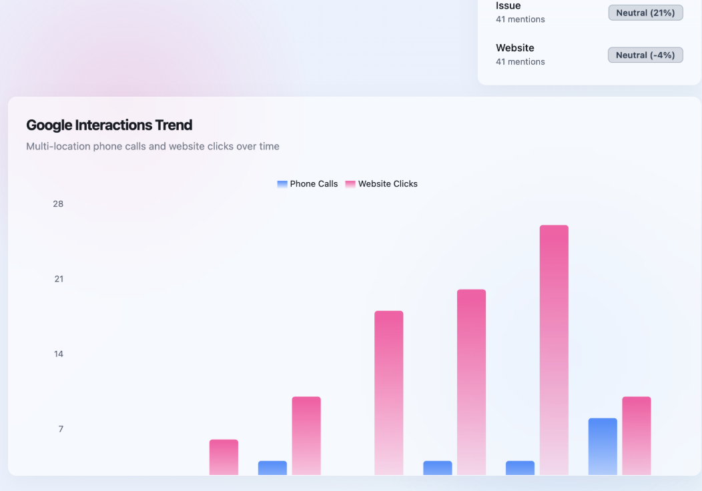

# Build a Custom Multi-Location Dashboard

Business App includes a built-in multi-location dashboard, but it's designed to cover a wide range of use cases. Building a custom version with Vibe makes sense when you want a dashboard organized exactly the way your business reviews performance, with a branded sign-in gate, only the metrics that matter, and a layout your team can check at a glance.

## When to build a custom dashboard

The SSO connector gates the dashboard to members of your Business App account, making this a strong fit when:

- **You want a focused view for your team,** giving owners, area managers, or staff a clean performance dashboard without navigating the full Business App interface
- **The layout should match how you review data,** putting revenue, leads, bookings, and reputation in the order and format that fits your actual workflow, not a default arrangement
- **You want a branded, dedicated experience,** a standalone app with its own sign-in screen feels different from a dashboard tab inside a larger platform

:::note
The SSO connector signs in users with their existing Business App account credentials. Only people who already have access to your Business App account can sign in. If you need to share data with someone who has no Business App access at all, SSO is not the right approach for that.
:::

## Before you start

This use case requires two connectors, enabled in the correct order. Open **Project Settings**, scroll to **Shared connectors**, and turn them on in this sequence:

1. Toggle **Single sign-on** on first.
2. Toggle **Analytics** on.

SSO must come first. It gates the dashboard to members of your Business App account — if it isn't enabled first, the sign-in UI will appear but authentication will not complete. Both need to be on before you run any of the prompts below.

## The prompts

**Starting prompt:**

> Build an owner dashboard for this multi-location business. Show a summary card for each location with total leads this month, bookings this week, and average review rating. Add a bar chart comparing monthly revenue across all locations, and a date-range picker at the top so I can compare any two time periods.

**To connect real Reputation AI data:**

> Please add in the Reputation AI Average Review rating for multi-location group [your-group-ID]

**To pull in live data across the rest of the dashboard:**

> Please add in the other real data for this multi location group

**To connect leads and bookings:**

> Can you add in leads and booking information from the multi-location group now?

**To fill in the revenue chart:**

> Can we fill in the monthly revenue box?

**To add a sign-in gate:**

> Gate the dashboard behind a sign-in screen so only authorized users can view the data.

**To apply visual polish:**

> Can you make the whole page more visually pretty but making it multi-coloured

## What Vibe built

From those prompts, Vibe produced a gated, fully connected dashboard with:

- **SSO login screen,** a branded sign-in page requiring Business App account authentication before the dashboard loads
- **Three summary metric cards,** Phone Calls (Leads), Website Clicks, and Reputation AI Rating, each pulling live data from the connected multi-location group
- **Monthly Revenue chart,** a bar chart showing aggregated revenue across all locations by month
- **Reputation AI Insights panel,** a ranked list of the top phrases mentioned in customer reviews, each with a mention count and sentiment score
- **Google Interactions Trend chart,** a dual-series bar chart tracking phone calls and website clicks over time across all locations
- **Date range selector,** a filter in the top right that updates all charts and metrics simultaneously

## What made this work

**Using the group ID pulled real data.** Prompting with the specific multi-location group ID told Vibe exactly which account's data to connect. Without it, the dashboard used placeholder values. Once the group ID was in the prompt, the live metrics appeared.

**Connecting data one section at a time produced better results.** Trying to connect all data sources in a single prompt led to incomplete results. Breaking it into focused prompts, Reputation AI first, then leads and bookings, then revenue, gave Vibe a clear target each time and made it easier to spot what wasn't working yet.

**Visual polish works best as a final step.** Asking for a multi-coloured redesign early can overwrite structure that Vibe is still building. Saving the visual prompt for the end, once the data connections are working, means the redesign applies to a stable layout rather than a work-in-progress.

## Tips for this use case

**Find your multi-location group ID before you start.** You'll need it to connect real data. Including it in your prompt is the most reliable way to scope the data correctly rather than getting aggregate approximations.

**Use separate prompts to connect each data source.** Leads, bookings, revenue, and Reputation AI each connect differently. If one section shows empty or placeholder data, prompt specifically for that section rather than asking Vibe to fix everything at once:

> The leads section isn't showing data. Connect it to the multi-location group and pull the real figures.

**SSO doesn't work inside an iframe.** The OAuth redirect flow can't complete inside an embedded frame. If you want to embed this dashboard somewhere, either open it in a new tab or ask Vibe to implement sign-in as a pop-up instead:

> Change sign-in to use a pop-up window instead of a redirect so it works when the app is embedded.

**Add a location-level breakdown as a follow-up.** The initial output aggregates data across all locations. Once the summary view is working, drill down:

> Add a table below the charts that breaks down phone calls and website clicks by individual location, sortable by each column.

**Test the date range filter before publishing.** Click through several date ranges and confirm that all charts and metrics update together. If any element stays static, prompt to reconnect it:

> The monthly revenue chart isn't responding to the date range filter. Fix it so it updates when the date range changes.
