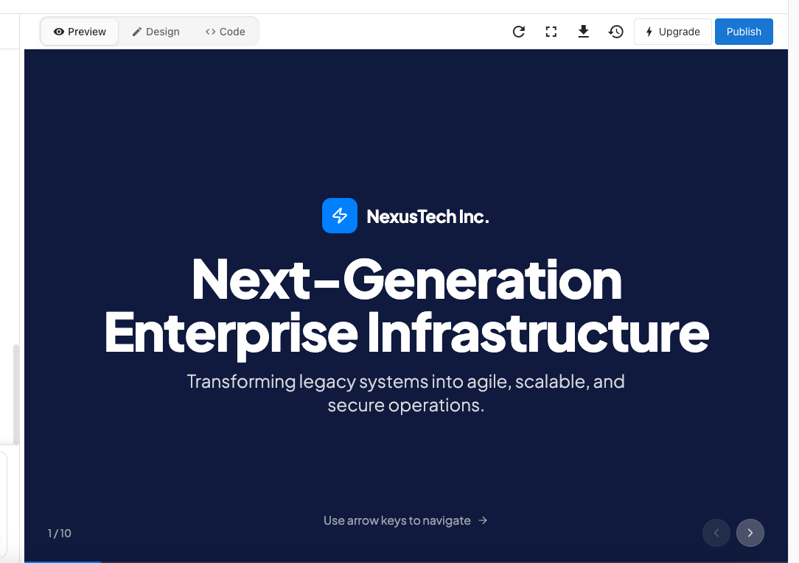
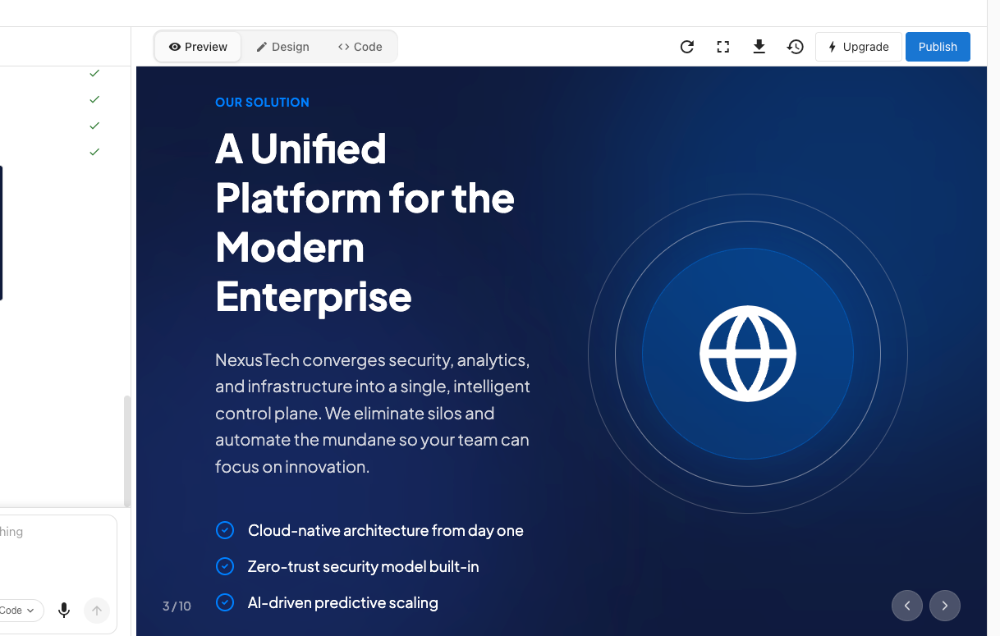
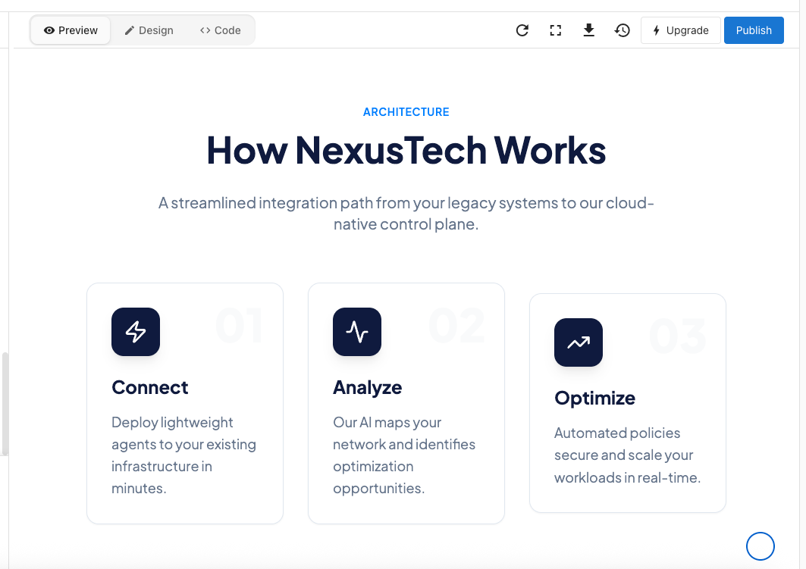
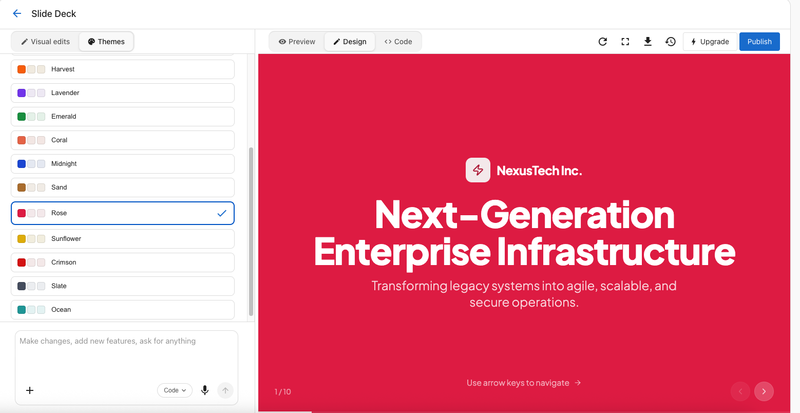

import Tabs from '@theme/Tabs';
import TabItem from '@theme/TabItem';

# Vibe a slide deck presentation

A slide deck is one of the fastest things you can build with Vibe. No connectors, no integrations, no external data sources required. Give Vibe a topic, a structure, and a visual direction, and it produces a polished, fully navigable presentation in minutes, making it a strong option for pitches, onboarding walkthroughs, or internal presentations.

<div
  className="wistia_responsive_padding"
  style={{ padding: '56.25% 0 0 0', position: 'relative' }}
>
  <div
    className="wistia_responsive_wrapper"
    style={{ height: '100%', left: 0, position: 'absolute', top: 0, width: '100%' }}
  >
    <iframe
      src="https://fast.wistia.net/embed/iframe/k7hkvu2dlc?web_component=true&seo=true"
      title="Vibe a Slide Deck Presentation Video"
      allow="autoplay; fullscreen"
      allowTransparency
      frameBorder="0"
      scrolling="no"
      className="wistia_embed"
      name="wistia_embed"
      width="100%"
      height="100%"
    ></iframe>
  </div>
</div>
<script src="https://fast.wistia.net/player.js" async></script>

:::caution[Before you start]
Vibe builds a **web-based presentation**, not a downloadable file. Here's what that means in practice:

- The slide deck runs in a browser and is navigated with arrow keys or on-screen buttons.
- There is no export to PowerPoint (.pptx) or Google Slides.
- The deck can be shared as a live link or embedded, but it cannot be opened in another presentation app.

If you need to share a .pptx file that someone else can edit, or present from a saved local file, Vibe is not the right tool for that job.
:::

## The prompt

```
Build a clean, professional 10-slide presentation for a corporate technology pitch. Include a title slide, the problem we're solving, our solution, key features, a results section with stats, a short case study, and a closing call to action. Use a modern navy-and-white design with smooth transitions and arrow-key navigation.
```

## Example output

Here's a sample of what Vibe produced from that prompt in a single generation:

<Tabs>
  <TabItem value="title" label="Title slide">
    
  </TabItem>
  <TabItem value="solution" label="Solution slide">
    
  </TabItem>
  <TabItem value="architecture" label="Architecture slide">
    
  </TabItem>
</Tabs>

## Why this prompt works

This prompt gives Vibe four things it needs to produce a strong first version:

- **A clear format and scope.** "10-slide presentation" tells Vibe exactly what it's building and how long it should be.
- **A natural slide structure.** Listing the slides as a sentence, rather than a numbered list, reads the way a brief would, and Vibe interprets it that way.
- **Specific visual direction.** "Modern navy-and-white design with smooth transitions" removes ambiguity about how the deck should look and feel.
- **An explicit navigation method.** Calling out arrow-key navigation ensures that feature is built in from the start, rather than added as an afterthought.

The result is a fully structured deck, not a blank template, that you can immediately review and refine.

## Tips to customize

Once Vibe produces the first version, use follow-up prompts to tailor it. A few examples:

{/* THEMES: restore when themes/colour palette feature launches:
**Change the color palette:**
> Change the color scheme to white and forest green with gold accents. Keep the same layout and structure.
*/}

**Add a testimonials slide:**
> Add a testimonials slide after the case study. Include three short quotes with a customer name and company below each one.

**Swap the topic:**
> Rebuild this as a pitch for a local landscaping company instead of a technology company. Keep the same 10-slide structure and visual style.

## Editing your deck with visual edits

For smaller visual changes, you can edit elements directly without writing a new prompt. Turn on the **Visual edits** button in the chat composer to enter the visual editor.

**Editing a specific element:**
Click on any element on the slide — a heading, a block of text, a background — and the left panel updates to show options for that element:

- **Text** — Edit the copy directly in the text field
- **Colors** — Change the background color or text color using a hex value or the color picker
- **Layout** — Adjust how the element is positioned on the slide
- **Spacing** — Change the margins around the element

{/* THEMES: restore the following block when themes feature launches:
**Changing the overall theme:**
Select the **Themes** tab at the top of the left panel to apply a new visual style across the entire deck at once. This is faster than editing individual slides when you want a full look-and-feel change.


*/}

**Navigating between slides while editing:**
Use the arrow buttons in the bottom-right corner of the preview, or your keyboard arrow keys, to move between slides. The counter in the bottom-left (for example, 1/10) shows which slide you're on.
