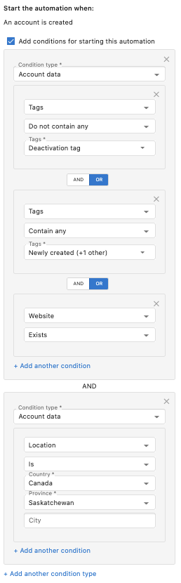

Trigger conditions allow you to further filter the triggers that start your workflows. There are a number of trigger conditions you can filter on, including tags, contact fields, account location, and more.

When applying multiple conditions, you can specify which logical operator (AND or OR) should be used when putting these conditions together.

**OR Operator**

When using the OR operator, the trigger conditions are met when ***any*** of the conditions in the group are met. In the example below, the conditional group in the top box is met if *either* the contact created does not contain the *Deactivation tag* **OR** it contains the *Newly created* tag **OR** a *Website exists*.

**AND Operator**

When using the AND operator, the trigger conditions are met only when ***all*** the conditions in the group are met. In the example below, the AND operator is being used between the conditional group in the top box and the conditional group in the bottom box. The trigger conditions are met if one of the conditions is met from the top box **AND** the condition is met in the bottom box.

## Best Practices

- Use AND conditions when all criteria must be met
- Use OR conditions when any criteria can trigger the automation
- Keep conditions simple and testable
- Document complex condition logic
- Regularly review and update conditions as your business changes
