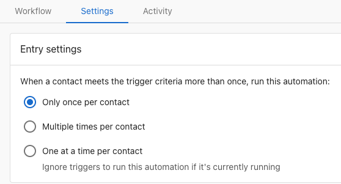
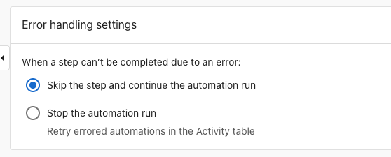

# Workflow settings

Each workflow has a Settings tab where you control how and when it runs. These settings help you avoid duplicate runs, manage errors gracefully, and ensure workflows behave as expected.

## Where to find settings

1. Go to Business App > Workflows
2. Open a workflow
3. Select the **Settings** tab
4. Configure entry settings and error handling options

## Entry settings

Entry settings control how frequently a workflow can run for the same contact or company. Many trigger events and conditions can be met multiple times. For example, A customer makes a payment trigger with the trigger options set to Succeeds or fails will fire each time a customer attempts to pay for an invoice or shopping cart purchase. The entry settings allow you to specify whether you want the workflow to start only the first time the trigger criterion is met or every time.

| Setting | What It Does | When to Use | Example |
|---------|--------------|-------------|---------|
| **Only once per contact** | Runs a single time for each contact, ever | One-time steps that should never repeat | Send welcome email when contact is created |
| **Multiple times per contact** | Runs every time the trigger conditions are met | Recurring notifications or event responses | Log activity when email is opened |
| **One at a time per contact** | Ensures a new run starts only after the previous one finishes | Workflows that update the same fields or have dependencies | Update lead score based on multiple criteria |

:::warning
If your workflow updates the same record (for example, applies tags or updates fields), prefer "One at a time per contact" to avoid overlapping runs and duplicate changes.
:::

## Error handling

Error handling settings determine what happens when a step in your workflow fails (for example, if a required field is missing or an API call times out). If at any point a step fails to complete, you can choose to have your workflow ignore the error and continue with the following steps, or stop that specific workflow run.

| Setting | What It Does | When to Use | Example |
|---------|--------------|-------------|---------|
| **Skip the step and continue** (Recommended) | Workflow continues to next step even if one fails. Failed steps are logged in Activity tab | Non-critical steps that don't depend on each other | Send notification + update CRM field (if notification fails, field still updates) |
| **Stop the workflow run** | Entire workflow stops if any step fails. No further steps execute | When later steps depend on earlier ones completing successfully | Create opportunity → Add note → Assign to rep (can't add note if opportunity creation failed) |

:::tip
Use "Skip and continue" for non-critical steps like logging or tagging. Use "Stop on error" when steps must complete in sequence (for example, create opportunity → add note → assign to rep).
:::

## Timezone Configuration

Set your preferred timezone for time-based workflow steps and scheduling.

## Notification Settings

Subscribe to error notifications to be alerted when workflows encounter issues.

## Frequently asked questions

What happens if I change entry settings after the workflow is running?

The new settings apply to future runs only. Past runs are not affected. For example, if you switch from "Only once" to "Multiple times," contacts who already ran through the workflow can go through it again on the next qualifying trigger.

Can I see which setting caused a workflow to skip?

Yes. Check the Activity tab for the workflow. If a run was skipped due to entry settings, you'll see a note indicating the contact already entered the workflow (for "Only once" setting) or that another run is in progress (for "One at a time" setting).

How do I reset "Only once per contact" for testing?

You can't reset the entry history directly. Instead, create a new test contact or clone the workflow for testing purposes. Once testing is complete, delete the test workflow and use the original.

What counts as an "error" for error handling purposes?

Errors include: missing required fields (phone for SMS, email for email steps), API timeouts, invalid data formats, permission issues, or external service failures. Conditions not being met is not an error—the workflow simply won't run.

Can different steps have different error handling?

No. Error handling is set at the workflow level and applies to all steps. If you need different error handling for different steps, consider splitting them into separate workflows.

## Related resources

- [Workflow activity & history](automation-activity.md) - Monitor and troubleshoot workflow runs
- [Messaging steps](use-cases/action-messaging.md) - Configure SMS and email steps
- [Workflows overview](index.mdx) - Learn the basics of creating workflows
