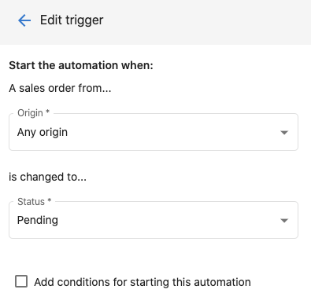
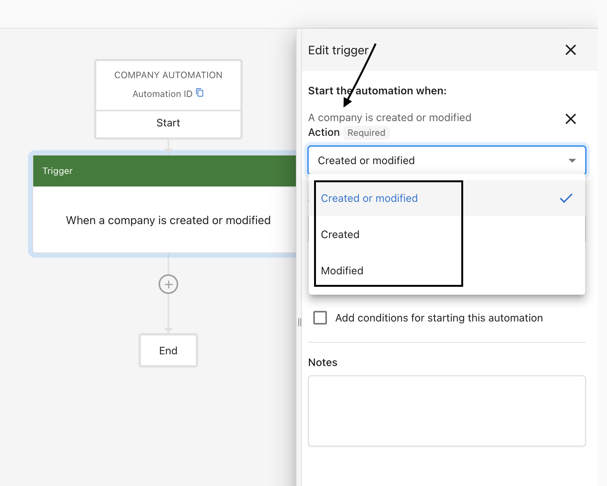

Automation triggers are specific actions that start your workflows. There are numerous triggers to choose from, and we're frequently adding more.

Some triggers are simple and are ready out-of-the-box. For example, the **A contact is created** trigger will start whenever any contact is created. Other triggers may require specifying trigger options. For example, the **A sales order status is changed** trigger requires that you specify the sales order origin and status that it's changed to.

## Example: Company trigger

The **When a Company is created or modified** trigger is a good example of a trigger that requires options. Instead of firing on every company update, you can specify which fields must change for the automation to run.

**Step 1** – Go to **Business App** → **Automations**.

**Step 2** – Create an automation and set the trigger to **When a Company is created or modified**.

**Step 3** – In the side panel, choose the fields that must change for the automation to run. This prevents every company update from triggering the automation.

**Step 4** – Turn the automation on using the toggle at the top right.

**Step 5** – You can also choose which updated field(s) trigger the automation.

## Trigger Configuration Tips

Choose the most specific trigger that matches your use case and think about how often it will fire. If a trigger could fire many times at once, make sure your workflow can handle that scale. Always test with real data before going live.

### Common Trigger Patterns

1. **Welcome Sequences**: Use "contact created" or "user added" triggers
2. **Follow-up Workflows**: Use "campaign activity" or "task status changed" triggers
3. **Payment Processing**: Use "payment made" triggers with success/failure options
4. **Lead Nurturing**: Use "contact created" or "lead stage changed" triggers

## Trigger Reference

### Companies

| Trigger | Description |
|---|---|
| A call activity is created or modified for a company | Fires when a call is logged or updated on a company record |
| A company is added to a list | Fires when a company is added to a CRM list |
| A company is created or modified | Fires when any company record is created or a specified field changes |
| A form is submitted for a company | Fires when a form submission is associated with a company |
| A company is removed from a list | Fires when a company is removed from a CRM list |
| An email activity is created or modified for a company | Fires when an email is logged or updated on a company record |
| A meeting activity is created or modified for a company | Fires when a meeting is logged or updated on a company record |
| A note activity is created or modified for a company | Fires when a note is created or updated on a company record |
| A CRM sales task is created or modified for a company | Fires when a sales task is created or updated for a company |
| A CRM sales task is overdue for a company | Fires when a sales task passes its due date for a company |

### Contacts

| Trigger | Description |
|---|---|
| A call activity is created or modified for a contact | Fires when a call is logged or updated on a contact record |
| A contact is added to a list | Fires when a contact is added to a CRM list |
| A contact is created or modified | Fires when any contact record is created or a specified field changes |
| A form is submitted for a contact | Fires when a form submission is associated with a contact |
| A contact is removed from a list | Fires when a contact is removed from a CRM list |
| An email activity is created or modified for a contact | Fires when an email is logged or updated on a contact record |
| A meeting activity is created or modified for a contact | Fires when a meeting is logged or updated on a contact record |
| A note activity is created or modified for a contact | Fires when a note is created or updated on a contact record |
| A CRM sales task is created or modified for a contact | Fires when a sales task is created or updated for a contact |
| A CRM sales task is overdue for a contact | Fires when a sales task passes its due date for a contact |

### Custom Objects

| Trigger | Description |
|---|---|
| A custom object is added to a list | Fires when a custom object record is added to a list |
| A custom object is created or modified | Fires when a custom object record is created or updated |
| A custom object is removed from a list | Fires when a custom object record is removed from a list |

### Opportunities

| Trigger | Description | Example Use Case |
|---|---|---|
| An opportunity is created or modified | Starts the workflow when an opportunity is created, moves into a new pipeline stage, and/or is closed. | When a new opportunity is created, send yourself a notification to follow up. |

### Inbox

| Trigger | Description |
|---|---|
| A contact communication summary is created | Fires when an AI-generated summary of a conversation is created for a contact |
| Web Chat captures a lead | Fires when a visitor submits their information through the Web Chat widget |

### Manual

| Trigger | Description | Example Use Case |
|---|---|---|
| Triggered manually for a company | Starts the automation on demand for a selected company, much like a shortcut you run whenever needed. | Manually tag or update a company record without waiting for a scheduled trigger. |
| Triggered manually for a contact | Starts the automation on demand for a selected contact, much like a shortcut you run whenever needed. | Manually kick off a follow-up sequence for a specific contact at any time. |

### Advanced

| Trigger | Description | Example Use Case |
|---|---|---|
| A webhook is received | Starts the automation when an external system sends a POST request to the given URL with a user-defined payload. | Connect your automation to a third-party tool or service that supports webhooks. |
| Triggered via Zapier | Starts the automation when the **Run Automation** action is used in the Zapier integration. | Trigger an automation from Zapier to update contacts in the CRM and pass along data from another app. |

### Time-based

| Trigger | Description |
|---|---|
| On a schedule | Runs the automation automatically at a set time and frequency (daily, weekly, etc.) |

### Integrations

| Trigger | Description |
|---|---|
| A Clio matter is closed | Fires when a matter is marked closed in Clio |
| A Dentrix appointment closed | Fires when an appointment is completed in Dentrix |
| FieldEdge work order finalized | Fires when a work order is finalized in FieldEdge |
| A Gingr reservation is checked out | Fires when a reservation is checked out in Gingr |
| A Housecall Pro job is finished | Fires when a job is marked finished in Housecall Pro |
| A Jobber job is completed | Fires when a job is completed in Jobber |
| A Jobber visit is completed | Fires when a visit is completed in Jobber |
| JobNimbus Contact Status Changed | Fires when a contact's status changes in JobNimbus |
| JobNimbus Job Status Changed | Fires when a job's status changes in JobNimbus |
| LightSpeed sale completed | Fires when a sale is completed in LightSpeed |
| Mindbody visit complete | Fires when a visit is completed in Mindbody |
| Mitchell Manager SE repair order complete | Fires when a repair order is completed in Mitchell Manager SE |
| A Napa TRACS repair order invoice closed | Fires when a repair order invoice is closed in Napa TRACS |
| A Napa TRACS Enterprise repair order invoice closed | Fires when a repair order invoice is closed in Napa TRACS Enterprise |
| PawLoyalty appointment checked out | Fires when an appointment is checked out in PawLoyalty |
| A PawPartner customer is checked out | Fires when a customer is checked out in PawPartner |
| A Petexec order is completed | Fires when an order is completed in Petexec |
| A Pet Resort Pro invoice is checked out | Fires when an invoice is checked out in Pet Resort Pro |
| A Protractor invoice is posted | Fires when an invoice is posted in Protractor |
| QuickBooks Desktop invoice or sales receipt updated | Fires when an invoice or sales receipt is updated in QuickBooks Desktop |
| A QuickBooks invoice is created or modified for a contact | Fires when a QuickBooks invoice is created or updated and linked to a contact |
| A QuickBooks payment is created or modified for a contact | Fires when a QuickBooks payment is created or updated and linked to a contact |
| A QuickBooks sales receipt is created or modified for a contact | Fires when a QuickBooks sales receipt is created or updated and linked to a contact |
| RBCS sales or service completed | Fires when a sale or service is completed in RBCS |
| A ROWriter repair order invoice closed | Fires when a repair order invoice is closed in ROWriter |
| A ServiceFusion job is closed | Fires when a job is closed in ServiceFusion |
| A ServiceMonster invoice is created for a contact | Fires when an invoice is created in ServiceMonster and linked to a contact |
| ServiceTitan Job Completed | Fires when a job is completed in ServiceTitan |
| A ShopBoss repair order invoice closed | Fires when a repair order invoice is closed in ShopBoss |
| A ShopMonkey invoice is paid | Fires when an invoice is paid in ShopMonkey |
| A Shopware repair order invoice picked up | Fires when a repair order invoice is picked up in Shopware |
| Tekmetric repair order posted | Fires when a repair order is posted in Tekmetric |
