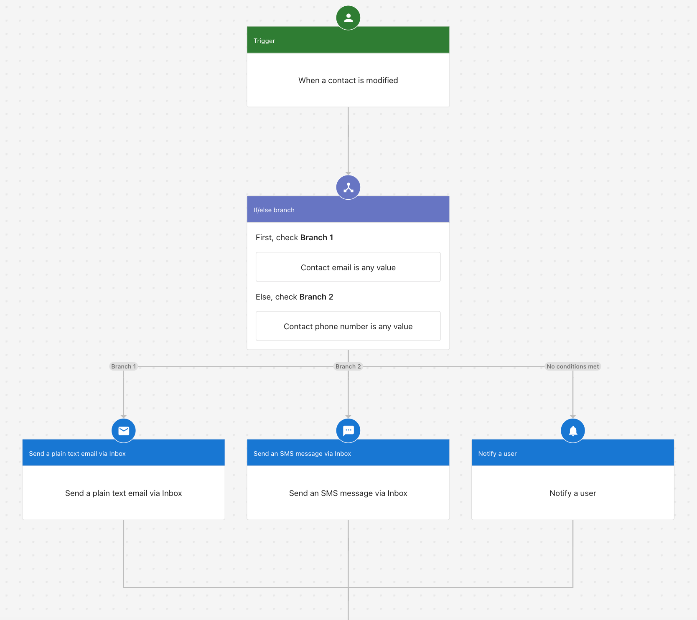

You can use automations in Business App to follow up with contacts by email or SMS after they open your campaign emails. This guide walks you through setting that up so you can engage people who have already shown interest.

Before you begin, make sure you have Conversations AI Pro and that your email and SMS setup is complete in Business App.

## Step 1: Create an automation

1. Create a new automation.
2. Set the trigger to **When a contact is modified** and use the field **Last campaign email open date**.
3. (Recommended) Add **contact tags** before this step and use them in **Additional conditions** in the trigger section so the automation runs only for the right contacts.

## Step 2: Add a follow-up step

Depending on what you want to do, you can:

- **Send a plain text email via Conversations** — a simple option for email follow-up.

- **Build a more advanced workflow** — for example, send follow-up by email, then by SMS or in-app notifications if needed.

When the automation runs, it will look similar to this:

