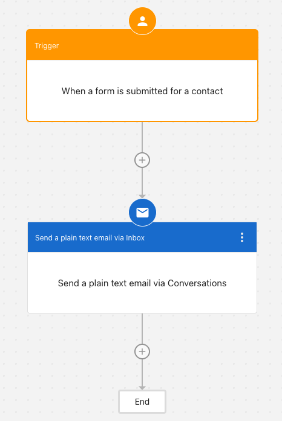
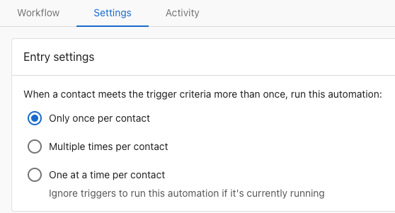
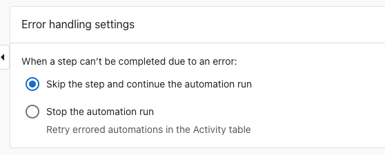

# Automations Overview
Automations let you create workflows that run on their own when specific events happen. Use them to save time, improve consistency, and respond to customers faster—without manual effort.

<div
  className="wistia_responsive_padding"
  style={{ padding: '56.25% 0 0 0', position: 'relative' }}
>
  <div
    className="wistia_responsive_wrapper"
    style={{ height: '100%', left: 0, position: 'absolute', top: 0, width: '100%' }}
  >
    <iframe
      src="https://fast.wistia.net/embed/iframe/er5hu3kuzk?web_component=true&seo=true"
      title="Automations overview walkthrough"
      allow="autoplay; fullscreen"
      allowTransparency
      frameBorder="0"
      scrolling="no"
      className="wistia_embed"
      name="wistia_embed"
      width="100%"
      height="100%"
    ></iframe>
  </div>
</div>
<script src="https://fast.wistia.net/player.js" async></script>

## What you can automate

- Send SMS or plain-text emails when a contact is created or updated
- Apply tags, update CRM fields, or create tasks based on activity
- Notify your team or log sales activities when messages are sent/received
- Kick off follow-ups after meetings, orders, or invoices
- Trigger workflows when a conversation summary is created
- Create tasks, notes, and logged calls on opportunities
- Get a response from an AI Employee as part of a workflow

## How it works

Every automation includes:

- **Trigger:** The event that starts your workflow (for example, When a contact is created)
- **Conditions:** Optional filters that must be met for the automation to run (for example, Contact has specific tag, or Company field equals value)
- **Actions:** What happens next (for example, Send SMS, Send plain-text email, Update company)

## How automations flow

```
            Event Occurs
                  ↓
              Trigger
                  ↓
         Are conditions met?
                  ↓
       ┌──────────┴──────────┐
       ↓                     ↓
      Yes                    No
       ↓                     ↓
  Execute Actions      Skip Automation
       ↓
    Complete
```

For example: **Form submitted** (event) → **When form is submitted for a contact** (trigger) → **Contact has "New Lead" tag?** (condition) → **Send welcome email** (action) → **Complete**

## Getting started

There are two ways to create an automation: start with a pre-built template or build your own from scratch. Templates are the fastest way to get started—they come with triggers and actions already configured, so you just customize them for your business. Building from scratch gives you complete control over every step.

**To use a template:**

1. Go to Business App > Administration > Automations
2. Select `Create Automation`

<div style={{ textAlign: 'center' }}>
  
</div>

3. Choose a template from the gallery that matches your goal
4. Customize the trigger, conditions, and actions as needed
5. Save and toggle your automation **On**


**To build your own automation from scratch:**

1. Go to Business App > Administration > Automations
2. Select `Create Automation`

3. Choose **Blank** to start from scratch. The automation builder opens with a workflow canvas.


4. **Add a Trigger**: Select a trigger from the left menu to choose the event that starts your workflow
   - Example: "When a form is submitted for a contact", "Contact created", "Meeting booked"
   - Add **Conditions** if needed to filter when it runs

<div style={{ textAlign: 'center' }}>
  
</div>

5. **Add an Action**: Select an action from the left menu to define what happens when the trigger fires
   - Example: "Send a plain text email via Inbox", "Send SMS", "Create task"
6. Save and toggle your automation **On**

Here is an example of a simple automation workflow. This example shows an automation that sends an email when a form is submitted for a contact.

<div style={{ textAlign: 'center' }}>



</div>

## Automation settings

Each automation has a settings tab where you control how and when your workflow runs.

### Entry settings



- Only once per contact: Run a single time for each contact
- Multiple times per contact: Run every time the trigger conditions are met
- One at a time per contact: Ensure a new run starts only after the previous one finishes

:::warning
If your automation updates the same record (for example, applies tags or updates fields), prefer "One at a time per contact" to avoid overlapping runs and duplicate changes.
:::

### Error handling

- Skip the step and continue: Recommended in most cases
- Stop the automation run: Use when later steps depend on earlier ones

:::tip
Use "Skip the step and continue" for non-critical actions like logging or tagging so the rest of the workflow can complete.
:::

### Review activity

Use the Activity tab on an automation to see what ran, when it ran, and whether it succeeded. This is helpful for verification and troubleshooting.

## Additional resources

- [Messaging actions](messaging.md)
- [Templates and recipes](templates-and-recipes.md)
- [Zapier integration](zapier.md)

## Frequently asked questions (FAQs)

<details>
<summary>Can I get a response from an AI Employee inside an automation?</summary>

Yes. Add the "Get a response from an AI Employee" action to send context (for example, a conversation summary or form submission) to your AI Employee and use the response later in the workflow.
</details>

<details>
<summary>How do I trigger automations for entire lists?</summary>

Use the **"Start automation for a list"** action in your automation builder. Select your target list (contacts, companies, or custom objects) and choose which automation to run. The automation will execute for each record in the list.
</details>

<details>
<summary>What are getter actions in automations?</summary>

Getter actions let you retrieve related data during automation runs. For example, "Get company from contact" retrieves company information when your automation is processing a contact record. This helps you work with connected data across your CRM.
</details>

<details>
<summary>What's the difference between regular automations and list automations?</summary>

Regular automations trigger based on events (like "when a contact is created"). List automations let you manually trigger a workflow for an entire existing list of records, making them ideal for bulk operations and targeted campaigns.
</details>
