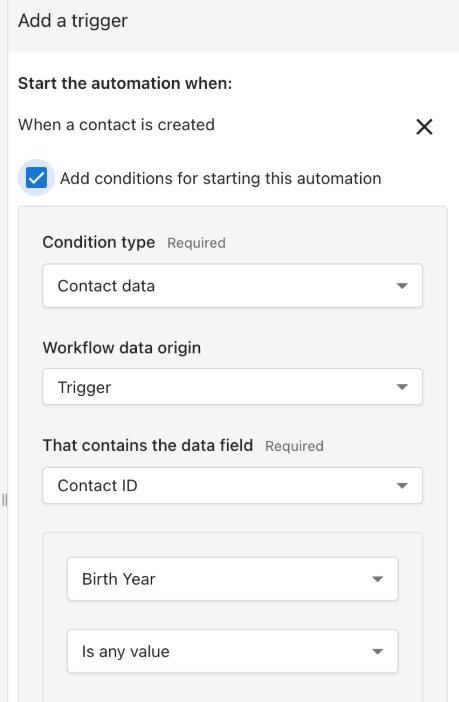
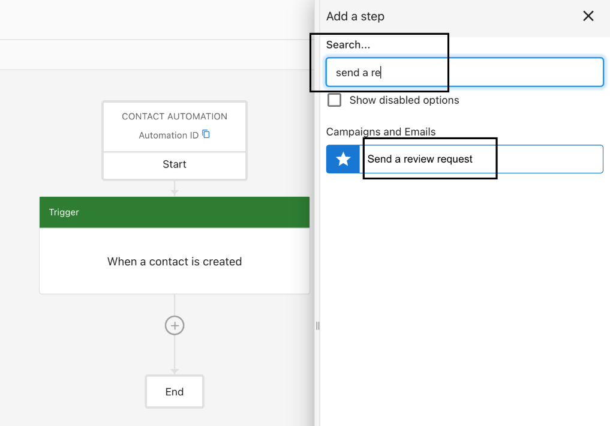
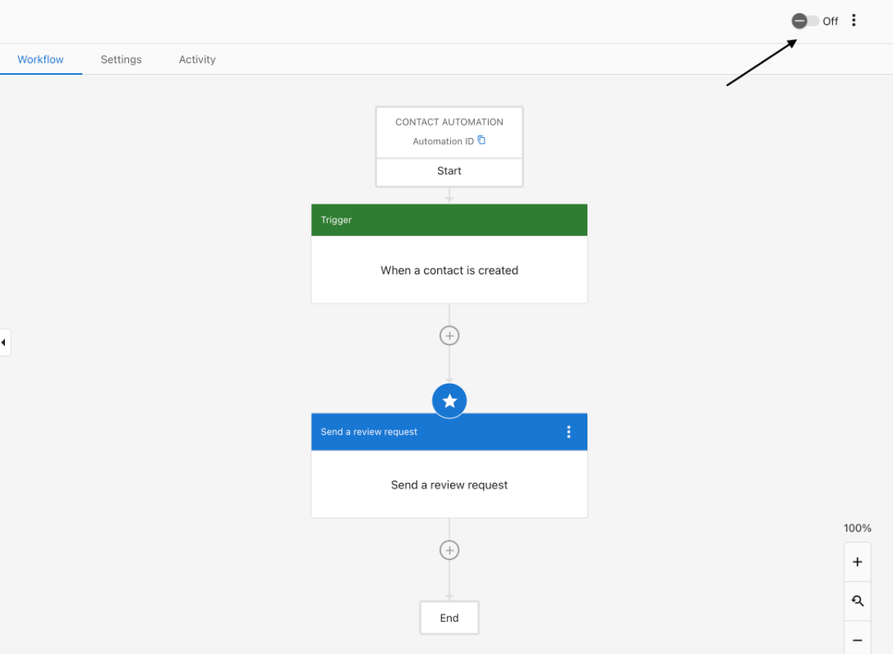
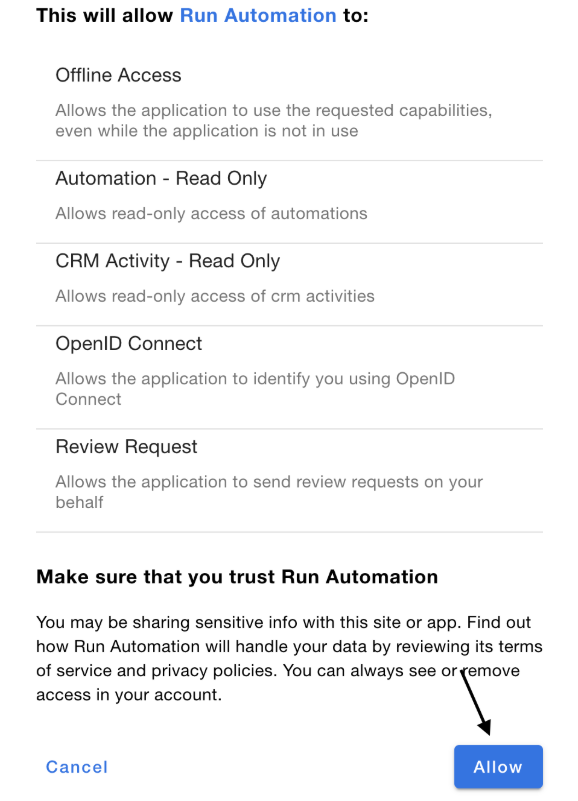

Get started fast with pre‑built templates and step‑by‑step recipes you can customize.

## Using templates

1. Go to Business App > Administration > Automations
2. Select Create Automation
3. Choose a template from the gallery (or search for one)
4. Review the suggested trigger, conditions, and actions
5. Edit as needed, Save, and toggle On

### Popular: Review request after service

Purpose: Automatically follow up with customers to request a review after a service is completed or a lead is converted.

:::note
Requirements: Reputation AI Premium is a required product for the `Send review request` action. Messaging actions require Conversations Pro.
:::

Steps:
1. Create Automation
2. Choose a Trigger (for example, When a contact is created)
3. Add Action > Send review request
4. Configure and Save
5. Toggle On and allow the confirmation prompt

Images for the review request flow are available here:
- 
- 
- 
- 

## FAQs

Is this paid?

Automations are available to all Business App users. Specific actions (for example, SMS and plain‑text email) require Conversations Pro.

