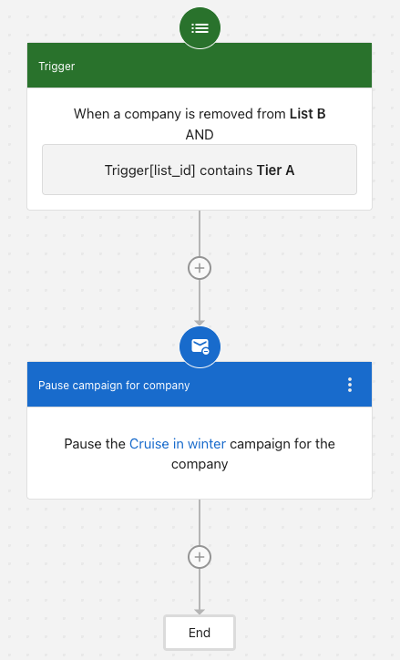

When a lead books a meeting, bounces an email, or drops off a target list, continuing to send campaign messages can feel irrelevant — or worse, damage the relationship. You can build automations that pause campaigns automatically when conditions change, so your outreach stays timely without manual intervention.

## When to use this

- A contact books a meeting and no longer needs nurture emails
- An email bounces and you want to stop further sends to that contact
- A company is removed from a target list and should stop receiving campaign messages
- A lead score drops below a threshold and outreach should pause until the lead re-qualifies

## Example: Pause a campaign when a company leaves a target list

You're running a "Cruise in winter" campaign for Tier A companies. When a company is removed from List B, and that list is tagged as Tier A, you want to automatically pause the campaign for that company.

1. **Trigger:** Set the trigger to **When a company is removed from a list** and select **List B**.
2. **Condition:** Add a condition where `list_id` contains **Tier A**.
3. **Action:** Add the **Pause campaign for company** step and select the **Cruise in winter** campaign.

When a company is removed from List B, the automation checks if the list ID contains "Tier A". If true, it pauses the "Cruise in winter" campaign for the entire company, stopping all campaign messages to every contact in that organization.

:::tip
Add a **Delay** step before the pause action to give leads time to re-engage before the campaign stops.
:::

## Contact-level vs. company-level pausing

| Level | Step name | When to use |
|-------|-----------|-------------|
| Contact | Pause campaign for contact | A specific lead takes action (books a meeting, bounces an email) |
| Company | Pause campaign for company | A business as a whole goes cold or no longer qualifies, and you want to stop outreach to all associated contacts |

You can combine both in the same automation — for example, pause a contact's campaign immediately on bounce, and pause the company's campaign if all contacts in that company have bounced.
