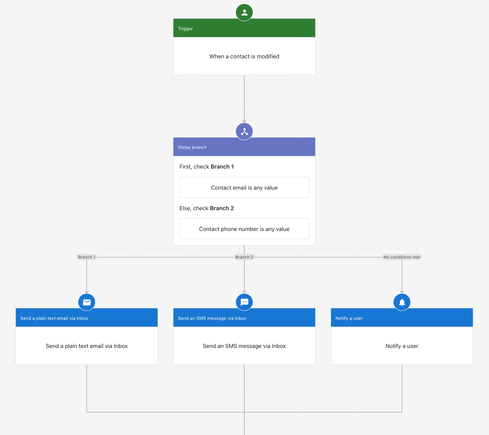
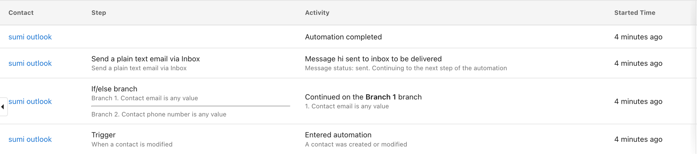

When a contact opens one of your campaign emails, they're signaling interest. Following up quickly — with a personal email or SMS — can turn that interest into a conversation. You can build an automation that triggers the moment a campaign email is opened, so you never miss that window.

:::note
This automation requires Conversations AI | Pro with email and SMS setup complete.
:::

## When to use this

- A contact opens a promotional email and you want to send a personalized follow-up
- You're running a campaign and want to escalate engaged contacts with a phone call or SMS
- You want to re-engage warm leads automatically without monitoring open rates manually

## How to set it up

1. Create a new automation and set the trigger to **When a contact is modified** with the field **Last campaign email open date**.
2. (Recommended) Tag the contacts you want to target beforehand and add those tags as **Additional conditions** in the trigger, so the automation only runs for the right audience.

3. Add your follow-up action. You have two options:

**Simple follow-up** — Send a plain text email via Conversations to acknowledge their interest and continue the conversation.

**Multi-step follow-up** — Send an email first, then follow up with SMS or in-app notifications if the contact doesn't respond.

When the automation runs, the Activity tab shows each step that executed for the contact:

