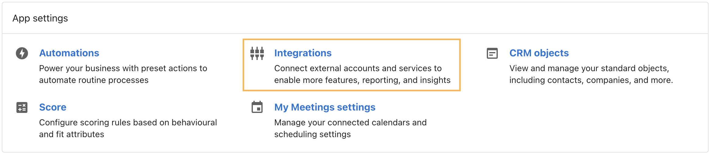
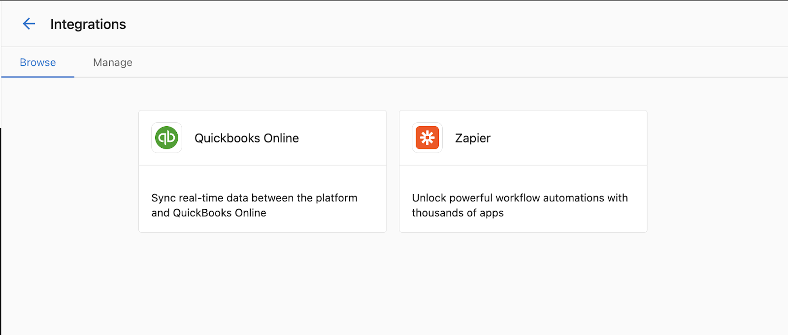
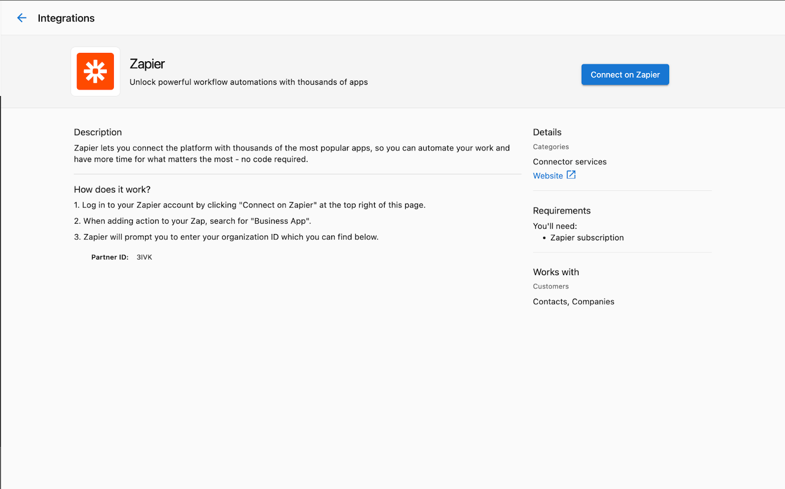
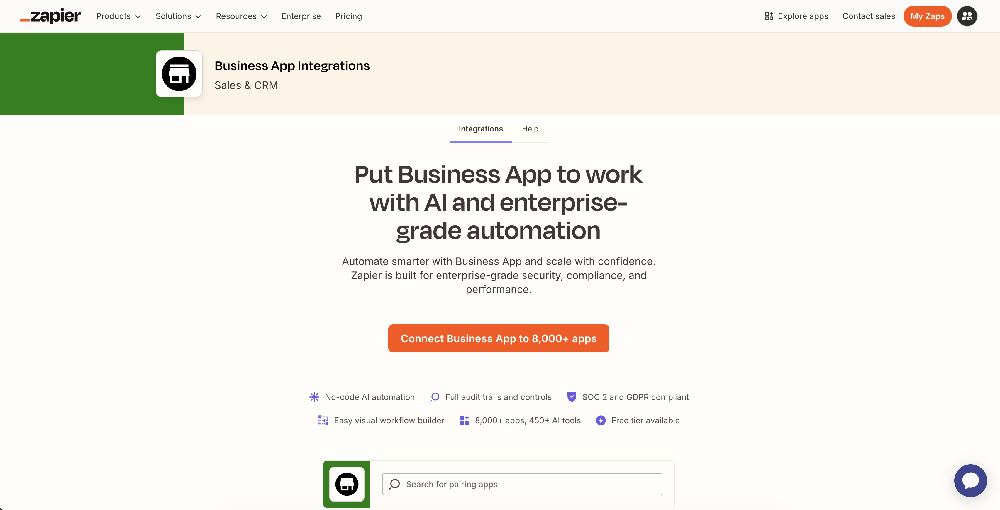

Zapier is an automation platform that connects thousands of apps and services. With Business App's Zapier integration, you can link your automations to the other tools you already use — in both directions — without writing any code.

The integration works in two ways:

- **Zapier triggers Business App** — An event in another app (such as a new payment in QuickBooks) fires one of your Business App automations.
- **Business App triggers Zapier** — A step inside one of your automations sends data out to Zapier when something happens in Business App, which can then trigger actions in other apps.

## What you can do

| Direction | What it does | Example |
|---|---|---|
| **Zapier → Business App** | Use the **Run Automation** action in Zapier to fire any of your automations | New QuickBooks payment → send a review request to the customer |
| **Business App → Zapier** | Use the **Send a webhook** step in your automation to push data out to Zapier | Contact created in Business App → add the contact to your HubSpot CRM |

## Why use the Zapier integration?

- **Automate across your tools** — connect the apps you use daily without manual data entry
- **React to external events** — let your automations respond to things that happen outside Business App
- **Push data outward** — keep external systems in sync when contacts, companies, or activities are created or updated
- **No coding required** — everything is configured through Zapier's visual builder and the Business App automation builder

## Connecting Business App to Zapier

1. In Business App, go to **Administration** > **Integrations**

2. Locate the Zapier tile

3. Click **Connect** to be directed to Zapier

4. On the Zapier page for Business App, you can browse existing Zap templates or start building your own

Once connected, your Business App account is linked to Zapier. You only need to do this once — the same connection is used across all your Zaps.

## How to get started

Choose the direction that fits your use case:

- [Zapier triggers Business App](./zapier-triggers-business-app) — an event in another app fires one of your automations
- [Business App triggers Zapier](./business-app-triggers-zapier) — an automation step pushes data out to Zapier

## Frequently Asked Questions

Do I need a paid Zapier plan?

Basic Zaps can be created on a free Zapier account. More complex multi-step Zaps may require a paid Zapier plan. Check Zapier's pricing for details on plan limits.

Does the automation need to be turned on for Zapier to trigger it?

Yes. The automation must be active (toggled on) for it to run when triggered via Zapier. If the automation is off, incoming Zapier triggers will be ignored.

Can I use the same Zapier account for multiple automations?

Yes. Once you connect your Business App account to Zapier, you can use it across as many Zaps as you need. You only go through the sign-in and permissions step once.

What trigger does my automation need to use for Zapier to fire it?

Your automation must use the **Triggered via Zapier** trigger, found under the Advanced section of the trigger picker. See [Zapier triggers Business App](./zapier-triggers-business-app) for the full setup.

Can I send data from Business App to any app that's in Zapier?

Yes. The **Send a webhook** step posts data to a Zapier webhook URL, and from there you can connect to any of the 6,000+ apps available in Zapier. See [Business App triggers Zapier](./business-app-triggers-zapier) for the full setup.

What happens if a Zap fails?

Zapier logs all Zap runs and failures in your Zapier account under **Zap History**. You can review errors there and re-run failed tasks. Setting up error notifications in Zapier is recommended so you're alerted if something goes wrong.

Can I test a Zap before turning it on?

Yes. Both Zapier and the Business App automation builder have test options. Always test before publishing to make sure data is being passed correctly between systems.

Is there a limit to how many Zaps I can create?

Zapier's own plan limits apply to the number of Zaps and tasks you can run. Business App does not impose a separate limit on Zapier connections.

