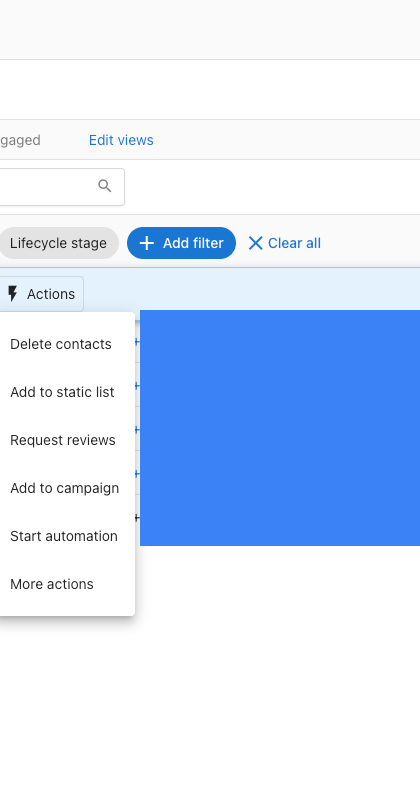
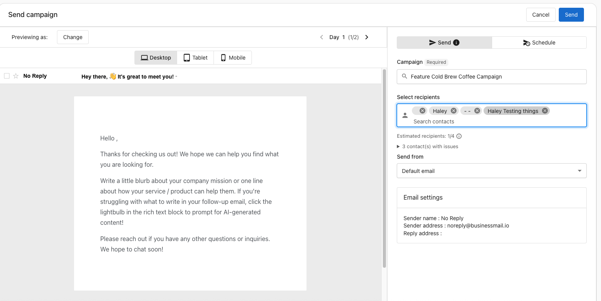
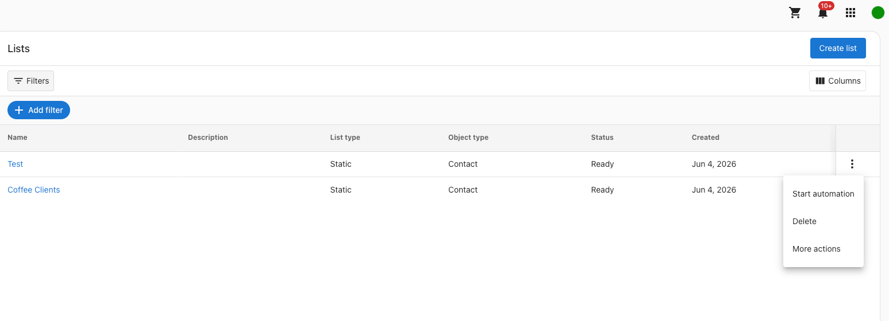
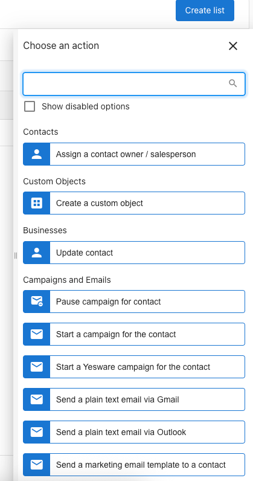
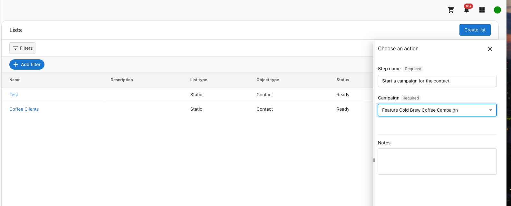

Publishing a campaign does not send it automatically. After you publish, you need to add contacts or a list as recipients to begin sending. You can do this directly from the Contacts table, through a workflow from Contacts, or by starting a workflow from a List.

## Prerequisites

Before you can send a campaign, make sure you have:

- A published campaign (see [Campaigns](index.mdx))
- Contacts added to your CRM (see [Contacts](../crm/contacts/index.md))
- Optionally, a static or smart list created in CRM (see [Lists](../crm/lists.md))

## How to send a campaign

### Add contacts directly to a campaign

Use this method to send a campaign to one or more specific contacts immediately or on a schedule.

1. Go to **CRM** > **Contacts**
2. Select one or more contacts using the checkboxes
3. Click `Actions` in the bulk action bar

4. Select `Add to campaign`
5. On the Send campaign page:
   - Choose your campaign from the dropdown
   - Review or adjust the recipient list
   - Select a **Send from** address
   - Preview the email using the **Desktop**, **Tablet**, or **Mobile** view tabs

6. To send immediately, click `Send`
7. To schedule for a later time, select the **Schedule** tab, set your date and time, then confirm

:::note
Contacts without a valid email address appear as "contacts with issues" and are excluded from sending. The **Estimated recipients** count reflects only contacts who will actually receive the email.
:::

### Start a workflow from Contacts

Use this method to enroll selected contacts into a campaign-based workflow.

1. Go to **CRM** > **Contacts**
2. Select one or more contacts using the checkboxes
3. Click `Actions` > `Start workflow`
4. Select a campaign-based workflow to enroll the selected contacts

The workflow runs immediately for the selected contacts and enrolls them according to the workflow's configured steps and delays.

### Start a workflow from a List

Use this method to enroll all current members of a list into a campaign at once.

1. Go to **CRM** > **Lists**
2. Find your list and click the three-dot menu (`...`)

3. Select `More actions`

4. In the **Choose an action** panel, select `Start a campaign for the contact` under **Campaigns and Emails**

5. Enter a step name
6. Choose your campaign from the **Campaign** dropdown
7. Click `Run` to start the campaign

The campaign starts immediately for all current members of the list. Contacts added to the list after this point are not enrolled unless you repeat the action or configure a membership trigger.

## Send campaign page

When you add contacts directly to a campaign, the Send campaign page gives you a full overview before you confirm.

- **Email preview**: Switch between **Desktop**, **Tablet**, and **Mobile** views to see how the email renders
- **Day navigation**: Use the arrows to browse through each step in a multi-step campaign
- **Campaign selection**: Choose which published campaign to send
- **Recipients panel**: Add or remove individual contacts before sending
- **Send from address**: Select which sender address to use for this send
- **Email settings summary**: Review the sender name, sender address, and reply address
- **Estimated recipients**: The total number of contacts that have the required information for each step in the campaign — email addresses for email steps and phone numbers for SMS steps

## Frequently Asked Questions

Why doesn't my campaign send after I publish it?

Publishing a campaign makes it available to send, but does not trigger sending automatically. You need to add recipients using one of the three methods above.

What are "contacts with issues"?

Contacts with issues are contacts that are missing the required information for a campaign step — an email address for email steps, or a phone number for SMS steps. They appear in the Send campaign page but are excluded from the estimated recipient count and will not receive that step.

Can I schedule a campaign send for a future date?

Yes. On the Send campaign page, select the **Schedule** tab instead of sending immediately, then choose the date and time for delivery.

Can I add recipients to a campaign that is already sending?

Yes. You can add eligible contacts or lists to an active campaign at any time. New recipients start from the beginning of the sequence.

What is the difference between sending directly and using a workflow?

Sending directly (via **Add to campaign**) gives you a real-time preview and lets you confirm or schedule the send immediately. Using **Start workflow** enrolls contacts into a workflow that may include delays, conditions, and other steps beyond just sending an email.

Does starting a workflow from a list add future list members automatically?

No. Starting a workflow from a list enrolls only the current members at the time you run it. To automatically enroll future members, set up a membership trigger workflow instead. See [Lists](../crm/lists.md).

Can I preview a multi-step campaign before sending?

Yes. On the Send campaign page, use the Day navigation arrows to move through each step in the sequence and preview how each email will look.

Can I change the sender address when sending a campaign?

Yes. The Send campaign page includes a **Send from** dropdown where you can select which sender address to use for that send.

How do I create a list to use when sending a campaign?

Go to **CRM** > **Lists** and click `Create` to set up a static or smart list. Once your list has members, you can use it to start a campaign workflow. See [Lists](../crm/lists.md).

Where can I see campaign performance and delivery stats?

Go to **Campaigns** and click on the campaign you want to review. The Campaign Details page shows recipient counts, in-progress and completed statuses, and email performance metrics including delivery rate, open rate, click-to-open rate, dropped, and bounced. Each email step also shows its individual delivered, pending, open rate, and click rate.

What happens if I select contacts who are already enrolled in the campaign?

Contacts already enrolled in a campaign will not receive duplicate emails. Only new eligible recipients are added to the send.

Can I remove a recipient from a campaign after it starts sending?

Yes. Open the campaign, navigate to the recipients list, and remove the contact. They will not receive any remaining steps in the sequence.

