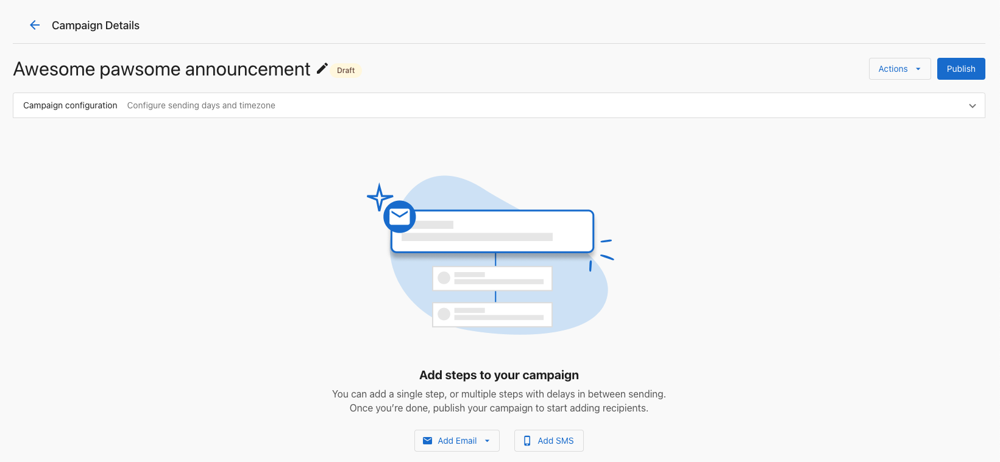
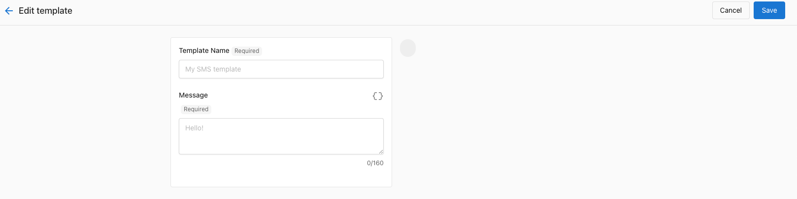
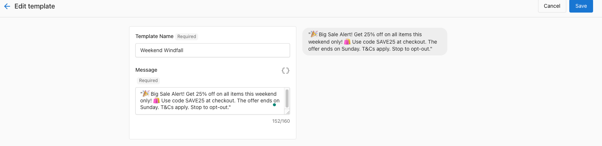
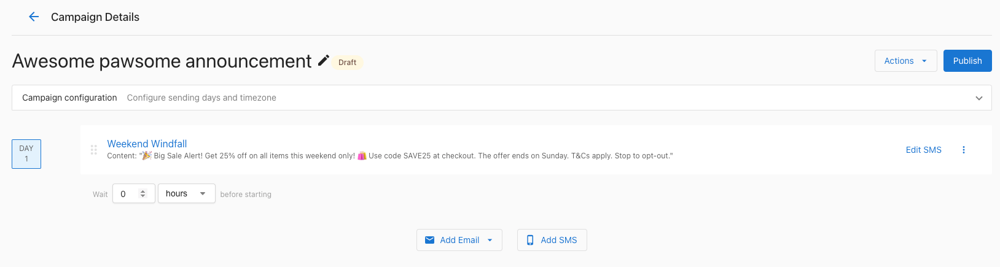
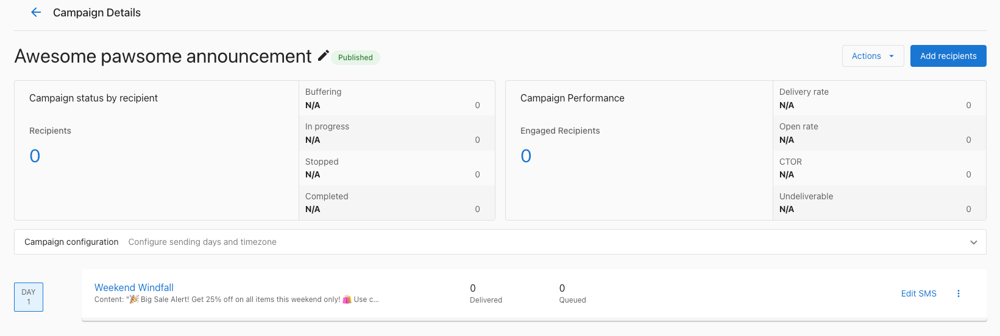

# How do I create an SMS campaign in Business App?

To create an SMS campaign in Business App, go to `Campaigns`, select `Create Campaign`, and choose `SMS`. Sending SMS campaigns requires a Campaigns Pro SMS add-on, because the base plan doesn't include SMS credits.

SMS campaigns let you reach your audience with text messages directly from Business App.

## Do I need an SMS add-on? {#sms-add-on-requirement}

Campaigns Pro does not include SMS in the base plan. To send SMS campaigns, you need to purchase an SMS add-on. The base plan includes email campaigns (for example, 10,000 emails per month) but not SMS credits.

**Key points:**

- SMS sending requires a separate SMS add-on; credits are not included by default.
- Without the add-on, the SMS campaign option is locked and you’ll be prompted to purchase it.
- SMS add-ons provide a set number of messages per month (for example, 100 or 500 depending on the add-on).
- The Campaigns Pro SMS add-on is separate from SMS credits used by other products (such as Reputation AI).
- You can use Conversations AI Pro to reply to SMS if it’s enabled, but sending bulk SMS campaigns requires the Campaigns Pro SMS add-on.

SMS add-ons are available in the United States, Canada, and Italy.

## How do I set up SMS for my country? {#sms-setup-by-country}

Requirements vary depending on your location:

- **United States and Canada**: You may need to complete SMS registration before sending. Follow the prompts in Business App to complete setup.
- **Italy**: No regulatory form is required. Activating the Italy SMS add-on sets up your account automatically, and you can build and send SMS campaigns right away.

## How do I start an SMS campaign? {#creating-an-sms-campaign}

1. In Business App, go to **Campaigns**.
2. Select **Create Campaign** and choose **SMS**.

## How do I set up my SMS campaign? {#setting-up-your-sms-campaign}

### Campaign details

1. Enter a **Campaign Name** for your reference.
2. Select a **Category** that fits your campaign.
3. Choose **One-Time Campaign** or **Recurring Campaign**.

### SMS content

1. Enter the **Message Text** for your audience. Keep in mind SMS character limits.
2. (Optional) Add an image to your message. You can add, edit, delete, and preview the image in both the step configuration and the recipient preview.
3. Use the preview to see how the message looks on mobile.

### Audience selection

1. Select the contacts or list that will receive the campaign.
2. Use filters to narrow the audience if needed.
3. Check the estimated recipient count.

## How do I schedule my SMS campaign? {#scheduling-your-sms-campaign}

1. Choose the date and time to send.
2. For recurring campaigns, set the frequency (daily, weekly, or monthly).
3. Consider your audience’s time zone when scheduling.

## Tips for successful SMS campaigns

- Keep messages short and clear because of character limits.
- Include a clear call-to-action.
- Schedule sends at reasonable times (avoid very early or late).
- Always include an opt-out option to stay compliant.
- Test with a small group before sending to your full list.

## How do I manage my SMS campaigns? {#managing-sms-campaigns}

From the Campaigns area you can:

- View performance (sends, replies, etc.)
- Edit scheduled campaigns
- Pause or cancel campaigns
- Duplicate campaigns to reuse

## Legal compliance

When sending SMS campaigns, follow applicable rules:

- Get clear consent before sending marketing messages
- Identify your business in the message
- Include opt-out instructions
- Honor do-not-contact requests
- Send only during appropriate hours

Check local regulations and carrier requirements for SMS marketing in your region.

## Frequently asked questions

Does Campaigns Pro include SMS credits?

No. The Campaigns Pro base plan includes email campaigns but not SMS credits. To send SMS campaigns, you need to purchase an SMS add-on.

How many messages does an SMS add-on include?

Each SMS add-on provides a set number of messages per month, for example 100 or 500 depending on the add-on.

Why do SMS campaigns need an add-on when I can already reply to SMS in Conversations?

The Campaigns Pro SMS add-on is separate from SMS credits used by other products. You can use Conversations AI Pro to reply to SMS if it's enabled, but sending bulk SMS campaigns requires the Campaigns Pro SMS add-on.

Can I send a recurring SMS campaign?

Yes. Choose `Recurring Campaign` in the campaign details, then set the frequency to daily, weekly, or monthly when you schedule it.

Can I add an image to an SMS campaign?

Yes. You can optionally add an image to your message, and you can add, edit, delete, and preview it in both the step configuration and the recipient preview.

