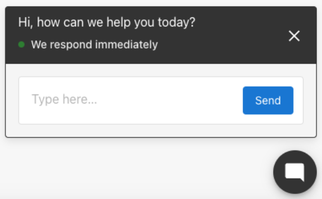
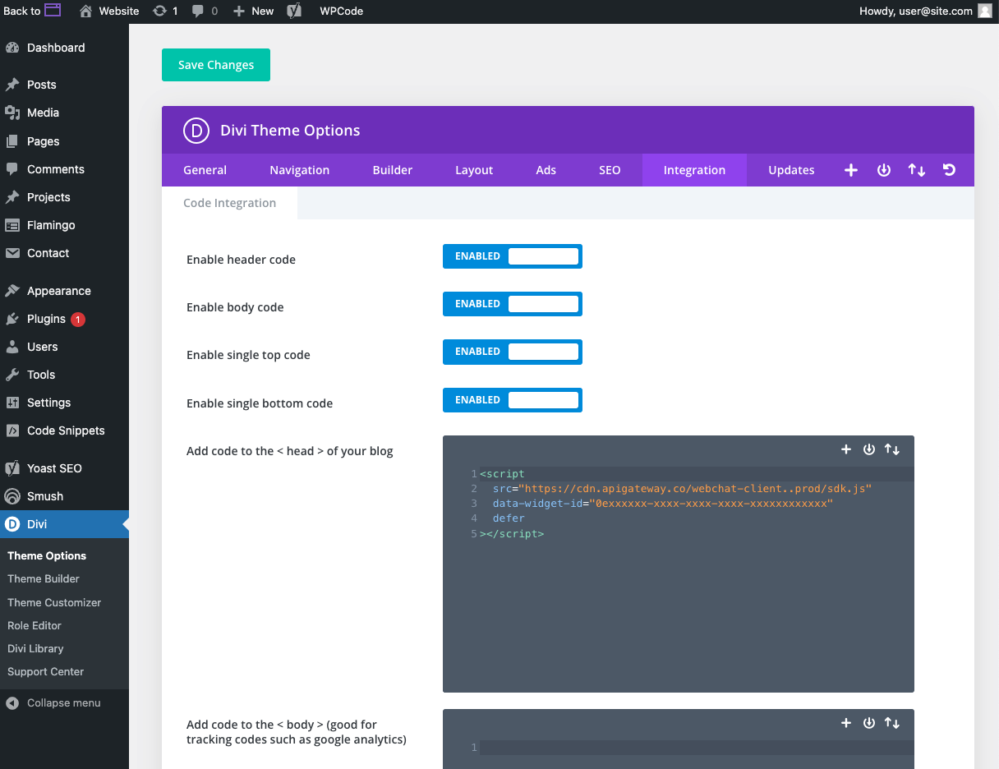
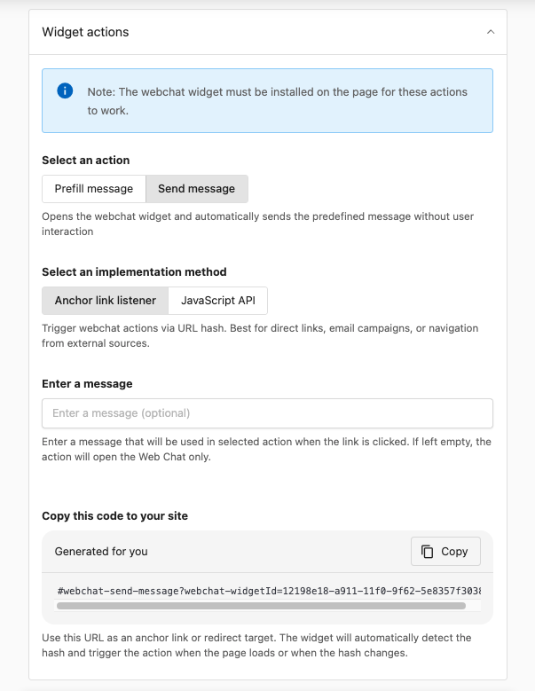

Easily capture leads and respond to website visitors 24/7 with AI-powered web chat. This guide will show you how to set up your chat widget so your AI Receptionist can greet visitors, answer questions, and deliver new leads right to your Conversations—even in over 40 languages.



## What’s included with the Conversations AI web chat

With the Conversations AI Web Chat, you get:

- An AI assistant that automatically greets and chats with visitors, even outside business hours.
- Multilingual engagement, with the assistant detecting and responding in over 40 languages.
- Automatic capture of visitor contact information, with new leads sent directly to your CRM Conversations.
- Conversation transcripts saved in Conversations for your team to review and follow up.

:::note
While your AI Receptionist is smart out-of-the-box, they can be configured and customized to work with your business in more detail.

[Learn more about how the AI Receptionist works.](/business-app/ai/ai-workforce/ai-receptionist)
:::

## How to install the Conversations web chat widget

Choose your website platform to get started:

import Tabs from '@theme/Tabs';
import TabItem from '@theme/TabItem';

<Tabs>
  <TabItem value="wordpress" label="WordPress">

### Install the web chat widget using the WordPress plugin

1. Download the web chat widget installation plugin from `Settings > Conversations Settings > Web Chat Configuration > Installation`.
2. In your WordPress admin (`your-website.com/wp-admin`), go to **Plugins > Add New Plugin**.
3. Upload the ZIP file you just downloaded.
4. Activate the plugin.
5. Your web chat widget should now appear on every page of your website.

### Install the web chat widget on WordPress manually

_The example below uses the Divi Theme, but the steps are similar for most WordPress themes that let you paste code into the `<head>` section._

1. Copy your web chat installation code from `Conversations Settings > Web Chat Configuration`.
2. In WordPress admin, go to **Divi > Theme Options > Integrations**.
3. Paste the code into the “Add code to the &lt;head&gt; of your blog” section.
4. Save changes.  

Your web chat widget should now be live on all pages!



  </TabItem>
  <TabItem value="shopify" label="Shopify">

### Install the web chat widget on Shopify

1. Copy your web chat installation code from `Conversations Settings > Web Chat Configuration`.
2. In Shopify, go to **Online Store > Themes > Actions > Edit Code**.
3. Open the `theme.liquid` file.
4. Paste the code just before the closing `</head>` tag.
5. Save the changes.
6. Your web chat widget should now be visible on your Shopify site.

  </TabItem>
  <TabItem value="custom-html" label="Other Platforms (HTML)">

### Install the web chat widget on other platforms (HTML)

This method works for most website builders and platforms that let you add custom HTML or header code, such as **Wix, Squarespace, Webflow, GoDaddy**, and more.

1. Copy your web chat installation code from `Conversations Settings > Web Chat Configuration`.
2. Open your website’s HTML source or use your site builder’s “Custom Code” or “Header Code” section.
3. Paste the code into the `<head>` section, just before the closing `</head>` tag.
4. Save and publish your changes.
5. Your web chat widget should now appear on your website.

  </TabItem>
</Tabs>


---

### Troubleshooting your web chat widget installation

If the Conversations web chat widget does not appear on your site after installation there are a couple of things you might be able to do yourself to make it appear:

#### 1. Clear your browser cache

- **Browser cache:** Force your browser to load the newest version of your site.
  - Mac: `Shift` + `Command` + `R`
  - PC: `Ctrl` + `F5`
- **Website hosting cache:** Clear your website’s cache (e.g., use the “Flush Cache” button if available in your website platform).
- **WordPress/Divi cache:** If using the Divi theme, go to Theme Options > Builder > Advanced and disable “Static CSS File Generation.”
- **Other cache plugins:** Temporarily disable any cache plugins and refresh your site.

#### 2. Check your widget code placement

Ensure the widget installation code is pasted in the correct location:
- The code must be inside the `<head>` section of your site’s HTML (not the `<body>` or a widget block).
- For WordPress, double-check if the plugin is active, or if you pasted the code into the correct theme section.

#### 3. Check your hosting platform for plugin or theme conflicts

- Disable other plugins or custom code temporarily to see if something is blocking the widget.
- If you find a conflict, try re-enabling plugins one by one to isolate the issue.

## How will I be notified about a new lead?

When your AI assistant is successful in capturing a name and contact info, a few things will happen automatically:

1. A new contact is added to your CRM Contacts, with the captured info: First name, last name, phone number, and email address.
   * If a lead updates their contact info in the AI-assisted web chat (like for example, if they make a mistake), the latest contact info will be updated on the contact automatically.
2. A "New lead" email notification is sent to users on your account. Make sure you have notifications enabled for new leads.


## Customization options

You can tailor the web chat widget to align with your branding and operational needs:

- **Color Scheme**: Adjust the primary and secondary colors to match your website's design.
- **Web Chat Greeting**: Customize the initial message to encourage visitor interaction.
- **AI Knowledge Base**: Enhance the assistant's responses by adding specific business information, such as FAQs, pricing, and services.
- **Profile Information**: Add a name and profile photo to personalize the assistant.
- **Welcome Greeting**: Set a header message to invite engagement.
- **Initial AI Message**: Configure a custom greeting that appears shortly after the chat is opened.
- **Phone Configuration**: Define how received calls and SMS messages should be handled.
- **Widget Actions**: Create direct links that automatically open the chat widget with predefined messages—perfect for email campaigns, landing pages, and support pages.

Access these settings via Administration > Conversations Settings > Configure Web Chat`.

## Widget actions

Widget actions allow you to create direct links that automatically open the web chat widget with predefined messages. This feature is perfect for email campaigns, landing pages, support pages, or any scenario where you want to direct visitors to start a chat with a specific message.

:::note
The web chat widget must be installed on the page for these actions to work.
:::

### Action types

There are two types of widget actions you can configure:

- **Prefill message**: Opens the widget and pre-fills the message field with your predefined text. The visitor must click send to actually send the message. Use this when you want to give visitors control over when to send the message.
- **Send message**: Opens the widget and automatically sends the predefined message without requiring any user interaction. Use this for immediate engagement and when you want the message sent automatically.

### Implementation methods

You can trigger widget actions using two methods:

**Anchor link listener**:
- Best for: Direct links, email campaigns, navigation from external sources
- Uses URL hash format that the widget automatically detects
- Format: `#webchat-send-message?webchat-widgetId={widget-id}` or `#webchat-prefill-message?webchat-widgetId={widget-id}`
- The widget detects the hash when the page loads or when the hash changes
- Example: `https://yourwebsite.com#webchat-send-message?webchat-widgetId=fedf2e7a-30fb-11f0-941a-ea112a20`

**JavaScript API**:
- Best for: Custom integrations, dynamic content, programmatic triggering
- Allows you to trigger actions programmatically from your own JavaScript code
- Useful when you need to trigger actions based on user interactions or dynamic conditions

### Configuration steps



1. Navigate to **Conversations Settings > Web Chat Configuration > Widget Actions**
2. **Select an action**: Choose **Prefill message** or **Send message**
3. **Select an implementation method**: Choose **Anchor link listener** or **JavaScript API**
4. **Enter a message** (optional): Type the message that will be used when the action is triggered. If left empty, the action will open the Web Chat only.
5. **Copy the generated code**: Use the provided code as an anchor link or redirect target

The generated code will look like: `#webchat-send-message?webchat-widgetId=fedf2e7a-30fb-11f0-941a-ea112a20`

### Code examples

**Anchor Link Example** (Send message):
```html
<a href="#webchat-send-message?webchat-widgetId=fedf2e7a-30fb-11f0-941a-ea112a20">Chat with us about pricing</a>
```

**Anchor Link Example** (Prefill message):
```html
<a href="#webchat-prefill-message?webchat-widgetId=fedf2e7a-30fb-11f0-941a-ea112a20">Ask about our services</a>
```

**JavaScript API Example**:
```javascript
// Trigger send message action programmatically
window.location.hash = '#webchat-send-message?webchat-widgetId=fedf2e7a-30fb-11f0-941a-ea112a20';
```

### Use cases

- **Email campaigns**: Include a "Chat with us" link that opens the widget with a message like "I'm interested in your services"
- **Landing pages**: Add CTAs that open chat with context-specific messages
- **Support pages**: Create links that open chat with pre-filled support questions
- **Product pages**: Enable visitors to ask about specific products with pre-filled inquiries
- **External navigation**: Link from external sites or apps directly to your chat with context

## FAQs about AI web chat in Conversations

<details>
<summary><strong>Can the AI assistant scrape websites for information?</strong></summary>

Yes, the AI can be trained on website content to enhance its knowledge base.
</details>

<details>
<summary><strong>Can I upload files like PDFs or DOCs for the AI to learn from?</strong></summary>

Currently, only raw text can be added to the AI's knowledge base.
</details>

<details>
<summary><strong>Why is the AI responding with incorrect or incomplete information?</strong></summary>

The information the AI responds to inquiries with is based on the source information it has only. The web chat tool shows you directly inside the Conversations chat record where it got the source information from, like a quick audit. You can then make the change on your website or inside your AI knowledge base. The most common culprit is old or incorrect information found on the website.
</details>

<details>
<summary><strong>How long does training the AI take?</strong></summary>

Training duration varies based on website size but typically takes between 1-5 minutes.
</details>

<details>
<summary><strong>Is there a limit to the number of AI responses?</strong></summary>

No, unlimited AI responses are included with Conversations Pro.
</details>

<details>
<summary><strong>How do I install the web chat widget?</strong></summary>

Copy and paste the installation code into the `<head>` section of your website's HTML. Detailed instructions are provided above.
</details>

<details>
<summary><strong>What languages does the AI support?</strong></summary>

The AI assistant can respond in over 40 languages, including English, Spanish, French, German, Italian, Turkish, Polish, Ukrainian, Russian, Japanese, and Chinese.
</details>

<details>
<summary><strong>Why won't the chat widget let me type certain letters or the "Space" key when trying to type?</strong></summary>

Some plugins can interfere with the ability to type in the widget because they “hijack” that key for their own functions.

For example, website admins will have trouble typing messages into the web chat widget when the WordPress Jetpack plugin is enabled because it hijacks some of the keys to open and close their own chat functions. Disabling the JetPack plugin will restore the function of these keys.

Smooth scrolling website features can also interfere with the ability of your website visitors to type the ‘space’ key with the web chat widget. If you have the Divi theme on a WordPress website, you can disable smooth scrolling by going to Divi > Theme Options and disabling the Smooth Scrolling functions.
</details>

<details>
<summary><strong>How do I remove the Google reCaptcha badge that's blocking my chat widget?</strong></summary>

When reCAPTCHA is being used on a website form, this badge will appear in the bottom right of a webpage – which could be in the way of the web chat widget.

You can hide the badge completely on your website with some custom CSS; just make sure to follow Google’s required alternative ways to inform the user that reCAPTCHA is being used.

Read more: https://developers.google.com/recaptcha/docs/faq#id-like-to-hide-the-recaptcha-badge.-what-is-allowed

To hide the reCAPTCHA badge, go to your website CSS editor:

- Log in to your WordPress dashboard  
- Go to Appearance » Customizer  
- Click Additional CSS  
- Add the snippet:

```css
.grecaptcha-badge {
  visibility: hidden !important;
}
```

- Save and preview your website.
</details>

<details>
<summary><strong>How do I create a link that opens the web chat with a predefined message?</strong></summary>

You can create widget action links that automatically open the chat widget with predefined messages:

1. Navigate to **Conversations Settings > Web Chat Configuration > Widget Actions**
2. Select an action type (**Prefill message** or **Send message**)
3. Choose **Anchor link listener** as the implementation method
4. Enter an optional message
5. Copy the generated code (e.g., `#webchat-send-message?webchat-widgetId=...`)
6. Use this code as an anchor link on your website, in emails, or as a redirect target

The widget will automatically detect the hash and trigger the action when the page loads or when the hash changes.
</details>

<details>
<summary><strong>What's the difference between prefill message and send message actions?</strong></summary>

**Prefill message**: Opens the widget and pre-fills the message field with your predefined text. The visitor must click send to actually send the message. This gives visitors control over when to send the message and allows them to edit it if needed.

**Send message**: Opens the widget and automatically sends the predefined message without requiring any user interaction. This is ideal for immediate engagement and when you want the message sent automatically.

Choose **prefill message** when you want visitors to review or edit the message before sending. Choose **send message** when you want immediate, automatic engagement.
</details>

<details>
<summary><strong>Can I trigger web chat actions programmatically with JavaScript?</strong></summary>

Yes! You can use the **JavaScript API** implementation method to trigger widget actions programmatically:

1. Navigate to **Conversations Settings > Web Chat Configuration > Widget Actions**
2. Select **JavaScript API** as the implementation method
3. Configure your action and copy the provided code
4. Use JavaScript to trigger the action, for example:

```javascript
window.location.hash = '#webchat-send-message?webchat-widgetId=your-widget-id';
```

This is useful for custom integrations, dynamic content, or triggering actions based on user interactions or conditions.
</details>
