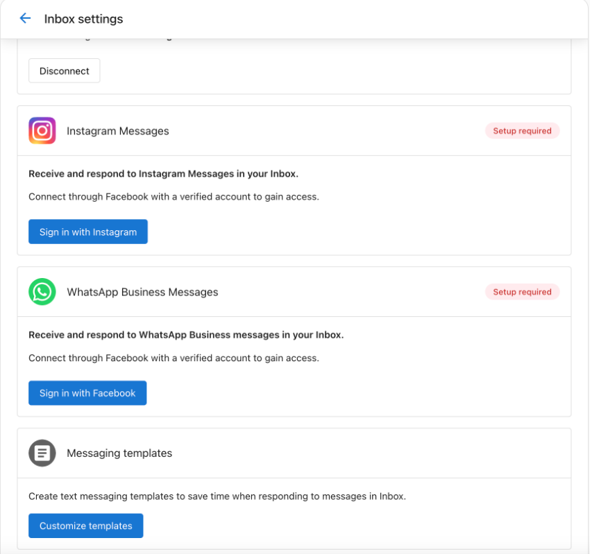
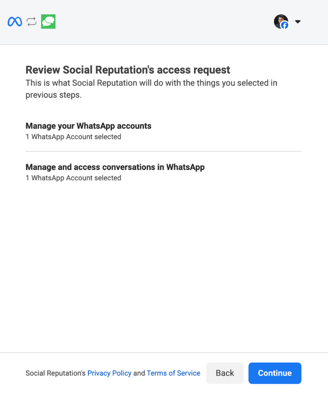

You can use Conversations to send and receive WhatsApp messages with customers through your WhatsApp Business account. This integration enables international customer communication by connecting your WhatsApp Business account directly to your team's shared Conversations. WhatsApp messaging is available starting with Conversations Standard.

## WhatsApp Business Integration and Setup

### What's Included

- Direct integration with Conversations (send and receive WhatsApp messages directly from Conversations)
- WhatsApp message templates for outbound messaging
   - Includes 250 outbound conversations per month (1,000 once verified by Meta)
- Unlimited incoming messages

### Setting Up WhatsApp Business Integration

To connect your WhatsApp Business account to Conversations, follow these steps:

1. **Go to Conversations Settings**  
   Navigate to `Administration > Conversations Settings`.

2. **Sign in with Facebook**  
   Find the **WhatsApp Business Messages** card and click **Sign in with Facebook**.

3. **Authorize Access**  
   In the pop-up, log in to your Facebook account and click **Continue as [Your Name]** to allow access.

4. **Connect Your Business Account**  
   Select **Get Started** to link your business to the platform called **Digital Agency**.

   

5. **Get your SMS/Phone number from Conversations**  
   - In Business App, go to `Settings > Conversations Settings > Phone & SMS > Configure`.
   - Take note of your number, as you’ll need it to set up WhatsApp.

6. **Temporarily Enable Call Forwarding**  
   - Go to `Conversations Settings > Your SMS/Phone Number > Settings`.  
   - Enable **Forward the call** temporarily to receive the verification call.

7. **Verify Ownership via Phone Call**  
   - Return to the WhatsApp setup screen.  
   - Enter your Conversations number and select **Phone Call** as the verification method.  
   - You will receive a verification call with a code.

8. **Restore Call Forwarding Settings**  
   After verification, disable call forwarding or return it to your original settings.

9. **Confirm Permissions and Complete Setup**  
   Finish any remaining prompts to finalize the WhatsApp Business connection. A green 'connected' badge will appear when verified.

---

## Sending WhatsApp Messages

Your options for sending a WhatsApp message are different based on your conversation history with your customer:
- If you are sending a WhatsApp message to someone who ***has* contacted you first**, you are free to write any message that meets WhatsApp guidelines.
- If you are sending a p messsage to someone who **has *not* contact you first**, you must reply using a WhatsApp template. 

If your account is new and does not yet have any templates, the system will automatically submit a template for approval on your behalf. You can also create and submit additional templates anytime through the [Meta Business Help Center](https://business.facebook.com/latest/whatsapp_manager/message_templates).

:::info
Only approved templated messages can be sent as outbound cold messages. Once a customer initiates contact, you can reply with custom messages within a 24-hour window.
:::

## Getting WhatsApp Replies

- Customer replies to your WhatsApp Business account automatically appear in the same Conversations thread
- All WhatsApp history is retained alongside other channels like email, SMS, and web chat

## Additional WhatsApp Features Managed by Meta

Some advanced features and upgrades are controlled directly by Meta (WhatsApp's parent company). We provide this information to help you understand these options and how to access them.

### Verified WhatsApp Business Accounts

Verified businesses get benefits such as:  
- Increased messaging limits (from 250 to 1,000 daily business-initiated conversations)  
- Business name displayed in customer chats  
- Higher trust and visibility within WhatsApp

To apply for verification, visit Meta’s [WhatsApp Manager](https://business.facebook.com/latest/whatsapp_manager).

### Conversation Expansion Beyond Free Limits

After you exceed your included monthly conversations (250 or 1,000 if verified), WhatsApp applies conversation-based fees.  
:::warning
These charges are billed directly by Meta and require a valid payment method in your Meta Business account.  
:::

## FAQs About WhatsApp Messaging in Conversations

<strong>Can a client connect an existing WhatsApp business account to Conversations, and still use the mobile app?</strong>

Not currently. WhatsApp is working on a feature called "WhatsApp Coexistence," which is in closed beta. If a business has a WhatsApp for business account on their phone already, they can register a new (second) account for using with Conversations. In the future, we hope to support 'coexistence' as well.

<strong>Why can't I write an outgoing message?</strong>

Only approved templated messages can be sent as outbound cold messages. Once a customer initiates contact, you can reply with custom messages within a 24-hour window.

<strong>Why did my message fail to send?</strong>

Your message template may not be approved. Check template status in the [WhatsApp Manager](https://business.facebook.com/latest/whatsapp_manager/message_templates).

<strong>What will WhatsApp messaging cost me?</strong>

You can send 250 (or 1,000 once verified) outbound conversations per month at no charge. Beyond that, Meta's conversation pricing applies. A valid payment method must be added to your Meta account.

