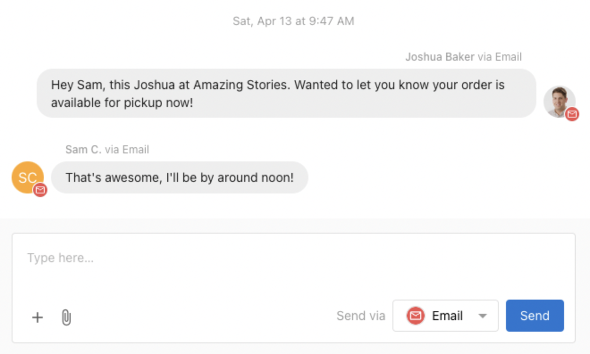
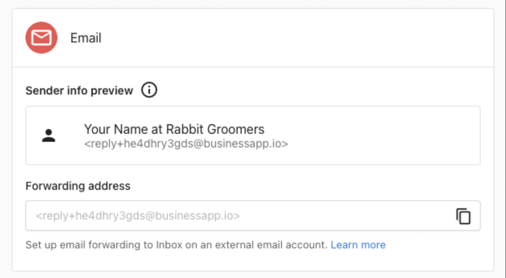

Conversations lets you send and receive emails with leads and customers from a shared team inbox. When a lead provides an email address through a web chat, form, or any other channel, anyone on your team can reply via email directly from Conversations without opening a separate email client.

## Features

- Available to all Conversations AI users (Standard and Pro)
- Send emails to contacts using your assigned Conversations email address
- Receive email replies into a shared Conversations inbox where any team member can continue the conversation
- Forward emails from your existing business email address into Conversations
- AI auto-response support for 24/7 customer support via email

## How email works in Conversations

### Your Conversations email address

Every business is assigned a unique Conversations email address in the format `reply+xxxxx@businessapp.io`. All outbound emails from Conversations are sent from this address, and customer replies to it are routed back into your Conversations inbox automatically.

You can find your assigned address at **Administration > Email Configuration > Advanced email settings**, listed as the **Forwarding address**.

### Sending emails

To send an email to a new or existing contact:

1. Click **New Message** in Conversations
2. Enter the recipient's email address
3. Write your message, then select **Email** in the **Send via** dropdown menu
4. Click **Send**

:::info
The channels available in the **Send via** menu depend on the contact information you have for the recipient and which channels you have connected to Conversations.
:::

### Receiving email replies

When a customer replies to an email you sent from Conversations, their response is automatically routed back into the same conversation thread. Any team member can view and respond from the shared inbox.

## Email forwarding

If your business already uses an email address for customer inquiries (like `team@yourbusiness.com`), you can forward those emails into Conversations. When a customer sends an email to your business address, a copy is automatically forwarded to your Conversations inbox, where it appears as a new conversation. Your team can then read and reply to the message directly from Conversations, without switching to a separate email client.

This is useful when you want customers to email a familiar, branded address while your team manages all replies from one place.

### How to set up forwarding

1. Find your Conversations forwarding address at **Administration > Email Configuration > Advanced email settings**, in the **Forwarding address** field (it looks like `reply+xxxxx@businessapp.io`)
2. Copy this address
3. In your email provider's settings, add this address as a forwarding destination

Once forwarding is active, any email sent to your business address is also delivered to Conversations. Your team can reply from within Conversations, and the customer receives the reply in their email inbox.

### Forward from Gmail

1. In Gmail, go to **Settings > See all settings**
2. Select the [Forwarding and POP/IMAP](https://mail.google.com/mail/u/0/#settings/fwdandpop) tab
3. Click **Add a forwarding address** and paste your Conversations forwarding address
4. Click **Next**, sign in again if required, and confirm
5. In Conversations, you receive a confirmation message with a link. Click the link to confirm the forwarding request
6. Return to Gmail Forwarding settings and enable forwarding, then save your changes

You can also use Gmail filters to forward only specific messages.

### Forward from Outlook

1. In Outlook, go to **Settings**
2. Select **Mail > [Forwarding](https://outlook.live.com/mail/options/mail/forwarding)**
3. Select **Enable forwarding**, enter your Conversations forwarding address, and select **Save**

### Forward from other providers

Most email providers support automatic forwarding. Look for a forwarding or redirect option in your provider's settings and enter your Conversations forwarding address as the destination.

## Email configuration settings

The **Administration > Email Configuration** page contains email settings for your business. It is important to understand which settings apply to Conversations and which apply to other products.

### Sender and reply settings

The **Sender and reply settings** section at the top of the Email Configuration page controls the sender name, reply address, and display address used by **Campaigns and other integrated services**. These settings do not affect emails sent through Conversations.

### Advanced email settings

The **Advanced email settings** section is where you find your Conversations forwarding address and configure your sender domain.

- **Forwarding address**: Your unique `reply+xxxxx@businessapp.io` address. Copy this to set up email forwarding from your business email provider.
- **Sender domain**: You can configure a custom email domain and sender address for use with Campaigns and other integrated services. Conversations sends from your assigned `@businessapp.io` address.

### Email domains and DNS records

If you configure a custom sender domain, you need to add DNS records that verify your domain and improve email deliverability. Go to **Administration > Email Configuration > Email domains** to see the required records.

You need to add the following records through your domain registrar or DNS provider:

- **SPF record**: A TXT record that authorizes the email service to send on behalf of your domain
- **DKIM records**: CNAME records that add a digital signature to your emails, proving they are legitimate
- **DMARC record**: A TXT record that tells receiving mail servers how to handle emails that fail SPF or DKIM checks

The **Email domains** section shows each required record along with its current value, so you can verify whether your DNS is configured correctly. Changes to DNS records can take up to 72 hours to propagate. Once your domain shows as **Active**, your custom sender address is ready for Campaigns and other services.

## AI auto-response for emails

The AI Chat Receptionist can automatically respond to inbound emails, providing 24/7 customer support. When enabled, the AI:

- Replies to customer emails within minutes
- Answers questions using your business profile and knowledge base
- Captures lead information and books appointments
- Creates a conversation thread for your team to monitor

**To enable AI auto-response for email:**

1. Go to **AI > AI Workforce** in your dashboard
2. Configure your AI Chat Receptionist
3. In the Communication Channels section, enable the **Email** channel

Learn more about setting up and customizing your [AI Chat Receptionist](/business-app/ai/ai-workforce/ai-chat-receptionist/).

## FAQs

<strong>Can each user on my team get their own email address?</strong>

Your business uses one shared email address for Conversations. When a team member sends a message, their name is visible in the sender details and email signature, so customers can see who they are communicating with.

<strong>Can I send Conversations emails from my own domain?</strong>

Conversations sends all emails from your assigned `reply+xxxxx@businessapp.io` address. You can configure a custom sender domain at **Administration > Email Configuration**, but that applies to Campaigns and other integrated services, not Conversations.

To give customers a familiar point of contact, set up email forwarding from your business email address so that inbound messages arrive in Conversations. Customers can email your branded address (e.g., `team@yourbusiness.com`) and your team responds from within Conversations.

<strong>Is there a limit on how many emails I can send?</strong>

Yes. There is a daily email sending quota. If you are unable to send emails, you may have reached your daily limit. The quota resets every 24 hours.

<strong>What is the difference between email forwarding and a custom sender domain?</strong>

Email forwarding routes **inbound** emails from your existing business address into Conversations. A custom sender domain controls the **from** address on **outbound** emails sent by Campaigns and other services. These are independent features. Email forwarding is the recommended way to connect your business email address to Conversations.

