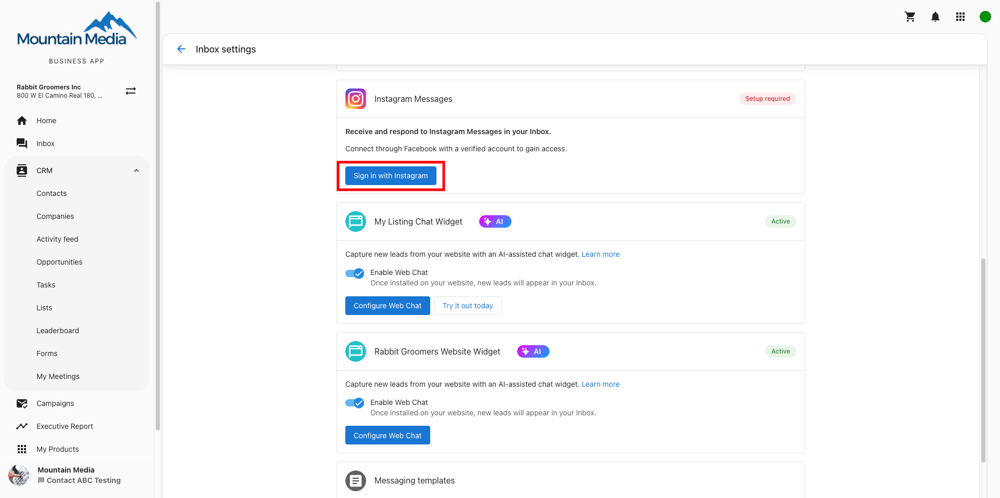

# Instagram Integration

Connect your Instagram Business account to Conversations to manage Instagram direct messages alongside all other customer communications in one place.

## Features

- **Unified Messaging**: Handle Instagram messages in the same place as email, SMS, and other channels
- **Team Collaboration**: Your team members can respond to Instagram messages
- **Worldwide Availability**: Available globally for all Instagram Business and Creator accounts
- **Automatic Contact Creation**: New Instagram conversations automatically create contacts in your CRM

## What You'll Need

- A professional Instagram account (Business or Creator account, not a personal account)
- The Instagram account must be connected to a Facebook Page
- Admin access to the Facebook Page associated with your Instagram account
- Conversations enabled in your Business App

## Getting Started

### Connect your Instagram Business Account

1. From the Business App, navigate to Conversations from the navigation sidebar on the left.

2. Click More in the top right corner.

3. In the dropdown menu, select Conversation Settings.

4. Scroll down to find the Instagram section.

5. Click Sign in with Instagram.

:::warning
You must use a professional Instagram account (Business or Creator), not a personal account. If you don't have a Business or Creator account, convert your Instagram account before proceeding.
:::

6. You'll be redirected to Facebook's login page. Log in to Facebook (or click **Reconnect** if already signed in).

7. Review and grant the requested permissions:
   - Grant access to **All Pages** linked to your Facebook account

8. Select the Instagram account you want to connect from the list.

9. Click **Connect** to confirm the connection. You'll be redirected back to Conversations.

10. Back in Conversation Settings, click **Turn on Messaging** to enable Instagram messages.

11. Verify the connection is successful by checking that your Instagram account appears in the Instagram section with a connected status.

## Using Instagram in Conversations

### Send Instagram Messages

Once your Instagram account is connected, you can send messages directly from Conversations:

1. Open Conversations Messages
2. Click the **Send a Message** button
3. Enter the customer's Instagram username or select from existing conversations
4. Type your message and select **Instagram** in the **Send via** dropdown
5. Click **Send**

:::info
You can only message customers who have previously sent a direct message to your Instagram account, in compliance with Instagram's messaging policies.
:::

### Receive Instagram Replies

- Customer replies automatically appear in the same Conversations thread
- All Instagram message history is retained alongside other channels like email, SMS, and web chat
- Any team member can respond from the shared Conversations workspace

## Troubleshooting

### Instagram Account Not Listed?

- Ensure your Instagram account is connected to a Facebook Page
- Verify you have admin access to the Facebook Page
- Convert personal Instagram accounts to Business or Creator accounts

### Connection Failed?

- Check that you granted access to "All Pages" during Facebook login
- Ensure the Instagram account has messaging enabled
- Try disconnecting and reconnecting the Facebook Page

## Best Practices

- Respond to Instagram messages promptly to maintain good customer relationships
- Use consistent branding and tone across all your messaging channels
- Monitor your message performance and response times
- Train your team members on Instagram messaging best practices

## Frequently Asked Questions

<strong>Why don't I see Instagram in my connection options?</strong>

Instagram integration requires a professional Instagram account (Business or Creator) connected to a Facebook Page. Personal Instagram accounts cannot be connected to Conversations.

<strong>Why isn't my Instagram account showing up in the connection list?</strong>

Ensure your Instagram account is properly connected to a Facebook Page and that you have admin access to that page. You may need to reconnect your Instagram account to Facebook first.

<strong>Can I message any Instagram user?</strong>

No, you can only message customers who have previously sent a direct message to your Instagram account. This complies with Instagram's messaging policies and prevents spam.

<strong>Can multiple team members respond to Instagram messages?</strong>

Yes, once connected to Conversations, any team member can view and respond to Instagram direct messages from the shared workspace, improving response times and collaboration.

<strong>What happens to existing Instagram conversations?</strong>

Existing Instagram conversations will continue to appear in the Instagram app. New messages after connecting to Conversations will appear in both Instagram and your Conversations workspace.

<strong>Can the AI Receptionist respond to Instagram messages?</strong>

Currently, the AI Receptionist does not automatically reply to Instagram messages. All Instagram replies must be handled manually by your team through Conversations to comply with Instagram's messaging policies and ensure appropriate responses.

<strong>Can I disconnect Instagram from Conversations later?</strong>

Yes, you can disconnect Instagram from Conversations through the connection settings. This will stop new messages from appearing in Conversations, but won't affect your Instagram account itself.

Instagram integration is included with your Business App account at no additional cost.
