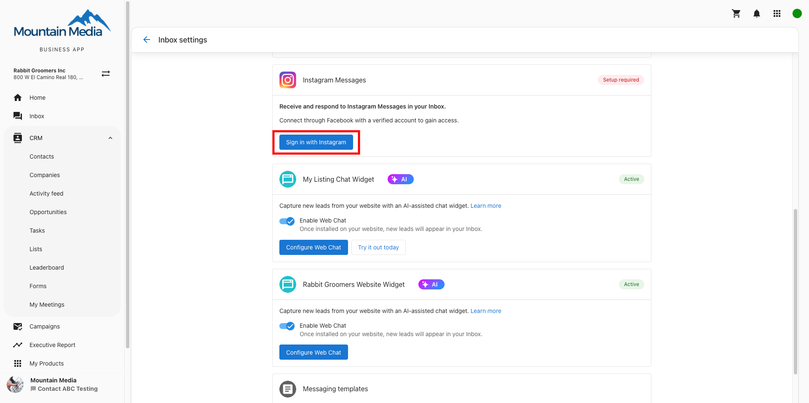

You can use Conversations to send and receive Instagram direct messages with customers from your connected Instagram business account. This integration centralizes all Instagram conversations alongside SMS, email, and web chat in one shared workspace.

## How to Connect Instagram to Conversations

### Instagram Integration Prerequisites

:::caution
Personal Instagram accounts cannot be connected to Conversations. You must convert to a Business or Creator account first.
:::

To connect Instagram to Conversations, you'll need:
- A professional Instagram account (Business or Creator account)
- The Instagram account must be connected to a Facebook Page
- Admin access to the Facebook Page associated with your Instagram account

### Step-by-Step Guide to Connect Instagram to Conversations

1. Go to `Settings > Conversations Settings`
2. Click **Sign in with Instagram**

3. Log in to Facebook (or click **Reconnect** if already signed in)
4. Grant access to **All Pages** linked to your Facebook account
5. Select the Instagram account you want to connect from the list
6. Click **Connect**
7. Back in Conversations Settings, click **Turn on Messaging** to enable Instagram messages

### Troubleshooting Instagram Connection Issues

#### Instagram Account Not Listed?

- Ensure your Instagram account is connected to a Facebook Page
- Verify you have admin access to the Facebook Page
- Convert personal Instagram accounts to Business or Creator accounts

#### Connection Failed?

- Check that you granted access to "All Pages" during Facebook login
- Ensure the Instagram account has messaging enabled
- Try disconnecting and reconnecting the Facebook Page

--- 

## How to Send Instagram Messages from Conversations

Once your Instagram account is connected:

1. Open `Conversations Messages`
2. Click the `Send a Message` button
3. Enter the customer's Instagram username or select from existing conversations
4. Type your message and select `Instagram` in the **Send via** dropdown
5. Click `Send`

:::info
You can only message customers who have previously sent a direct message to your Instagram account, in compliance with Instagram's messaging policies.
:::

## How to Get Instagram Replies in Conversations

- Customer replies automatically appear in the same Conversations thread
- All Instagram message history is retained alongside other channels
- Any team member can respond from the shared Conversations workspace

## FAQs About Instagram Messaging in Conversations

<strong>Why don't I see Instagram in my connection options?</strong>

Instagram integration requires a professional Instagram account (Business or Creator) connected to a Facebook Page. Personal Instagram accounts cannot be connected to Conversations.

<strong>Why isn't my Instagram account showing up in the connection list?</strong>

Ensure your Instagram account is properly connected to a Facebook Page and that you have admin access to that page. You may need to reconnect your Instagram account to Facebook first.

<strong>Can I message any Instagram user?</strong>

No, you can only message customers who have previously sent a direct message to your Instagram account. This complies with Instagram's messaging policies and prevents spam.

<strong>Can multiple team members respond to Instagram messages?</strong>

Yes, once connected to Conversations, any team member can view and respond to Instagram direct messages from the shared workspace, improving response times and collaboration.

<strong>What happens to existing Instagram conversations?</strong>

Existing Instagram conversations will continue to appear in the Instagram app. New messages after connecting to Conversations will appear in both Instagram and your Conversations workspace.

<strong>Can the AI Receptionist respond to Instagram messages?</strong>

Currently, the AI Receptionist does not automatically reply to Instagram messages. All Instagram replies must be handled manually by your team through Conversations to comply with Instagram’s messaging policies and ensure appropriate responses.

<strong>Can I disconnect Instagram from Conversations later?</strong>

Yes, you can disconnect Instagram from Conversations through the connection settings. This will stop new messages from appearing in Conversations, but won't affect your Instagram account itself.

